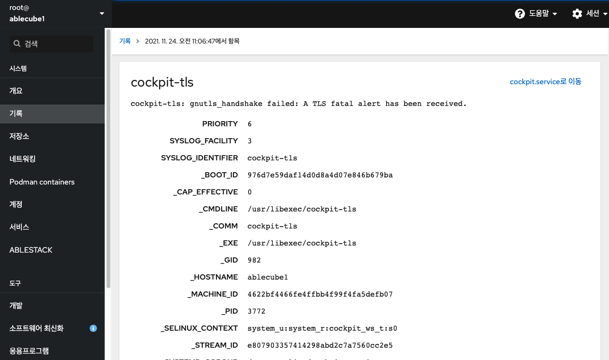
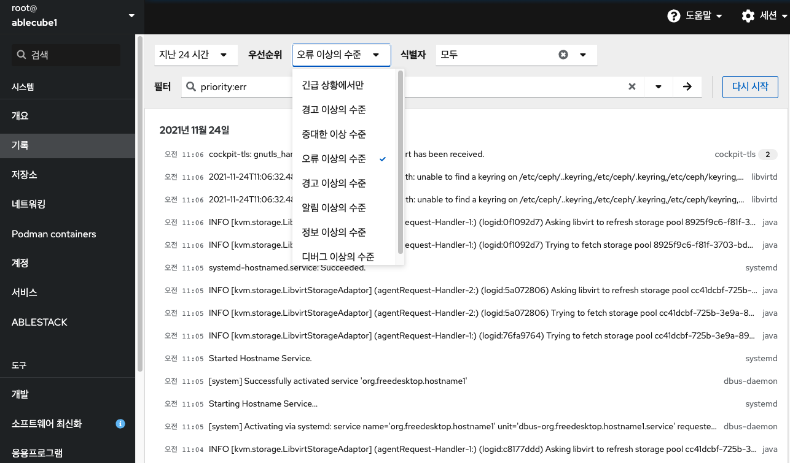

# 로그
웹 콘솔에서 로그에 액세스, 검토 및 필터링하는 방법을 설명합니다.

## 웹 콘솔에서 로그 확인
Cube 웹 콘솔 기록 메뉴는 journalctl 유틸리티에 대한 UI입니다. 웹 콘솔 인터페이스에서 시스템 로그에 액세스하는 방법에 대해 설명합니다.

### 전제 조건
* Cube 웹 콘솔이 설치되고 액세스 가능해야 합니다.

### 순서
1. 웹 콘솔에 로그인합니다.
2. 기록를 클릭 합니다.

3. 목록에서 로그 항목을 클릭하여 로그 항목 세부정보를 확인합니다. 시간, 우선 순위 또는 식별자별로 로그를 필터링할 수 있습니다.

## 웹 콘솔에서 로그 필터링
Cube 웹 콘솔에서 로그 항목을 필터링하는 방법을 설명합니다.

### 전제 조건
* Cube 웹 콘솔이 설치되고 액세스 가능해야 합니다.

### 순서
1. 웹 콘솔에 로그인합니다.
2. 기록를 클릭 합니다.
3. 웹 콘솔에서 최신 로그 항목을 기본적으로 표시됩니다. 특정 시간 범위로 필터링하려면 시간 드롭다운 메뉴를 클릭하고 원하는 옵션을 선택합니다.

4. '오류 이상의 수준' 목록이 기본적으로 표시됩니다. 다른 '우선 순위'로 필터링하려면 오류 이상 드롭다운 메뉴를 클릭하고 선호하는 우선순위를 선택합니다.

5. 웹 콘솔은 '모든 식별자에 대한 로그'를 기본적으로 표시됩니다. 특정 '식별자'에 대한 로그를 필터링하려면 모두 드롭다운 메뉴를 클릭하고 식별자를 선택합니다.

6. 로그 항목을 열려면 선택한 로그를 클릭하십시오.

## 웹 콘솔에서 로그 필터링을위한 텍스트 검색 옵션
텍스트 검색 옵션 기능은 로그 필터링을위한 다양한 옵션을 제공합니다. 텍스트 검색을 사용하여 로그를 필터링할 경우 세 개의 드롭 다운 메뉴에 정의 된 미리 정의 된 옵션을 사용하거나 전체 검색을 직접 입력 할 수 있습니다

### 드롭 다운 메뉴
검색의 주요 매개 변수를 지정하는 데 사용할 수있는 세 가지 드롭 다운 메뉴가 있습니다.

* 시간 :이 드롭 다운 메뉴에는 검색의 다양한 시간 범위에 대한 사전 정의 된 검색이 포함되어 있습니다.
* 우선 순위 :이 드롭 다운 메뉴는 다양한 우선 순위 수준에 대한 옵션을 제공합니다. journalctl --priority옵션에해당합니다. 기본 우선 순위 값은 오류 이상 입니다. 다른 우선 순위를 지정하지 않을 때마다 설정됩니다.
* 식별자 :이 드롭 다운 메뉴에서 필터링 할 식별자를 선택할 수 있습니다. journalctl --identifier옵션에해당합니다.

### Quantifiers
검색을 지정하는 데 사용할 수있는 6개의 옵션이 있습니다. 로그 필터링 옵션 표에서 다룹니다.

### 로그 필드
특정 로그 필드를 검색하려는 경우 필드 내용과 함께 필드를 지정할 수 있습니다.

### 로그 메시지에서 자유 형식 텍스트 검색
로그 메시지에서 원하는 텍스트 문자열을 필터링 할 수 있습니다. 문자열은 정규식 형식 일 수도 있습니다.

### 로그 필터링 - I
2021 년 04 월 20 일 이후 발생한 'systemd'로 식별 된 모든 로그 메시지를 필터링하고 'JOB_TYPE'은 'start'또는 'restart'인 경우를 필터링합니다.

1. identifier:systemd since:2021-04-20 JOB_TYPE=start,restart 검색필드에 입력
2. 결과 값을 확인합니다.    

### 로그 필터링 - II
'service'가 'cockpit'이면서 'succeeded'가 포함된 경우를 필터링합니다.

1. service:cockpit boot:0 succeeded 검색필드에 입력
2. 결과 값을 확인합니다.    

## 로그 필터링 옵션
journalctl 웹 콘솔에서 로그를 필터링하는 데 사용할 수있는 몇 가지 옵션을 유용하게 사용할 수 있습니다.

 Option name | Usage | Notes
 ----------- | ----- | -----
 `priority`| 메시지 우선 순위별로 출력을 필터링합니다. 단일 숫자 또는 텍스트 로그 수준을 사용합니다. 로그 수준은 일반적인 syslog 로그 수준입니다. 단일 로그 수준이 지정되면이 로그 수준 또는 더 낮은 (따라서 더 중요한) 로그 수준의 모든 메시지가 표시됩니다.|우선 순위 드롭 다운 메뉴 에서 다룹니다 .
 `identifier` | 지정된 syslog 식별자 SYSLOG_IDENTIFIER에 대한 메시지를 표시합니다. 여러 번 지정할 수 있습니다. | 식별자 드롭다운 메뉴에 포함되어 있습니다.
 `follow` | 가장 최근의 저널 항목만 표시하고 저널에 추가 될 때 새 항목을 계속 인쇄합니다. | 드롭다운에 포함되지 않습니다.
 `service` | 지정된 systemd 장치에 대한 메시지를 표시합니다. 여러번 지정할 수 있습니다. | 드롭다운에 포함되지 않습니다. journalctl --unit매개 변수에 해당합니다.
 `boot` | 특정 부팅의 메시지를 표시합니다. 양의 정수는 저널의 시작부터 부팅를 조회하고 0보다 같거나 작은 정수는 저널의 끝에서 시작하는 부팅를 조회합니다. 따라서 1은 시간순으로 저널에서 찾은 첫 번째 부팅을 의미하고, 2는 두 번째 등의 순서로 검색됩니다. -0은 마지막 부팅이고, -1은 마지막 부팅 이전 부팅입니다. | 시간 드롭 다운 메뉴 에서 현재 부팅 또는 이전 부팅 으로 만 적용됩니다. 다른 옵션은 수동으로 작성해야합니다.
 `since` | 날짜 포맷은 '2021-04-20 18:17:16'형식이어야합니다. 시간 부분을 생략하면 "00:00:00"으로 간주됩니다. 초 구성 요소 만 생략하면 ": 00"으로 간주됩니다. 날짜 구성 요소를 생략하면 현재 날짜로 간주됩니다. 대안으로, "yesterday", "today", "tomorrow"문자열이 이해되며, 이는 각각 현재 날짜 전날, 현재 날짜 또는 오늘 다음날의 00:00:00을 나타냅니다. "now"은 현재 시간을 나타냅니다. 마지막으로, 각각 현재 시간 이전 또는 이후의 시간을 나타내는 "-"또는 "+"접두사가 붙은상대 시간을 지정할 수 있습니다. | 드롭다운에 포함되지 않습니다.