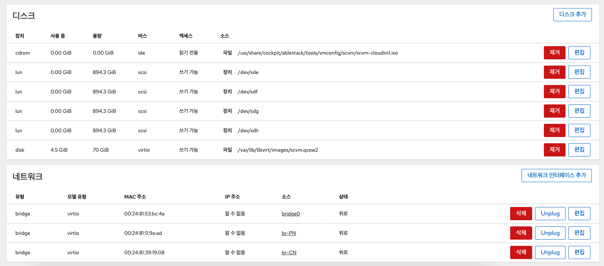

## 가상머신 관리
Cube의 Cokckpit에서 가상머신을 관리하고, 가상화 관리 기능을 제공합니다.

호스트의 그래픽 인터페이스에서 가상머신을 관리하려면 Cube의 Cokckpit의 가상머신 메뉴를 사용할 수 있습니다.

### 가상머신 관리 개요
Cube의 Cokckpit은 시스템 관리를 위한 웹 기반 인터페이스입니다. 호스트 시스템에서 가상머신(VM)의 그래픽 보기를 제공하고 이러한 VM을 생성, 액세스 및 구성 할 수 있도록 합니다.

Cube의 Cokckpit을 사용하여 VM을 관리하려면 먼저 가상화를 위한 Cube의 Cokckpit 플러그인을 설치해야합니다.

다음 단계

- Cube의 Cokckpit에서 VM 관리를 활성화하는 방법에 대한 지침은 “가상머신 관리를 위한 설정” 을 참조하십시오.
- Cube의 Cokckpit이 제공하는 VM 관리 작업의 전체 목록은 “사용 가능한 가상머신 관리 기능” 을 참조하십시오.
- 현재 Cube의 Cokckpit에서 사용할 수 없지만 virt-manager 응용 프로그램 에서 사용할 수 있는 기능 목록은 “Virtual Machine Manager의 가상화 기능과 웹 콘솔 간의 차이점” 을 참조하십시오.

### 가상머신 관리를 위한 설정

Cube의 Cokckpit을 사용하여 가상머신(VM)을 관리하기 전에 호스트에 Cube의 Cokckpit 가상머신 플러그인을 설치해야합니다.

전제조건

- Cube의 Cokckpit이 설치되고 활성화되어있습니다.

순서

1. cockpit-machines 플러그인을 설치합니다.

    $ yum install cockpit-machines

확인

- 설치에 성공하면 Cube의 Cokckpit 사이드 메뉴에 가상머신이 나타납니다.

### 사용 가능한 가상머신 관리 기능

Cube의 Cokckpit을 사용하여 다음 작업을 수행하여 시스템에서 가상머신(VM)을 관리 할 수 ​​있습니다.

* Cube의 Cokckpit에서 수행 할 수 있는 VM 작업
    - VM 생성과 게스트 운영 체제로 설치                              
    - VM 삭제                                                 
    - VM 시작, 종료 및 다시 시작                                  
    - 콘솔을 사용하여 VM에 연결하고 다양한 상호 작용                    
    - VM에 대한 다양한 정보 보기                               
    - VM에 할당된 호스트 메모리 조정                                 
    - VM에 대한 네트워크 연결 관리                                  
    - 호스트에서 사용 가능한 VM 스토리지를 관리하고 가상 디스크를 VM에 연결   
    - VM의 가상 CPU 설정 구성                                   

!!! warning "가상머신 메뉴를 통한 VM 작업 관련 주의사항"
    위 작업 중 간단한 정보 확인을 제외한 VM 생성, 삭제 등 가상머신에 영향이 있는 작업은 클라우드 센터나 ABLESTACK 메뉴를 이용하여 수행해야하며, 가상머신 메뉴에서 해당 작업을 진행한 경우 자원의 손실 또는 시스템 오류가 발생할 수 있습니다.

### 가상머신 세부 정보 확인

Cube의 Cokckpit을 사용하여 가상머신(VM)의 세부 정보를 확인할 수 있습니다.

전제조건

- Cube의 Cokckpit이 설치되고 활성화되어있습니다.

순서

1. Cube의 Cockpit에 로그인합니다.
2. 가상머신 메뉴를 클릭합니다.
3. 가상머신을 선택하여 개요, 사용량, 콘솔, 디스크, 네트워크 정보를 확인합니다.

<!-- 
### Virtual Machine Manager와 Cube의 Cockpit의 가상화 기능 간의 차이점

Virtual Machine Manager(virt-manager) 애플리케이션은 RHEL 8에서 지원되지만 더 이상 사용되지 않습니다. 그러나 RHEL 8에서 일부 VM 관리 작업은 virt-manager 또는 명령줄에서만 수행 할 수 있습니다. 다음 표는 virt-manager 에서는 사용할 수 있지만 RHEL 8.0 Cube의 Cockpit에서는 사용할 수 없는 기능을 강조합니다.

RHEL 8의 이후 부 버전에서 기능을 사용할 수있는 경우 최소 RHEL 8 버전이 소개된 Cube의 Cockpit에서 지원 항목에 나타납니다.

* RHEL 8.0에서 Cube의 Cokckpit을 사용하여 수행 할 수 없는 VM 관리 작업

| 작업                                        | Cube의 Cockpit 지원 도입 | CLI를 사용하는 대체 방법                   |
| -------------------------------------------| ----------------------| --------------------------------------|
| 호스트가 부팅 될 때 시작되도록 가상머신 설정          | RHEL 8.1              | virsh autostart                      |
| 가상머신 일시중지                               | RHEL 8.1              | virsh suspend                        |
| 일시중지된 가상머신 재개                         | RHEL 8.1               | virsh resume                          |
| 파일시스템 디렉토리 스토리지 풀 생성                | RHEL 8.1               | virsh pool-define-as                  |
| NFS 스토리지 풀 생성                           |  RHEL 8.1              | virsh pool-define-as                  |
| 물리적 디스크 장치 스토리지 풀 생성                 | RHEL 8.1              | virsh pool-define-as                  |
| LVM 볼륨 그룹 스토리지 풀 생성                    | RHEL 8.1              | virsh pool-define-as                  |
| 파티션 기반 스토리지 풀 생성                       | 현재 사용할 수 없음       | virsh pool-define-as                  |
| GlusterFS 기반 스토리지 풀 생성                  | 현재 사용할 수 없음        | virsh pool-define-as                  |
| SCSI 장치를 사용하여 vHBA 기반 스토리지 풀 생성      | 현재 사용할 수 없음       | virsh pool-define-as                  |
| 다중 경로 기반 스토리지 풀 생성                    | 현재 사용할 수 없음        | virsh pool-define-as                  |
| RBD 기반 스토리지 풀 생성                        | 현재 사용할 수 없음        | virsh pool-define-as                  |
| 새 스토리지 볼륨 생성                            | RHEL 8.1               | virsh vol-create                      |
| 새 가상 네트워크 추가                            | RHEL 8.1               | virsh net-create 또는 virsh net-define |
| 가상 네트워크 삭제                              | RHEL 8.1               | virsh net-undefine                    |
| 호스트 머신의 인터페이스에서 가상머신으로의 브리지 생성   | 현재 사용할 수 없음        | virsh iface-bridge                    |
| 스냅샷 생성                                    | 현재 사용할 수 없음        | virsh snapshot-create-as              |
| 스냅샷으로 되돌리기                              | 현재 사용할 수 없음        | virsh snapshot-revert                 |   
| 스냅샷 삭제                                    | 현재 사용할 수 없음        | virsh snapshot-delete                 |
| 가상머신 복제                                  | 현재 사용할 수 없음         | virt-clone                             |
| 가상머신을 다른 호스트로 마이그레이션                | 현재 사용할 수 없음         | virsh migrate                          | -->
