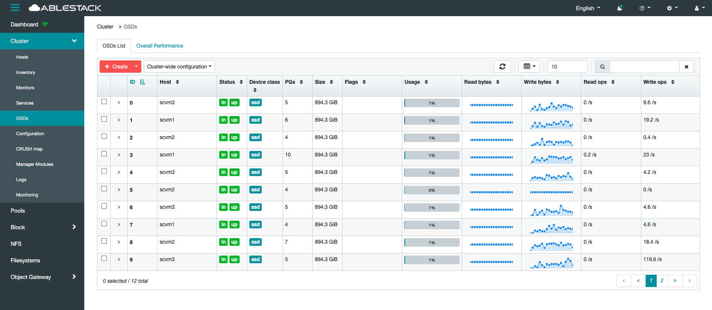

# ABLESTACK 시스템 점검

 ABLESTACK HCI를 안정적으로 운영을 하기 위하서는 시스템에 대한 점검이 필요합니다.
 정기 혹은 비정기적인 점검을 통하여 시스템의 상태를 확인하여 장애를 미리 예방할 수 있으며, 자원에 대한 사용율을 확인하여 증설 혹은 재배치 계획등을 통하여 서비스의 연속성을 확보 할 수 있습니다
 점검대상 및 방법은 다음과 같습니다. 

## 점검대상
* Cube
* Cell
* Glue
* Mold
* Wall

### Cube
!!! info "Cube"
    Cube는 x86 기반의 서버에 Linux Kernel을 제공하고, 호스트 관리 환경을 제공하는 서버 OS 입니다.
    해당 구성요소를 점검하기 위해서는 물리적인 하드웨어와 Process들이 정상적인지 확인을 해야 합니다.

#### 점검항목 및 방법

- 호스트 서버 외관 점검
  - 호스트 전면 혹은 후면의 LED 램프 이상 점등이 있는지 육안으로 점검
  - 전원 및 네크워크 케이블의 연결 상태 및 점등 여부를 육안으로 점검
- IPMI 원격 콘솔 접속을 통한 상태 점검
  - 대시보드의 하드웨어 상태 점검
  - 하드웨어 벤더 사 별로 제공되는 UI와 컨텐츠는 차이가 있을 수 있음 

### Cell
!!! info "Cell"
    Cell은 서버 가상화를 지원하는 가상화 하이퍼바이저 입니다.
    해당 구성 요소를 점검하기 위해서는 하이퍼바이저 상태 및 Process들이 정상인지 확인을 해야 합니다.
#### 점검항목 및 방법


### Glue
!!! info "Glue"
    Glue는 소프트웨어 정의 스토리지를 통해 통합 스토리지를 제공하고, 다양한 게이트웨이를 제공하는 스토리지 플랫폼 입니다.
    해당 구성 요소를 점검하기 위해서는 Glue 가상머신의 상태와 Storage 및 Clustering 상태가 정상인지 확인을 해야 합니다.
#### 스토리지 클러스터 상태 점검
스토리지 상태를 확인하기 위해서는 스토리지 클러스터의 Health를 점검하여야 합니다.
확인하는 방법으로는 웹 UI를 통하여 상태를 확인하는 방법과 Glue 가상머신에 접속하여 명령어를 통해서 확인하는 방법이 있습니다
`웹 UI를 통하여 확인 하는 방법`
: 웹 UI에 접속하여 login을 합니다.
!!! tip "웹 UI 주소는 일반적으로 Glue 가상머신의 management 대역의 IP의 8443포트입니다(ex. https://[IP]:8443)"


!!! result "상태확인"
    대시보드의 Cluster Status가 HEALTH_OK이면 클러스터의 전체 상태가 정상이라는 뜻이며 문제가 있을 경우에는 HEALTH_Warning 혹은 HEALTH_ERR라고 출력됩니다.
    
`CLI를 통하여 확인 하는 방법`
: SCVM 가상머신에 SSH 접속 후 다음과 같이 명령어를 입력합니다
``` shell
ceph -s 
```
``` 
[root@scvm1 ~]# ceph -s
  cluster:
    id:     b9c88c1e-92ad-11eb-8a92-00248158f481
    health: HEALTH_OK

  services:
    mon: 2 daemons, quorum scvm2,scvm3 (age 3d)
    mgr: scvm2.qkurlf(active, since 3d), standbys: scvm1.vpxqxm
    osd: 9 osds: 9 up (since 3d), 9 in (since 3d)

  data:
    pools:   2 pools, 33 pgs
    objects: 2.69k objects, 10 GiB
    usage:   26 GiB used, 7.8 TiB / 7.9 TiB avail
    pgs:     33 active+clean

  io:
    client:   4.4 KiB/s wr, 0 op/s rd, 0 op/s wr
```
!!! result "상태확인"
    출력 결과에서 health의 값이 HEALTH_OK이면 클러스터의 전체 상태가 정상이라는 뜻이며 문제가 있을 경우에는 HEALTH_Warning 혹은 HEALTH_ERR라고 출력됩니다.

#### OSD 상태 점검
  
OSD는 스토리지 클러스터를 구성하는 Disk로 각 OSD의 상태 및 사용율을 점검해야 합니다.
확인하는 방법으로는 웹 UI를 통하여 상태를 확인하는 방법과 Glue 가상머신에 접속하여 명령어를 통해서 확인하는 방법이 있습니다
`웹 UI를 통하여 확인 하는 방법`
: 웹 UI에 접속하여 login을 합니다.
!!! tip "웹 UI 주소는 일반적으로 Glue 가상머신의 management 대역의 IP의 8443포트입니다(ex. https://[IP]:8443)"



`CLI를 통하여 확인 하는 방법`
: SCVM 가상머신에 SSH 접속 후 다음과 같이 명령어를 입력합니다
``` shell
ceph osd tree 
``` 
``` 
[root@scvm1 ~]# ceph osd tree
ID  CLASS  WEIGHT    TYPE NAME       STATUS  REWEIGHT  PRI-AFF
-1         10.47949  root default
-3          3.49316      host scvm1
 1    ssd   0.87329          osd.1       up   1.00000  1.00000
 3    ssd   0.87329          osd.3       up   1.00000  1.00000
 7    ssd   0.87329          osd.7       up   1.00000  1.00000
10    ssd   0.87329          osd.10      up   1.00000  1.00000
-7          3.49316      host scvm2
 2    ssd   0.87329          osd.2       up   1.00000  1.00000
 5    ssd   0.87329          osd.5       up   1.00000  1.00000
 8    ssd   0.87329          osd.8       up   1.00000  1.00000
11    ssd   0.87329          osd.11      up   1.00000  1.00000
-5          3.49316      host scvm3
 0    ssd   0.87329          osd.0       up   1.00000  1.00000
 4    ssd   0.87329          osd.4       up   1.00000  1.00000
 6    ssd   0.87329          osd.6       up   1.00000  1.00000
 9    ssd   0.87329          osd.9       up   1.00000  1.00000
```
``` shell
ceph osd df 
```
```
[root@scvm1 ~]# ceph osd df
ID  CLASS  WEIGHT   REWEIGHT  SIZE     RAW USE  DATA     OMAP  META     AVAIL    %USE  VAR   PGS  STATUS
 1    ssd  0.87329   1.00000  894 GiB   10 GiB  9.8 GiB   0 B  117 MiB  884 GiB  1.11  1.14    6      up
 3    ssd  0.87329   1.00000  894 GiB   15 GiB   15 GiB   0 B  160 MiB  879 GiB  1.66  1.69   10      up
 7    ssd  0.87329   1.00000  894 GiB  6.7 GiB  6.4 GiB   0 B  290 MiB  888 GiB  0.75  0.77    4      up
10    ssd  0.87329   1.00000  894 GiB  8.1 GiB  8.0 GiB   0 B   92 MiB  886 GiB  0.90  0.92    5      up
 2    ssd  0.87329   1.00000  894 GiB  6.4 GiB  6.3 GiB   0 B   84 MiB  888 GiB  0.72  0.73    4      up
 5    ssd  0.87329   1.00000  894 GiB  5.0 GiB  4.9 GiB   0 B   59 MiB  889 GiB  0.56  0.57    4      up
 8    ssd  0.87329   1.00000  894 GiB   11 GiB   11 GiB   0 B  346 MiB  883 GiB  1.28  1.31    7      up
11    ssd  0.87329   1.00000  894 GiB   12 GiB   12 GiB   0 B  132 MiB  883 GiB  1.31  1.34    7      up
 0    ssd  0.87329   1.00000  894 GiB  8.3 GiB  8.2 GiB   0 B   90 MiB  886 GiB  0.93  0.95    5      up
 4    ssd  0.87329   1.00000  894 GiB  8.1 GiB  8.0 GiB   0 B   94 MiB  886 GiB  0.91  0.93    5      up
 6    ssd  0.87329   1.00000  894 GiB  6.2 GiB  6.1 GiB   0 B   72 MiB  888 GiB  0.69  0.71    5      up
 9    ssd  0.87329   1.00000  894 GiB  8.3 GiB  8.2 GiB   0 B  104 MiB  886 GiB  0.93  0.95    5      up
                       TOTAL   10 TiB  105 GiB  104 GiB   0 B  1.6 GiB   10 TiB  0.98
MIN/MAX VAR: 0.57/1.69  STDDEV: 0.30
```

### Mold
!!! info "Mold"
    Mold는 가상머신 관리 및 소프트웨어 정의 네트워크, 오케스트레이션 및 오토메이션을 제공하는 클라우드 플랫폼 입니다.
    해당 구성 요소를 점검하기 위해서는 Mold 가상머신의 상태와 Cloud 관리 플랫폼 및 PCS Clustering 상태가 정상인지 확인을 해야합니다.

### Wall
!!! info "Wall"
    Wall은 인프라 전체에 대한 모니터링, 알람 등을 위한 통합 모니터링 플랫폼 입니다.
    해당 구성 요소를 점검하기 위해서는 Wall 가상머신의 상태와 Process들이 정상인지 확인을 해야합니다.


