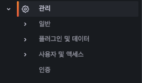

# 환경 설정
Wall 모니터링에 필요한 환경 설정 정보를 관리할 수 있습니다. 

메뉴 구조는 원천 데이터를 제공하는 "데이터 소스", Wall 사용자를 관리하는 "사용자", 팀을 관리하는 "팀", 패널을 플러그인으로 추가할 수 있는 "플러그인", Wall의 기본 설정을 설정할 수 있는 "기본 설정", API 활용에 필요한 키 관리하는 "API 키" 기능으로 구성되어 있습니다.

## 데이터 소스

데이터 소스 항목에서 등록되어 있는 데이터 소스의 목록을 확인 가능합니다. 또한 "이름과 유형으로 검색" 기능은 검색하고자 하는 데이터 소스의 이름 또는 유형으로 검색이 가능합니다.

* 데이터 소스 추가 : 기본적으로 Wall에서는 "Glue", "Mold", "Wall" 3개의 데이터 소스가 설정되어 있으며 "Glue", "Wall"의 데이터 소스는 Prometheus이며 "Mold"의 데이터 소스는 Mysql을 사용합니다.

## 사용자

사용자 항목에서 등록되어 있는 사용자의 목록을 확인 가능합니다. 또한 "이메일과 이름으로 사용자 검색" 기능은 검색하고자 하는 사용자의의 이메일 또는 사용자로 검색이 가능합니다.

* 초대 : 사용자를 초대하는 기능을 제공
* 권한 : 권한을 변경
* x 버튼 : x 버튼을 클릭하여 사용자를 삭제

### 사용자 권한

사용자는 하나 이상의 조직에 속할 수 있습니다. 사용자의 조직 구성원 자격은 해당 조직에서 사용자가 수행할 수 있는 작업을 정의하는 역할에 연결됩니다.

**역할 비교**

||admin|editor|viewer|
|----|----|----|----|
|대시보드 보기|NS|NS|NS|
|대시보드 추가, 편집, 삭제|NS|NS||
|폴더 추가, 편집, 삭제|NS|NS||
|재생목록 보기|NS|NS|NS|
|재생 목록 생성, 업데이트, 삭제|NS|NS||
|액세스 탐색|NS|NS||
|데이터 소스 추가, 편집, 삭제|NS|||
|사용자 추가 및 수정|NS|||
|팀 추가 및 편집|NS|||
|조직 설정 변경|NS|||
|팀 설정 변경|NS|||
|앱 플러그인 구성|NS|||

## 팀

팀은 Wall 서버에 조직에 할당된 사용자의 그룹입니다. 각 사용자는 둘 이상의 조직과 둘 이상의 팀에 속할 수 있습니다. 팀은 일반적으로 조직 관리자가 관리하지만 editors_can_admin 서버 설정을 true로 설정하면 편집자도 관리할 수 있습니다. 자세한 내용은 역할 비교를 참조하십시오.

팀 검색 : 검색하고자 하는 팀 이름 입력
