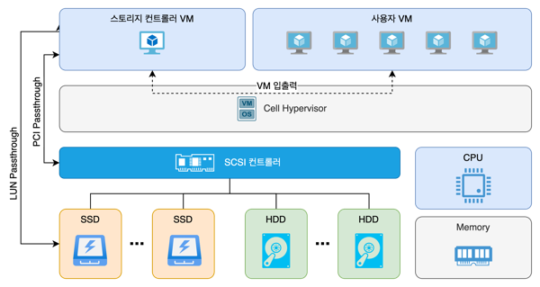

Cell은 '세포, 방' 등의 의미를 가진 명사로,  하나의 개체를 구성하기 위한 요소가 각자의 역할을 수행하는 상태를 묘사합니다. ABLESTACK은 호스트 내에서 구역을 정해 실행되는 가상머신 또는 컨테이너를 실행하기 위한 하이퍼바이저에 이 이름을 붙였습니다. 말 그대로 하나의 호스트의 자원을 쪼개서 각각의 역할을 수행하는 작은 단위의 세포 또는 방인 가상머신을 실행하기 위한 환경을 제공하는 플랫폼입니다. 

Cell은 ABLESTACK에 내장되어 있는 하이퍼바이저이며, CentOS KVM을 기반으로 합니다. 기본적인 KVM에 HA, 라이브 마이그레이션, 네트워크 자동화 및 격리 등의 기능이 ABLESTACK에 맞게 작동하도록 기본 기능을 확장하였씁니다. Cell은 리눅스 뿐 아니라, Windows 및 관련 응용 프로그램이 실행되는 것에 대해 검증되어 있으며, 다양한 형태의 드라이버 지원을 통해 유연하게 관련 애플리케이션을 실행하도록 설계되어 있습니다. 

본 문서에서는 Cell의 아키텍처 및 기능을 설명합니다. 

## 아키텍처

Cell의 가상화 환경 제공 방식을 이해하고, 효과적으로 가상머신을 운영하기 위해서는 가상화 아키텍처를 이해하는 것이 필요합니다. 본 문서에서는 가상화 환경을 제공하기 위한 ABLESTACK의 호스트 아키텍처와, 하이퍼바이저의 아키텍처를 설명하고, 개별 가상머신의 구성요소의 구성 시 최대로 할당 가능한 자원의 제한값, 그리고 네트워크의 구성 아키텍처에 대해 설명합니다. 

### 호스트 아키텍처

호스트에 Cube OS를 설치하고 스토리지 컨트롤러를 배포하면 컨트롤러는 가상머신으로 실행됩니다. 그리고 해당 가상머신에는 Glue 스토리지를 구성하기 위한 디스크 인벤토리로 SCSI 컨트롤러를 패스스루해서 전체 디스크를 컨트롤러 가상머신에 할당하거나, LUN 패스스루를 이용해 호스트의 특정 디스크를 가상머신에 할당합니다. 이를 통해 호스트에 있는 디스크는 하이퍼바이저를 우회하여 컨트롤러 가상머신에 직접 전달됩니다. 즉, 하이퍼바이저는 Glue를 구성하기 위해 설치된 호스트의 디스크를 컨트롤하지 않습니다. 

Cell은 전체 디스크 중 호스트의 OS 영역으로 할당되어 있는 디스크만 컨트롤하며 각각의 가상머신의 루트디스크 등의 볼륨으로 사용합니다. Cell은 CentOS KVM을 기반으로 하며 사용자가 생성한 게스트 VM을 위해 베어메탈 하드웨어 가상화를 사용합니다. 

다음의 그림은 Cell 하이퍼바이저의 호스트 관점에서의 아키텍처를 묘사합니다. 

### 하이퍼바이저 아키텍처

### 구성 최대 제한

### 네트워크

## 동작 방식

### 스토리지 I/O 경로

### 고가용성

### 라이브 마이그레이션

### 네트워크 자동화

## 관리

### 가상머신 관리

### 가상머신 콘솔 연결