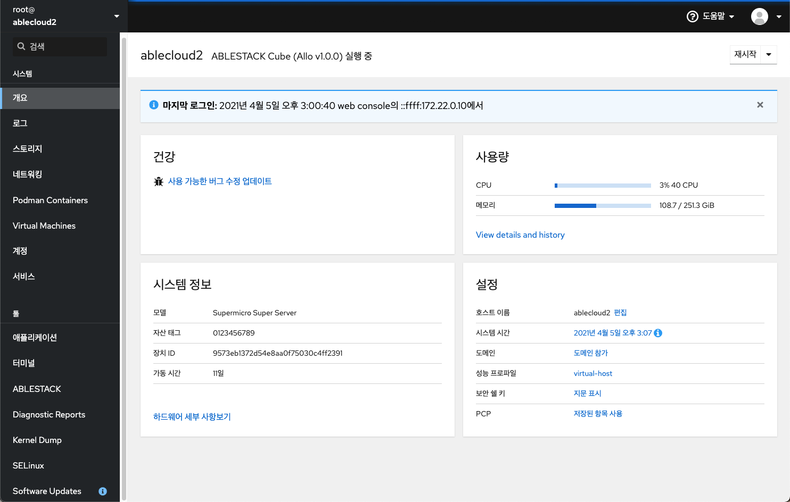

ABLESTACK의 핵심 목표는 어떠한 상용 서버에서도 빠르게 설치하고 쉽게 관리할 수 있는 직관적인 제품을 만드는 것입니다. Cube는 이러한 핵심 목표를 달성하기 위해 마법사를 이용해 설치 및 구성이 가능하도록 하기 위한 목적으로 Linux Kernel과 관련 패키지, 그리고 플러그인으로 구성된 호스트 운영체제 세트입니다. 

본 섹션에서는 ABLESTACK Cube에 대한 소개 및 아키텍처를 설명하고, 각각의 컴포넌트에 대해 다룹니다. 

## 아키텍처

Cube는 상용 서버에서 ABLESTACK이 동작할 수 있도록 설치하는 운영체제입니다. Linux Kernel을 기반으로 하며 웹 기반으로 호스트를 관리하고 모니터링 할 수 있습니다. 

이러한 Cube의 기능은 크게 세 가지로 나눌 수 있습니다. 

- 설치 미디어 및 자동설치관리자
    - 부팅 가능 ISO 이미지 제공 (별도로 USB 등의 매체로 변환 가능)
    - Anaconda 및 자동 설치 관리자(Kickstart) 제공
- Kernel 및 핵심 라이브러리
    - Rocky Linux 9을 기반으로 하는 Linux Kernel 포함
    - ABLESTACK Glue, Cell Labrary 및 VM Appliance Image 포함
- 웹 기반 관리 기능
    - 웹을 이용해 호스트 관리, 호스트의 가상머신 및 컨테이너 관리, 각종 서비스 및 호스트 보안 관리 기능을 제공

다음 그림을 ABLESTACK 전체 플랫폼 구성 중 Cube의 개념을 보여줍니다. 

## 설치 미디어 및 자동설치 관리자

Cube는 상용 x86 서버에서 사용할 수 있는 부팅 가능한 ISO 이미지를 제공합니다. 사용자는 이 ISO 이미지를 이용해 부팅 가능 USB 매체 등을 생성하여 서버에 Cube를 설치할 수 있습니다. Cube는 어떤 브랜드의 x86 서버라도 바로 설치가 가능합니다. 

Cube 설치 미디어를 이용해 서버를 부팅하면 자동 설치 관리자인 "Anaconda"가 실행됩니다. Anaconda는 Fedora 계열의 리눅스 배포판이 사용하는 설치 프로그램입니다. Anaconda는 100% Python 코드로 작성되어 있으며, Cube 설치를 위해 각종 자동화 코드가 포함되어 있습니다. 

Anaconda 인스톨 프로그램에는 기본적인 리눅스 커널과 Cell 하이퍼바이저를 포함하여 Glue, ABLESTACK 관련 패키지 및 라이브러리, 그리고 가상어플라이언스 이미지 등이 자동으로 설치됩니다. 

사용자는 단지 인스톨 프로그램이 지시하는 사항만 따라 설치를 진행하면 되고, 10분 이내에 모든 설치 과정이 완료됩니다 

## Kernel 및 라이브러리

Cube는 Fedora 프로젝트의 가장 안정화된 버전(Downstream OS)의 리눅스 커널을 사용하여 시스템의 안정성을 보장합니다. 

또한 해당 커널에 대해 검증된 라이브러리를 사용합니다. 다양한 PCI 장비에 대한 드라이버, NIC 드라이버 등을 최적화하여 제공하게 됩니다. 

Cube는 이러한 기본 커널 및 라이브러리를 비롯해, ABLESTACK을 구성하고 사용하기 위한 Cell Hypervisor, ABLESTACK Glue Driver 등을 포함하고 있으며, Glue 컨트롤러 및 ABLESTACK 클라우드 플랫폼을 배포하기 위한 가상머신 어플라이언스 이미지를 포함하고 있습니다. 

!!! info "Cube 구성요소 변경"
    ABLESTACK의 Cube 구성요소 및 라이브러리 등은 사용자의 설치 시점의 형상을 유지하는 전제조건 하에, 안정적인 운영을 보장하기 위해 최신의 라이브러리 및 드라이버를 추가적으로 변경하여 배포할 수 있습니다. 이러한 변경은 사용자의 사전 동의나 예고 없이 이루어지며, 사용자는 해당 변경사항의 적용여부를 선택할 수 있습니다. 

## 웹 기반 관리 

Cube는 ABLESTACK을 구성하는 호스트를 편리하고 효율적으로 관리할 수 있도록 호스트별로 웹 기반 관리 플랫폼인 Cockpit을 제공합니다. 

Cube의 Cockpit을 이용하면 다음과 같은 작업을 수행할 수 있습니다. 

- 시스템의 개요 및 상태, 전원관리, 그리고 서비스 실행 상태 등을 모두 관리할 수 있습니다.
- 호스트 NIC에 대한 설정 및 NIC Bonding, 브릿지 생성, 방화벽 관리 기능을 제공합니다. 
- 호스트에 있는 디스크에 대한 관리 기능을 제공합니다. 
- 실행 중인 가상머신 및 Container의 현황을 조회하고 관리할 수 있습니다. 
- 기타 커널 정보 관리 및 SELinux 관리 등의 시스템 관리 기능을 제공합니다. 
- 인터넷에 연결되어 있는 경우 소프트웨어 업데이트를 통해 시스템의 라이브러리 등을 바로 업데이트할 수 있습니다.  

위의 기본적인 관리 기능과 함께 ABLESTACK 구성을 위한 핵심 기능이 포함되어 있습니다. Cockpit 화면에서 "ABLESTACK" 메뉴를 클릭하여 다음의 작업을 수행할 수 있습니다. 

- ABLESTACK 구성을 위한 Glue Controller VM 배포 마법사 제공
- ABLESTACK 구성을 위한 ABLESTACK Cloud VM 배포 마법사 제공
- Glue Cluster 상태 관리 및 가상머신 관리
- Mold Cluster 상태 관리 및 가상머신 관리
- 각 플랫폼의 웹 기반 관리 시스템에 접근할 수 있는 퀵 링크 제공
