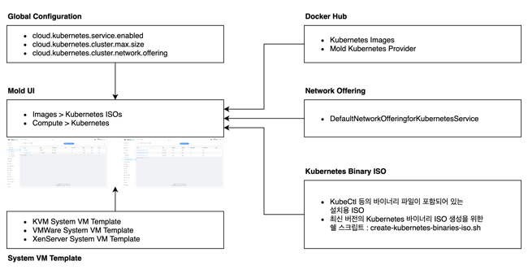
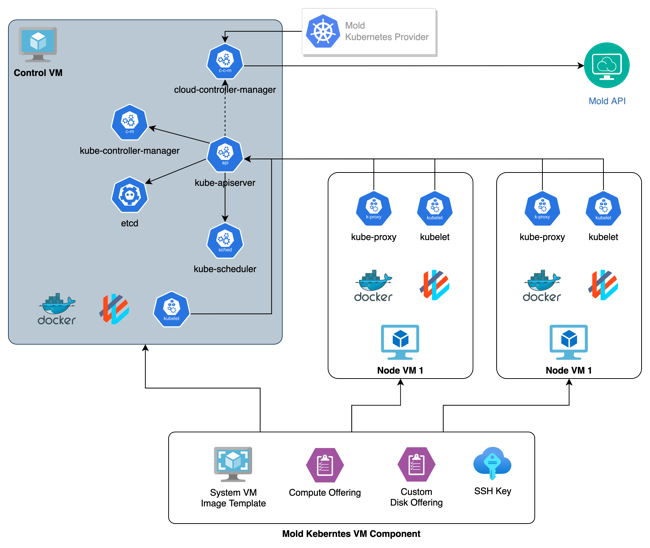

Koral은 Mold를 통해 Kubernetes 클러스터를 자동으로 배포하고 구성하는 Orchestration 기능을 제공하는 플러그인 확장으로, 이러한 기능을 적절하게 표현하기 위해 Kubernetes의 K와 합창이라는 의미를 가진 Choral을 합성한 단어로, 실제 발음은 Choral과 동일하게 발음합니다. 

Koral은 ABLESTACK 설치 시 기본적으로 설치되는 플러그인입니다. 이 기능을 사용의 사용은 플러그인 사용을 위한 설정을 적용하고, Kubernetes 클러스터를 배포하기 위한 실행 바이너리 ISO를 등록함으로써 가능합니다. Koral을 이용하면 쉽고 빠르게 컨테이너 환경을 ABLESTACK에 배포할 수 있으며, 안정적으로 운영할 수 있을 뿐 아니라, 필요 시 신속하게 확장이 가능합니다. 

## Koral의 설계 목표

Koral은 ABLESTACK 사용자에게 가상머신 기반의 애플리케이션이 아닌 컨테이너 기반의 애플리케이션 배포를 지원하기 위한 플러그인 입니다. Koral은 Mold와 연동하여 Kubernetes 클러스터를 위한 네트워크를 생성하고, 가상머신을 컨트롤러 노드 및 워커 노드로 하는 Kubernetes 클러스터를 배포합니다. 이를 통해 사용자는 컨테이너 기반 애플리케이션을 배포하고 사용할 수 있습니다. Koral은 사용자의 편리성, 원클릭 배포, 업그레이드, 스케일링, 최신의 Kubernetes 지원 등을 제공하기 위해 다음과 같은 목표로 지속적으로 플러그인을 개발하여 사용자에게 제공합니다. 

- Mold를 통한 간결하고 직관적인 웹 기반 원클릭 Kubernetes 클러스터 배포
- 애플리케이션 서비스 제공을 위한 Load Balancing 서비스 기본 제공
- 자동 방화벽 설정을 통해 별도의 방화벽 설정 없이도 기본 환경 접속 가능
- Kubernetes 버전 업그레이드 및 사설 Docker Registry 지원
- Kubernetes Provider를 통한 Kubernetes 클러스터 오토스테일링
- 최신의 Kubernetes 지원을 위한 클러스터 빌더 ISO 생성 기능 지원

본 문서에서는 이러한 설계 목표를 달성하기 위한 Koral의 아키텍처 및 각종 기능, 사용법 등에 대한 간단한 소개를 제공합니다. 

## 플러그인 아키텍처

Koral은 Mold에 내장된 플러그인으로 다음의 그림은 Mold 입장에서의 플러그인 아키텍처를 묘사합니다. 

<center>

</center>

### 글로벌 설정

Koral 기능을 사용하기 위해서는 Mold의 글로벌 설정에서 Koral을 활성화 하기 위한 설정을 수정하여 적용해야 합니다. 기본적으로 설정해야 할 글로벌 설정값은 다음과 같습니다. 

| 설정 항목       | 설명             | 기본값                |
| -----------  | -------------      | -----------------       |
| cloud.kubernetes.service.enabled | Koral 기능을 사용할지의 여부를 설정합니다. | false |
| cloud.kubernetes.cluster.max.size | Kubernetes 클러스터를 생성할 때 클러스터의 노드 수 최대값입니다. | 10 |
| cloud.kubernetes.clusternetwork.offering | Kubernetes 클러스터를 생성할 때 기본적으로 사용할 네트워크 제공 정책입니다. | Default Network Offering for Kubernetes Service |

Koral 기능을 사용하기 위해서는 반드시 `cloud.kubernetes.service.enabled` 항목의 값을 'true'로 설정해야 하고, Mold 서비스를 재시작해야 합니다.
### Mold UI

Mold 서비스를 재시작한 후 Mold UI에 접속하면 두개의 Koral 관련 메뉴가 생성됩니다. 

먼저 Kubernetes 바이너리 ISO를 등록하고 버전 관리를 할 수 있는 "쿠버네테스 ISOs" 메뉴가 이미지 섹션에 생성되고, 실제 Kubernetes 클러스터를 생성하는 기능을 제공하는 "쿠버네테스" 메뉴가 컴퓨트 섹션에 생성됩니다. 

해당 메뉴를 통해 Koral 기능을 사용할 수 있으며 해당 기능을 사용하기 위해서는 쿠버네테스 ISO를 먼저 등록해야 합니다. 
### Koral VM 이미지 템플릿

Koral은 가상머신에 Docker 와 Kubernetes 바이너리를 탑재하여 클러스터링하는 가상머신 기반의 컨테이너 서비스를 제공합니다. 따라서 Kubernetes 클러스터를 배포하기 위해서는 이러한 구성요소와 소프트웨어를 미리 탑재한 가상머신 이미지를 필요로 합니다. 

ABLESTACK은 백업 및 가상머신 콘솔, 가상 라우터 등의 기능을 제공하기 위해 관련 소프트웨어를 미리 탑재한 시스템 VM 템플릿을 기본적으로 제공합니다. 우리는 Koral를 위한 소프트웨어 역시 기존의 시스템 VM 템플릿에 탑재하여 관련 기능을 구현하는 것이 타당하다는 결론에 도달하였습니다. 

따라서 ABLESTACK의 시스템 VM 템플릿은 기존의 백업, 가상머신 콘솔, 가상 라우터 기능에 더해 Kubernetes 클러스터 배포를 위한 소프트웨어를 기본적으로 탑재하여 배포되며, 사용자가 플러그인을 활성화 하고 Mold UI를 통해 클러스터를 배포하면 해당 이미지를 사용하여 가상머신을 생성하게 됩니다. 

### Kubernetes 바이너리 ISO

Koral은 시스템 VM 템플릿을 이용해 Kubernetes 클러스터용 가상머신, 즉 컨트롤러 및 워커 노드를 배포한 후 가상머신 내부에 Kubernetes 클러스터를 위한 설정을 하게 됩니다. 이 때 해당 설정을 적용하기 위해 Kubernetes 바이너리 ISO를 가상머신에 마운트하여 관련된 바이너리를 가상머신에 탑재하고 프로그램을 실행하게 됩니다. 

따라서 ABLESTACK HCI를 관리하는 시스템 관리자는 반드시 ABLESTACK에서 공식적으로 제공하는 Kubernetes 바이너리 ISO를 다운로드하거나 해당 링크를 이용해 ISO를 Mold에 등록해야 합니다. 

현재 지원되는 Kubernetes 바이너리 ISO와 다운로드 링크는 다음과 같습니다.

| Kubernetes 바이너리 버전       | 다운로드 링크             | 
| -----------  | -------------      | 
| 1.20.9 | [다운로드](https://images.ablecloud.io/koral-setup-1.20.9.iso) |
| 1.21.3 | [다운로드](https://images.ablecloud.io/koral-setup-1.21.3.iso) |
| 1.22.4 | [다운로드](https://images.ablecloud.io/koral-setup-1.22.4.iso) |
| 1.23.0 | [다운로드](https://images.ablecloud.io/koral-setup-1.23.0.iso) |

### Kubernetes를 위한 기본 네트워크 오퍼링

Koral은 Kubernetes 클러스터를 배포할 때, 원활한 클러스터 배포 작업 모니터링 및 서비스 밸런싱을 위해 기본적인 네트워크 오퍼링을 이용해 클러스터를 배포합니다. 기본적으로 제공되는 네트워크 오퍼링은 다음과 같습니다. 

- DefaultNetworkOfferingforKubernetesService

해당 네트워크 오퍼링은 다음과 같은 네트워크 정책 및 서비스가 제공되도록 설정되어 있습니다. 

| 속성 | 설정값 |
| --- | ----- |
| 게스크 네트워크 종류 | Isolated |
| 트래픽 종류 | Guest |
| 네트워크 속도 | 200 Mb/s |
| 영구성 | false |
| 기본 Egress 정책 | true |
| 고가용성 | Required |
| 절약 모드 | true |
| VLAN 지정 | false |
| IP 범위 지정 | false |
| Public Access 지원 | false |
| 확장된 L2 Subnet 지원 | false |
| 지원되는 서비스 | DHCP : VirtualRouter |
|| StaticNat : VirtualRouter |
|| UserData : VirtualRouter |
|| SourceNat : VirtualRouter |
|| DNS : VirtualRouter |
|| LB : VirtualRouter |
|| Firewall : VirtualRouter |
|| VPN : VirtualRouter |
|| PortForwarding : VirtualRouter |

!!! info "Koral용 네트워크 제공 정책 생성"
    Koral을 이용해 Kubernetes Cluster용 네트워크 정책을 신규로 생성할 경우, 반드시 위의 설정 내용을 참고하여 생성합니다. 위의 설정 내용 중 주로 변경되는 설정은 '네트워크 속도'와 'VLAN 지정'이 될 것입니다. 나머지 설정 및 지원되는 서비스는 위의 설정 정보를 참고하여 적용합니다. 

### Docker Hub

Koral은 Kubernetes Cluster를 생성할 때, 최신의 Kubernetes Cluster를 효과적으로 적용하고, 다양한 Docker 이미지를 사용할 수 있도록 하기 위해 기본적으로 Docker Hub를 Docker Registry로 사용합니다. 

즉, Kubernetes Cluster를 구성하기 위해 필요한 애플리케이션 이미지를 다운로드 하고, Kubernetes Cluster가 Docker Hub를 사용하기 위해서는 해당 클러스터가 인터넷에 연결되어 있어야 합니다. 

Koral을 사용하기 전에 Kubernetes Cluster에 연결하고자 하는 네트워크가 인터넷에 연결되어 있는지 반드시 확인해야 합니다. 

## 서비스 아키텍처

Koral은 내장되어 있는 플러그인을 이용해 사용자별로 다수의 Kubernetes 클러스터를 배포할 수 있도록 설계되어 있습니다. 다음의 그림은 사용자가 하나의 Kubernetes 클러스터를 배포했을 때의 서비스 아키텍처를 묘사합니다. 

<center>

</center>

### 서비스 오퍼링

위의 플러그인 아키텍처에서 설명한 바와 같이, 시스템 VM 템플릿을 이용해 클러스터를 구성하는 가상머신을 생성합니다. 이 때 각 가상머신의 CPU, Memory 및 루트 디스크의 크기를 설정해야 하는데 이를 위해서는 Mold에 필요한 서비스 오퍼링을 미리 생성해야 합니다. 필수적으로 필요한 서비스 오퍼링은 다음과 같습니다. 

- 컴퓨트 오퍼링 : 클러스터를 구성하는 가상머신의 CPU 및 메모리, 루트디스크의 크기에 대한 정책을 설정합니다. 해당 정책을 생성할 때 '루트 디스크 크기'는 지정하지 않아야 합니다. 
- 디스크 오퍼링 : 클러스터를 구성하는 가상머신의 디스크 크기에 대한 정책을 설정합니다. 클러스터를 구성 시 루트 디스크의 크기를 가변적으로 설정할 수 있습니다. Koral에서는 Custom 디스크 오퍼링을 사용하여 가상머신의 루트디스크 크기를 설정합니다.  
### 노드 구성 및 SSH Key

Kubernetes 클러스터는 클러스터 설정 및 역할에 따라 다음과 같이 역할에 맞는 컴포넌트가 포함된 노드가 생성되어 실행됩니다. 

- Control VM : Kubernetes 컨트롤러가 포함된 노드이며, 기본적으로 전체 클러스터에서 1대 배포되지만, 클러스터 고가용성이 설정되어 있는 경우 2개의 노드가 실행됩니다. 가상머신에 포함된 구성요소는 다음과 같습니다.
    - Docker
    - WeaveNet
    - Kubelet
    - Kubernetes API Server
    - etcd
    - Kubernetes Controller Manager
    - Kubernetes Scheduler
    - Cloud Controller Manager
- Worker VM : Kubernetes 컨테이너가 실행되는 노드이며, 클러스터 생성 시 설정한 클러스터 크기 만큼 노드가 실행됩니다. 가상머신에 포함된 구성요소는 다음과 같습니다. 
    - Docker
    - WeaveNet
    - kubelet
    - Kubernetes Proxy

!!! info "각 구성요소의 역할"
    가상머신에 포함되어 있는 Kubernetes 구성요소에 대한 상세한 설명은 다음의 Kubernetes 아키텍처 문서 및 WeaveNet 문서를 참고하십시오. 

    - [Kubernetes 아키텍처](https://kubernetes.io/ko/docs/concepts/overview/components/){:target="_blank"}
    - [WeaveNet 문서](https://www.weave.works/docs/net/latest/kubernetes/kube-addon/){:target="_blank"}

각각의 노드는 상호간 SSH 연결이 필수적입니다. 이 때 안전한 SSH 연결을 위해 SSH Key를 사용하게 됩니다. SSH Key는 Mold에서 계정별로 생성된 SSH Key를 선택하여 사용하게 됩니다. 

### 클러스터 크기 및 확장

위에서 언급한 바와 같이 클러스터의 크기는 전체 클러스터 구성요소 중 Worker VM의 숫자를 의미합니다. 즉 클러스터의 크기가 2라는 것은 Worker VM이 2개 실행된다는 의미입니다. 클러스터의 크기가 클 수록 더 많은 컨테이너를 실행할 수 있고, 또 더 많은 요청을 처리할 수 있습니다. 

클러스터의 크기를 클러스터를 운영 중에 확장할 수 있습니다. 노드의 확장은 사용자가 수동으로 노드의 숫자를 확장하거나, Kubernetes Auto Scale 기능을 이용해 자동으로 노드를 확장하거나 축소하게 됩니다. 노드의 확장은 Kubernetes 클러스터의 Control VM에 내장되어 있는 'Cloud Controller Manager'가 Mold Kubernetes Provider를 이용해 Mold API와 통신하여 가상머신 생성 및 삭제 API를 전송함으로써 이루어지며, 이 때 실행 중인 컨테이너의 조정도 해당 Provider를 이용해 자동으로 이루어지게 됩니다. 

### 초기 네트워크 설정

Koral에 의해 생성된 Kubernetes 클러스터는 Mold에 의한 자동 배포 및 설정, 그리고 노드간 통신, 컨트롤 서비스 액세스를 위한 Proxy 서비스 등을 위해 네트워크에 기본적인 방화벽 설정 및 Port Forwarding 설정을 적용하게 됩니다. 기본적으로 적용되는 초기 네트워크 설정은 다음과 같습니다.

- 포트 포워딩 (Mold에서 k8s Cluster 가상머신에 SSH 연결을 위한 설정)
    - 퍼블릭 2222 -> 컨트롤 VM : 22
    - 퍼블릭 2223 부터 가상머신 수 만큼 1씩 증가 -> Worker VM : 22
- 방화벽
    - 2222 ~ 가상머신 수 만큼 1씩 증가 : Mold에서 k8s Cluster 가상머신 SSH 연결을 위한 설정
    - 6443 : Kubernetes 클러스터의 컨트롤 API 서버에 접근하기 위한 설정
- 로드밸런서
    - 퍼블릭 6443 -> 사설 6443 : Kubernetes 컨트롤 API 서버의 로드밸런싱을 위한 설정

### 클러스터 액세스

Koral에 의해 Kubernetes Cluster가 생성되고, 클러스터가 정상적으로 시작되면 Kubernetes 클러스터의 API 서버에 접속할 수 있고, kubectl을 이용해 Kubernetes 클러스터를 컨트롤 할 수 있습니다. 

클러스터 시작 후에 Mold에 접속하여 접속하고자 하는 클러스터를 선택하고 "액세스" 탭을 확인하면 Kubernetes 클러스터의 구성 파일(kubeconfig 파일)을 확인할 수 있고 해당 파일을 이용해 클러스터의 API 서버와 연결할 수 있습니다. 

사용자는 클러스터 액세스를 위해 사용자의 컴퓨터를 이용해 직접 접속하거나, 별도의 가상머신을 이용해 접속하는 등의 다양한 방법을 선택적으로 사용할 수 있습니다. 

## Kubernetes 버전 지원 

Koral은 이미 배포된 Kubernetes Cluster에 대한 사용자 수준의 관리 지원을 위해 Kubernetes 지원 버전을 사용자가 직접 생성하고, 이를 업그레이드 하는 방법을 지원합니다. 

### 바이너리 ISO 생성 스크립트

Koral 플러그인을 설치하면 Kubernetes의 최신 버전을 포함하여 Kubernetes Cluster를 배포할 수 있도록 구성요소를 빌드하여 바이너리 ISO를 생성하는 스트립트를 다음과 같이 지원합니다. 

```
/usr/share/cloudstack-common/scripts/util/create-kubernetes-binaries-iso.sh
```

위의 쉘 스크립트는 다음과 같은 형식으로 사용합니다. 

```
create-kubernetes-binaries-iso.sh OUTPUT_PATH KUBERNETES_VERSION CNI_VERSION CRICTL_VERSION WEAVENET_NETWORK_YAML_CONFIG DASHBOARD_YAML_CONFIG BUILD_NAME
```

예를 들어 Kubernetes 버전 중 1.23.0에 대한 바이너리 ISO를 생성하고자 하는 경우라면 각 항목에 다음과 같은 값을 입력하여 실행합니다. 

- OUTPUT_PATH : `~/.`
- KUBERNETES_VERSION : `1.23.1` (kubernetes.io 에서 [릴리즈 정보 확인](https://kubernetes.io/releases/){:target="_blank"})
- CNI_VERSION : `1.0.1` (CNI Github에서 [릴리즈 정보 확인](https://github.com/containernetworking/cni/releases){:target="_blank"})
- CRICTL_VERSION : `1.22.0` (cri-tools Github에서 [릴리즈 정보 확인](https://github.com/kubernetes-sigs/cri-tools/releases){:target="_blank"})
- WEAVEVET_NETWORK_YAML_CONFIG : `https://cloud.weave.works/k8s/net?k8s-version=1.23.1` (Weave Net Kube Addon [인스톨 가이드에서 주소 확인](https://www.weave.works/docs/net/latest/kubernetes/kube-addon/#install){:target="_blank"})
- DASHBOARD_YAML_CONFIG : `https://raw.githubusercontent.com/kubernetes/dashboard/v2.4.0/aio/deploy/recommended.yaml` (Kubernetes Dashboard Github의 [릴리즈 정보에서 Installation 항목 정보 확인](https://github.com/kubernetes/dashboard/releases){:target="_blank"})
- BUILD_NAME : setup-1.23.1.iso (사용하고자 하는 이름 기재)

위의 항목을 모두 완성하면 다음과 같은 명령행이 됩니다.

```
create-kubernetes-binaries-iso.sh ~/. 1.23.1 1.0.1 1.22.0 https://cloud.weave.works/k8s/net?k8s-version=1.23.1 https://raw.githubusercontent.com/kubernetes/dashboard/v2.4.0/aio/deploy/recommended.yaml setup-1.23.1.iso
```

해당 명령을 실행하면 지정된 컴포넌트 및 구성정보를 이용해 바이너리 ISO가 생성됩니다.

!!! warning "바이너리 ISO 빌드 시 주의사항"
    바이너리 ISO를 정상적으로 빌드하기 위해서는 다음과 같은 요건이 충족되어야 합니다. 

    - 바이너리 ISO는 Mold VM(CCVM)에서 실행할 수 없습니다. 별도의 CentOS 8.5 가상머신을 사용하고, Mold Common RPM을 설치한 수 명령을 실행하십시오.
    - 바이너리 ISO를 빌드하기 위해서는 반드시 빌드 환경이 인터넷에 연결되어 있어야 합니다. 
    - 가상머신에는 Docker 또는 Podman이 설치되어 있어야 하고 Docker Hub가 기본 리파지터리로 설정되어 있어야 합니다. 

### Kubernetes 버전 업그레이드

Kubernetes 버전 업그레이드는 Mold UI에서 쉽게 실행할 수 있습니다. 다음과 같은 절차로 진행합니다. 

- 신규 버전의 바이너리 ISO를 생성합니다. 
- 생성된 바이너리 ISO를 Kubernetes ISO로 등록하여 Mold 환경에 업로드 합니다. 
- 업그레이드 하고자 하는 Kubernetes Cluster를 선택합니다. 
- 클러스터 업그레이드 메뉴에서 신규 버전의 바이너리 ISO를 선택합니다. 

신규 버전의 바이너리 ISO를 연결하면 Mold가 자동으로 해당 노드들에 대한 업그레이드를 진행합니다. 