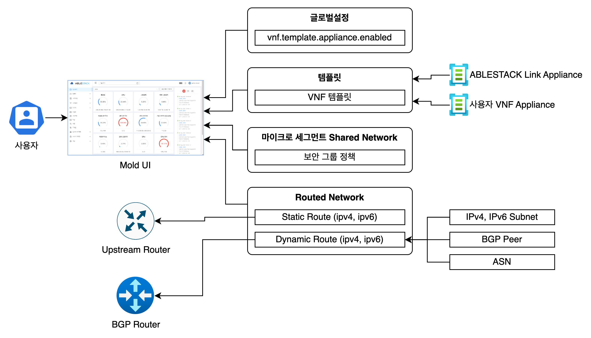
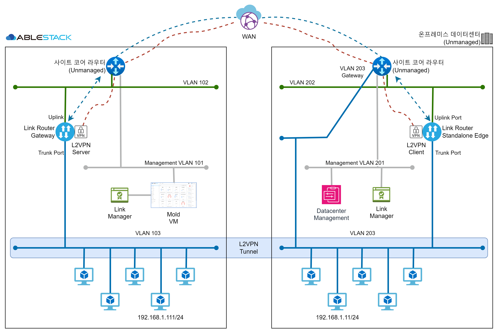

Link는 ABLESTACK에 내장된 Track이 제공하는 기본적인 오버레이 네트워크 기능에 더해 추가적인 오버레이 네트워크 기능을 제공하고, 마이크로 세그먼트 보안 관리 기능을 제공하기 위한 확장 기능입니다. Link라는 제품명은 다양한 추가 네트워크 기능을 연결하여 Mold에서 관리할 수 있도록 해 주고 가상머신 간의 네트워크 연결 정보를 관리한다는 의미로 명명되었습니다. 

Link는 Track에서 제공하는 SDN 기능 외에 다음의 3가지 기능을 추가적으로 제공하며, 기능에 따라 별도의 가상 어플라이언스를 필요로 하거나, 내장된 플러그인을 사용합니다. 

- Link VPN Router : ABLESTACK이 추가적으로 제공하는 가상 어플라이언스로 다양한 네트워크 기능을 추가적으로 제공
- VNF 어플라이언스 관리 : 타사의 가상 네트워크 어플라이언스를 등록하고 관리하여 추가적인 네트워크 기능을 제공
- 마이크로 세그먼트 : 가상머신 간의 트래픽을 세밀하게 통제하고 관리할 수 있는 보안정책을 관리하는 기능 제공

Link를 별도로 제공되는 라우터 어플라이언스 등을 통해 추가적인 네트워크 기능을 사용하고 네트워크의 유연성을 높일 수 있습니다. 또한 사용자의 선택에 따라 가상 네트워크 및 연결된 가상머신에 대한 세밀한 보안 정책을 가상머신에 적용할 수 있습니다. 

## Link의 설계 목표

Link는 ABLESTACK 사용자에게 추가적인 네트워크 기능을 제공하기 위해 가상 어플라이언스 및 플러그인 방식을 사용합니다. Link는 Mold에 어플라이언스 형태로 연동되거나 플러그인 방식으로 제공되어 사용자(테넌트) 네트워크에 필요한 기능을 제공하고 보안 기능을 강화합니다. 이를 통해 사용자는 높은 수준의 네트워크 기능을 사용할 수 있고 또한 세부적이면서 일관된 가상머신 간 트래픽을 통제할 수 있게 됩니다. Link는 고수준의 네트워크 기능 활용, 서드파티 네트워크 어플라이언스의 활용, 높은 보안 수준 달성 등 다음과 같은 목표로 지속적으로 가상 어플라이언스 및 플러그인을 개발하여 사용자에게 제공합니다. 

## Link 아키텍처

Link는 마이크로 세그먼트 서비스를 제공하기 위한 플러그인과 가상 어플라이언스로 구성되며 Mold와 연계하여 다양한 네트워크 서비스 및 강력한 보안을 제공하기 위한 아키텍처를 제공합니다. 

Link는 다음의 구성요소와 각각의 상호작용을 하면서 네트워크 서비스를 제공합니다. 

- Mold : Link 관련 기능에 대한 다음의 관리 기능을 UI로 제공
    - Link 기능 사용을 위한 글로벌 설정 정보 관리
    - ABLESTACK Link 어플라이언스 등록 및 네트워크 관리
    - 사용자 등록 가상 라우터 어플라이언스 등록 및 네트워크 관리
    - 마이크로 세그멘테이션 기능이 활성화된 Shared Network 생성 및 보안그룹 관리
    - Routed Network 설정 및 관리리
- ABLESTACK Link Appliance : ABLESTACK이 제공하는 가상머신 형태의 라우터 어플라이언스로 다음의 기능 제공
    - 방화벽, NAT
    - 포트미러링
    - L2VPN, Edge Network
    - IPsec VPN, Site to Site VPN, Open VPN 등
- 사용자 VNF Appliance : 사용자가 원하는 네트워크 기능을 구현한 가상머신 형태의 네트워크 장비
- Upstream Router : Static Route 정책을 관리하는 라우터로 Isolated/VPC Network의 NAT, LB 등을 처리
- BGP Router : Dynamic Route를 위해 통신사 간 라우팅을 위한 라우터로 AS Number에 의해 서브넷 라우팅 관리

## 주요 동작 방식

### ABLESTACK Link Appliance

ABLESTACK Link Appliance는 ABLESTACK에서 자체적으로 제공하는 가상머신 형식의 라우터 어플라이언스로 Link 기능을 사용하고자 하는 사용자를 위해 템플릿 이미지의 형태로 제공됩니다. 

템플릿을 등록하고 관련 설정을 하기 위해서는 글로벌 설정에서 다음의 항목을 설정해서 활성화 해야 합니다. 

| 설정 항목       | 설명             | 기본값                |
| -----------  | -------------      | -----------------       |
| vnf.template.appliance.enabled | VNF 템플릿을 생성하고 VNF 어플라이언스 기능을 사용할 지 여부를 나타냅니다. | false |

사용자는 Link Appliance 템플릿을 Mold UI를 이용해 VNF 형식으로 등록합니다. 템플릿을 이용해 Link Appliance를 생성하면 Track이 제공하는 Overlay Network 기능 외에도 L2VPN, Port Mirroring 등의 추가적인 네트워크 기능을 사용할 수 있습니다. 

L2VPN은 서로 다른 VLAN으로 생성된 데이터센터 간 네트워크에서 L2 레벨, 즉 동일 CIDR 네트워크로 통신할 수 있도록 하는 기능입니다. 위의 그림과 같이 ABLESTACK으로 구성된 네트워크와 다른 데이터센터에 구성된 네트워크 사이에 동일 CIDR IP를 이용할 수 있도록 구성할 수 있고, 다수의 데이터센터를 운영하는 조직 및 단계별 레거시 인프라 마이그레이션 시나리오를 실행하는 조직 등에서 적극적으로 활용할 수 있습니다. 

"Port Mirroring 아키텍처 이미지"

Port Mirroring은 특정 포트로 흐르는 트래픽을 다른 포트로 복사하여 보냄으로써 트래픽을 감시하거나 저장하기 위한 목적으로 사용되는 기능입니다. 위의 그림과 같이 Link Appliance 내에서 미러링 포트를 구성하고 가상머신 등으로 전송되는 모든 트래픽을 미러링 포트로 전송할 수 있습니다. 이러한 미러링 기능은 트래픽을 감시하는 IPS, IDS 등의 보안 솔루션이나 녹취 시스템 등의 고객 관리 시스템 등에서 활용할 수 있습니다.

### 사용자 VNF 어플라이언스

ABLESTACK는 사용자가 직접 추가적인 네트워크 서비스를 사용하기 위해 사용자가 직접 VNF(Virtual Network Function) 어플라이언스 이미지를 생성할 수 있습니다. ABLESTACK VNF 어플라이언스를 만드는 과정은 다음과 같습니다. 

1. 사용자가 사용하기 원하는 VNF 제품을 가상머신으로 생성합니다.
2. VNF 사용을 위한 다양한 초기 설정을 적용합니다.
3. 가상머신을 정지하고 해당 가상머신을 Template으로 생성합니다.

사용자 VNF Appliance는 Link Appliance와 같이 사용자가 원하는 다양한 네트워크 기능을 이용할 수 있습니다. 예를 들어 상용 L4/L7 어플라이언스, IPS/IDS 어플라이언스 등을 만들고 사용할 수 있습니다. 일반적으로 사용자 VNF 어플라이언스는 상용 VNF 기능을 제공하는 스위치 제조사의 이미지를 사용하는 경우가 많습니다. VNF Appliance는 다음과 같은 구조로 서비스를 제공합니다. 

"VNF 어플라이언스 아키텍처 이미지"

### 마이크로 세그먼트 Shared Network

ABLESTACK는 Shared Network에 대해 마이크로 세그먼트 보안 기능을 제공합니다. 

마이크로 세그먼트를 사용하면 가상머신 간의 트래픽을 효과적으로 제어할 수 있고, 정책을 사용하고 있는 가상머신을 그룹화하여 관리할 수 있습니다. 다음의 그림은 ABLESTACK의 마이크로 세그먼트 네트워크 서비스의 아키텍처를 나타냅니다.

"마이크로 세그먼트 네트워크 아키텍처"

### Routed Network 구성 관리

