Mold는 '주형, 뼈대' 등의 의미를 가진 명사로, 틀에 부어 만드는 것을 가리키는 단어입니다. Mold는 이러한 단어의 의미를 이용해 Cloud 관리 플랫폼에 Mold 라는 이름을 붙였습니다. 말 그대로 사용자에게 자동화 또는 오케스트레이션 등을 통해 일정한 틀을 만들어 제공하고, 사용자는 그 틀 안에서 가상자원을 생성하고 사용하도록 하는 플랫폼입니다. 

Mold는 이러한 클라우드의 기본적인 사상과 ABLESTACK의 특성을 조합하여, 사용자에게 최상의 클라우드 환경을 제공하기 위해 개발되었습니다. 

## Mold의 설계 목표

Mold는 실제 사용자의 입장에서 ABLESTACK을 사용해 가상머신과 네트워크를 만들고, 서비스를 배포하기 위한 핵심 플랫폼입니다. 즉, 사용자가 가장 많이 사용하는 플랫폼입니다. 따라서 사용자가 편리하게 사용할 수 있는 사용자 환경을 제공해야 하는데, 이를 실현하기 위해 다음과 같은 목표로 지속적인 플랫폼 개발 및 업그레이드를 계획하고 실행합니다. 

- 간결하고 직관적인 웹 기반, 멀티 플랫폼, 완벽한 모바일 환경 대응 제품
- 완벽한 Private Cloud 환경 제공을 위해 다양한 가상화 플랫폼을 통합하여 관리
- 다양한 환경에 대한 자동화, 오케스트레이션 제공
- 가상머신 및 컨테이너 환경에 능동적으로 대응할 뿐 아니라, 지속적으로 다양한 가상화 환경 대응
- 높은 확장성과 유연성, 안정성 제공

본 문서에서는 이러한 설계 목표를 달성하기 위한 Mold의 아키텍처 및 각종 기능, 사용법 등에 대한 간단한 소개를 제공합니다. 

## 아키텍처

Mold는 클라우드 플랫폼으로, Mold으로 구성된 HCI 클러스터 및 로컬 또는 외부에서 호스팅 되는 또 다른 ABLESTACK 클러스터, VMWare/Citrix Hypervisor/Hyper-V 클러스터의 개체 및 서비스를 관리하고 모니터링 할 수 있습니다. 이러한 기능은 ABLESTACK 클러스터 상에서 실행되는 Mold Cloud VM에 의해 서비스됩니다. 

### Mold Cloud VM

Mold는 ABLESTACK 내에서 실행되는 Mold Cloud VM에 의해서 서비스됩니다. 해당 가상머신은 Mold 서비스가 모두 내장되어 있는 가상 어플라이언스입니다. Mold Cloud VM은 ABLESTACK 클러스터를 구성하는 호스트 상에 고가용성 클러스터를 구성하고, 해당 클러스터 내에 1개의 가상머신을 이용해 구성됩니다. 

최소 3대로 구성된 ABLESTACK 호스트는 각각에 Failover Cluster를 구성할 수 있는 Agent가 설치되어 있습니다. 이를 통해 Mold VM에 대한 장애 조치 클러스터 서비스를 운영합니다.

장애 조치 클러스터는 Management Network를 통해 각각의 Failover Cluster Agent에게 Cluster Heartbeat 신호를 보내서 해당 호스트가 정상적으로 동작하고 있는지 계속 확인합니다. 

Failover Cluster Agent는 Mold Cell의 libvirt를 이용해 Mold VM을 시작합니다. 이때 Failover Cluster Service 관리자에게 Mold VM 자원을 시작한다고 알리고, 어떤 호스트에 해당 가상머신을 실행할 수 있는지 확인하여 Failover Cluster Service 관리자의 통제에 따라 가상머신 시작이 가능한 호스트에서 Mold VM을 시작합니다. 

Mold VM은 Glue Storage에 루트 디스크 볼륨을 저장하여 관리합니다. 따라서 Mold VM은 어떤 호스트에서 가상머신이 실행 중이어도 동일한 데이터를 바라볼 수 있게 됩니다. 

호스트에 장애가 발생하게 되면 Failover Cluster Service는 해당 장애를 인식하게 되고, 해당 호스트에서 Mold VM이 실행 중이었다면 바로 다른 호스트에서 Mold VM을 시작하여 Mold 애플리케이션 서비스의 연속성을 보장합니다. 

### Mold Platform

Mold Cloud VM은 Mold 소프트웨어 플랫폼을 모두 포함하고 있기 때문에 사용자는 별도의 설치 절차 등의 복잡한 과정 없이 바로 Mold를 사용할 수 있습니다. 

Mold Platform은 크게 5가지의 구성요소로 이루어지며 각각의 구성요소의 상관관계를 그려보면 다음과 같습니다. 

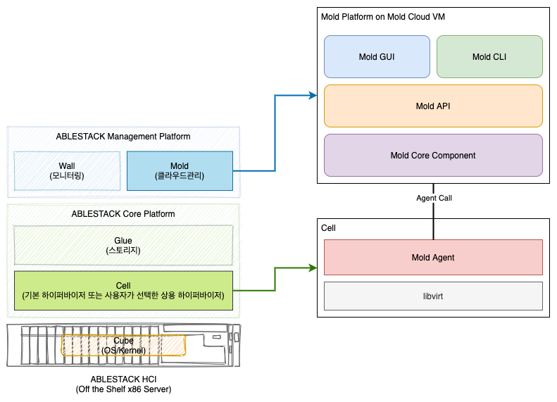

각각의 구성요소를 설명하면 다음과 같습니다. 

- Mold Agent : 각각의 ABLESTACK Host에 설치됩니다. 이 에이전트는 Cell 하이퍼바이저의 libvirt 라이브러리를 이용해 가상머신과 관련된 모든 명령을 실제적으로 Cell에 전달하는 역할과 호스트의 상태를 모니터링 하는 역할을 수행합니다. 
- Mold Core Component : 인프라(호스트, 스토리지 등) 관리, 가상머신 관리, 볼륨 관리, 네트워크 관리 등의 핵심 기능을 처리하는 모듈과 플러그인을 제공합니다. 
- Mold API : REST형식의 API를 제공하여 가상머신 등을 관리하는 인터페이스를 제공합니다. 
- Mold CLI : Mold API를 호출하여 명령행 환경에서 사용자가 직접 명령을 전달하고, 가상자원을 관리할 수 있도록 지원합니다. 
- Mold GUI : Mold API를 호출하여 웹 기반 환경에서 화면을 통해 사용자에게 기능을 사용할 수 있도록 관리 기능을 제공합니다. 

## Infra 구성

Mold는 완벽한 클라우드 환경을 구성하기 위해 다양한 개념의 인프라스트럭트 관리 체계를 제공합니다. 이러한 Full Scope Cloud 기능을 제공하기 위한 인프라 구성을 개념적으로 그려보면 다음과 같습니다. 

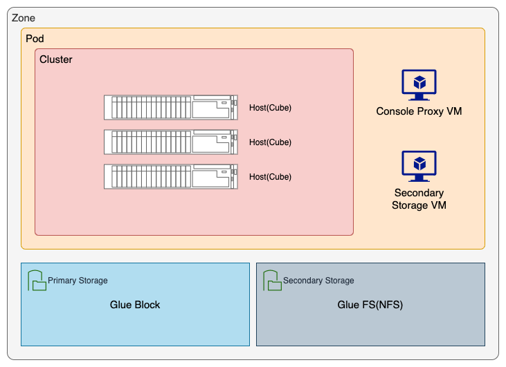

각각의 인프라 구성요소의 의미 및 역할은 다음과 같습니다. 

- Zone : 물리적인 데이터센터를 의미합니다. 수많은 Rack과 ABLESTACK 서버, 네트워크 장비 등으로 구성되어 있는 공간을 생각할 수 있습니다. 네트워크 토폴로지 상에 여러 North-West Traffic과 East-West Traffic을 포함합니다. 
- Pod : 물리적으로 여러 개의 Rack으로 구성된 인프라 전체를 나타냅니다. 네트워크 토폴로지 상에 동일 East-West Traffic을 사용하는 서버와 네트워크 장비가 하나의 Pod입니다. 
- Cluster : 물리적으로 여러 개의 Host로 구성된 인프라를 나타냅니다. 일반적으로 동일 ToR 스위치 상에 연결되어 있는 호스트의 집합으로 구성됩니다. 
- Host : Mold Cube가 설치된 단일 서버를 나타내거나, VMWare ESXi, Citrix Hypervisor 등이 설치된 호스트일 수 있습니다. 클러스터 내의 Host는 반드시 동일한 클러스터 스위치(ToR 스위치)에 연결돼 있어야 합니다.
- Primary Storage : Mold가 가상머신을 만들 때 가상머신의 디스크로 사용하기 위해 연결하는 주스토리지입니다. ABLESTACK은 기본적으로 Glue 스토리지를 사용하며, 이때 Glue의 Block Storage GW를 사용합니다. 
- Secondary Storage : 가상머신을 생성하기 위한 ISO 및 템플릿 이미지 파일을 관리하거나, 스냅샷 백업을 저장하는 백업스토리지입니다. ABLESTACK은 이미지만을 관리하는 목적으로 Glue 스토리지를 사용하며, 이때 Glue의 Filesystem GW를 사용합니다. 만약 스냅샷 백업을 저장하는 백업 용도인 경우 반드시 NFS를 지원하는 별도의 외장 백업 스토리지를 사용해야 합니다. 
- Console Proxy VM : 가상머신의 콘솔을 표시하기 위한 시스템 가상머신입니다.
- Secondary Storage VM : 백업스토리지를 호스트에 연결하거나 백업을 처리하기 위한 에이전트를 포함하는 이미지/백업 서비스 가상머신입니다. 

## System VM

Mold는 Multi Hypervisor를 지원하는 클라우드 플랫폼으로 ABLESTACK 클러스터를 다양한 하이퍼바이저로 구성하거나 별도로 구성된 하이퍼바이저 클러스터를 통합관리할 수 있습니다. 

이러한 멀티 하이퍼바이저 환경 속에서 Mold는 다양한 하이퍼바이저에서 실행되는 가상머신의 콘솔을 확인하거나 가상머신의 스냅샷을 백업하고, ISO 이미지를 제공하는 등의 기능 지원할 수 있어야 합니다. 이런 기능을 통합해서 지원하도록 설계된 가상머신을 System VM이라고 부릅니다. System VM은 위에서 소개한 Mold Infra를 구성하면 자동으로 배포되며 역할에 따라 Console Proxy VM과 Secondary Storage VM으로 나눌 수 있습니다. 

### Console Proxy VM

Console Proxy VM은 이름 그대로, 가상머신의 콘솔을 사용자에게 표시하는 역할을 하는 시스템 가상머신입니다. 

윈도우즈 또는 리눅스 가상머신은 처음 시작한 후 가상머신에 앱을 설치하거나, 여러 가지 설정을 적용하기 위해 가상머신에 접속해야 합니다. 각각의 하이퍼바이저는 VNC 등의 콘솔 포트를 이용해 자체적으로 가상머신의 콘솔을 볼 수 있는 기능을 지원합니다. 

멀티 하이퍼바이저를 지원하는 Mold는 이러한 다양한 하이퍼바이저의 콘솔 기능을 통합하여 제공하기 위해 통합해서 모든 하이퍼바이저의 콘솔을 보여줄 수 있는 콘솔 프록시가 필요합니다. 이러한 기능을 지원하기 위해 Console Proxy Server를 VM 형태로 제공합니다. 

Console Proxy VM의 구조를 그림으로 표현하면 다음과 같습니다. 

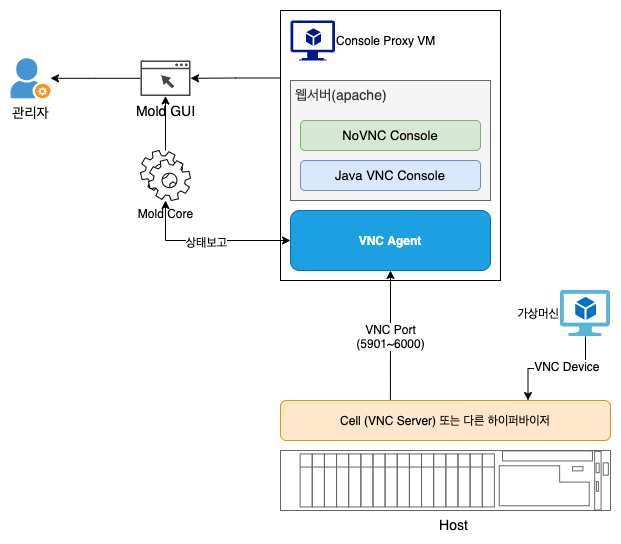

Console Proxy VM은 내부에 크게 2개의 구성요소를 포함하고 있습니다. 살펴보면 다음과 같습니다. 

- 웹 서버 : 별도의 웹 서버를 포함하고 있으며, Mold GUI에서 콘솔을 표시할 때 해당 웹서버의 화면을 호출합니다.
    - NoVNC Console : 가상머신의 콘솔을 표시하기 위해 NoVNC를 이용해 표시하기 위한 구성요소입니다. HTML5 기술을 이용해 콘솔을 표시합니다.
    - Java VNC Console : 가상머신의 콘솔을 표시하기 위해 Java Applet으로 만들어진 구성요소입니다.
- VNC Agent : Cell 또는 다른 하이퍼바이저의 VNC 서버에 접속하여 원하는 가상머신의 VNC 데이터를 가져오기 위한 에이전트입니다. 

Console Proxy VM의 에이전트는 Cell 또는 하이퍼바이저의 VNC 서버에 연결하여 정상인지 확인한 후, Mold Core 엔진에 Agent 상태를 보고하여 Mold가 가상머신의 콘솔을 표시할 수 있는 상태인지를 항상 확인할 수 있도록 합니다. 

사용자는 이러한 매커니즘을 통해 하이퍼바이저의 종류와 상관없이, 투명하게 가상머신의 콘솔은 Mold를 통해 일관성 있게 확인할 수 있게 됩니다. 

### Secondary Storage VM

Secondary Storage VM은 이미지를 저장하거나 스냅샷을 백업하기 위한 에이전트를 포함하는 시스템 가상머신입니다. 

멀티 하이퍼바이저를 지원하는 Mold는 하이퍼바이저별로 서로 다른 스냅샷 생성 방식 및 백업 방식을 조정하여 통합하고 투명하게 백업 등을 처리할 수 있도록 하기 위해서는 이러한 중간 프록시가 필요합니다. 이러한 기능을 지원하기 위해 Image/Snapshot Backup Agent를 가상머신 형태로 제공합니다. 

Secondary Storage VM의 구조를 그림으로 표현하면 다음과 같습니다. 

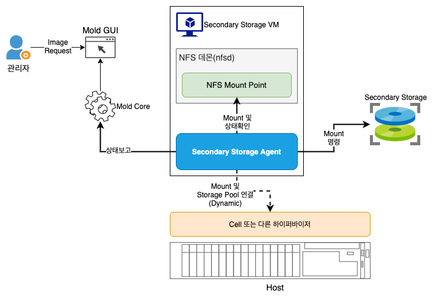

Secondary Storage VM은 2개의 구성요소를 포함하고 있습니다. 살펴보면 다음과 같습니다. 

- NFS 데몬 : Secondary Storage를 NFS 방식으로 마운트하고, 스토리지의 상태 및 용량 등을 확인하여 이미지 스토리지가 정상적인지 확인하게 됩니다.
- Secondary Storage Agent : 스토리지의 마운트 상태를 확인하여 Mold Core에 상태를 보고하고, Image 요청에 따라 동적으로 ABLESTACK 서버에 Secondary Storage를 연결하는 작업을 수행합니다.

사용자가 ISO 연결을 요청하면 Secondary Storage를 호스트에 연결하고, 연결이 이루어지면 요청한 이미지를 가상머신에 연결해 주는 일련의 작업을 수행하여 사용자가 GUI 상에서 간단한 버튼 액션만으로도 모든 작업이 이루어질 수 있도록 기능을 제공합니다.

!!! info "Secondary Storage 구성"
    Secondary Storage VM은 스토리지 연결을 위해 NFS 프로토콜을 사용합니다. 따라서 Secondary Storage는 반드시 NFS 프로토콜을 지원해야 합니다. 

## 사용자 관리 및 인증

Mold는 사용자 인증의 안정성 및 조직 내에서의 효율적인 인증체계 지원을 위해 다양한 방식의 인증체계를 지원합니다. 

Mold가 지원하는 인증 방법은 다음과 같습니다. 

- Mold가 자체적으로 지원하는 Cookie 기반 인증 (SSL 사용 시 Secured Cookie 지원)
- Signature/HMAC 기반의 인증 (API Key/Secret Key)
- 사전에 정의되어 정의된 단일 Pre-shared Key 기반 인증
- 기업의 기능 통합 등을 지원하기 위한 비인증 통합 포트 사용 (기본 : Disable)

본 문서에서는 이러한 인증 방법을 사용하기 위한 아키텍처를 설명합니다. 

### 조직 및 사용자 관리

Mold는 사용자의 조직 내에서 다양한 사용자가 접속하여 자신만의 가상 인프라 환경을 구성할 수 있는 Multi Tenant 환경을 제공합니다. 

다음의 그림은 Mold가 어떤 체계로 사용자의 정보를 관리하는지를 표현합니다. 

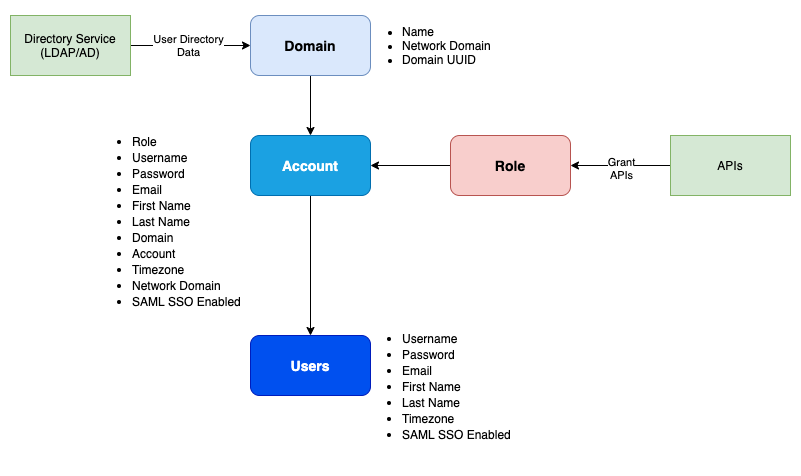

Mold는 자체적으로 User Directory를 관리합니다. Mold의 User Directory는 다음과 같이 구성됩니다. 

- Domain : 사용자 정보의 최상위 디렉토리입니다. 도메인의 이름과 해당 도메인이 가지는 네트워크 도메인 정보를 포함합니다. 
- Account : 도메인은 여러 사용자 계정을 포함합니다. 사용자 계정은 사용자의 역할과 사용자명, 비밀번호, 이메일 주소, 사용자 성명, 사용자가 속한 도메인, 타임존, 계정이 사용할 네트워크 도메인, 그리고 SAML SSO를 사용하는 사용자인지의 여부 등의 정보를 포함합니다. 
- Users : 사용자는 Account의 Alias(별칭)입니다. 계정은 여러 개의 사용자 Alias를 만들 수 있고, 목적에 따라 다양하게 사용할 수 있습니다. 사용자명, 비밀번호, Email, 사용자 성명, 타임존, SSO 사용 여부 등의 정보를 포함합니다. 
- Role : 각각의 계정은 역할을 지정해야 합니다. 이 역할은 Mold의 수많은 API에 대한 권한 여부의 집합입니다. 즉, 가상머신에 대한 권한, 사용자 정보에 대한 권한 등의 집합체입니다. 

!!! info "외부 디렉토리 서비스 연결"
    Mold는 자체적으로 User Directory를 관리하지만, 조직에 따라 해당 조직이 기존에 사용하는 디렉토리 서비스를 사용하고 연동해야 할 수 있습니다. Mold는 LDAP 표준을 지원하는 외부 Directory Service와 연동하여 해당 서비스에서 사용자 정보를 가져와 동기화 할 수 있습니다. 

!!! info "사전 정의된 Role"
    Mold는 초기 사용자의 사용 편의성을 제공하기 위해 사전에 정의된 Role을 제공합니다. 사전 정의 Role은 다음과 같습니다. 

    - Root Admin : 초기 인프라 구성부터 모든 관리 작업을 수행할 수 있습니다.
    - Resource Admin : 인프라 구성이 되어 있는 상태에서 모든 리소스를 관리할 수 있습니다.
    - Domain Admin : 특정 도메인 내에 포함된 리소스를 관리할 수 있습니다. 
    - User : 특정 계정 내에 포함된 리소스를 관리할 수 있습니다. 
    - Read-Only Admin : 물리적인 인프라 및 자원을 모두 조회할 수 있습니다.
    - Read-Only User : 특정 계정 내의 리소스에 대해 조회할 수 있습니다.
    - Support Admin : 자원을 생성할 수 없고, 서비스를 제공하기 위한 정책 등을 관리할 수 있습니다. 
    - Support User : 이미 생성된 자원에 대한 관리(시작, 정지) 만 가능하며, 자원을 생성하거나 삭제할 수는 없습니다. 

### 통합 인증 아키텍처

Mold는 자체적인 사용자 디렉토리 서비스를 이용해 Mold GUI에서 사용자의 아이디 및 패스워드를 이용해 로그인하는 방법 외에 다양한 통합 인증 아키텍처를 지원합니다. 

지원하는 통합 인증 아키텍처는 다음과 같습니다. 

- SAML2 SSO Authentication : SAML2 표준을 지원하는 SP/IdP를 이용해 통합 인증을 제공합니다.
- Pre-shared Key Based Proxy Authentication : 사용자 인증을 위한 Proxy Server를 만들고, 사전에 정의된 키를 이용해 특정 사용자에 대한 인증을 제공합니다.
- Localhost Admin Port Based Non-Auth Integration : 기업의 기존 시스템과의 통합을 위해 Localhost 내에서만 비인증으로 모든 API를 호출할 수 있습니다. 

다음의 그림은 Mold가 제공하는 통합 인증 체계를 개념적으로 표현합니다. 

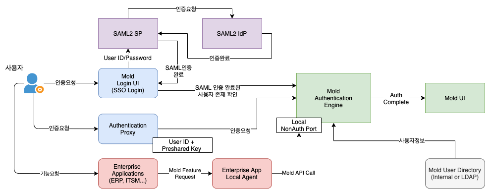

SSO 지원은 SAML2 표준을 기반으로 지원합니다. 해당 기능은 Mold UI에서 SSO 로그인 탭을 이용해 서비스 제공자를 선택하여 해당 서비스 제공자의 인증 페이지를 통해 인증을 수행합니다. SAML2를 지원하는 Google, Microsoft 등의 환경을 이용할 수 있으며, 최종적으로 Mold의 사용자 정보와 일치하면 로그인이 이루어집니다. 

SAML2 표준을 이용하는 방법 외에, Mold는 별도의 Proxy Server를 구성하여 인증하는 방법을 지원합니다. Proxy Server는 사용자가 직접 구축해야 하며, 로그인 시 별도의 로그인 절차를 사용하지 않고, 사전에 공유된 키를 Mold 인증 엔진에 전송하여 인증을 처리하게 됩니다. 

사용자의 조직 내에 이미 여러 애플리케이션이 존재하고, 이러한 애플리케이션에 Mold의 기능을 포함하고자 하는 경우, 해당 기능을 호출하는 에이전트를 Mold Server에 배포하고, 이 에이전트가 Mold의 로컬 비인증 포트를 이용해 직접 API를 호출하는 방식을 사용할 수 있습니다. 

!!! warning "비인증 포트의 사용"
    조직 내 애플리케이션과의 통합 등의 목적을 위해 비인증 로컬 포트를 사용하는 경우 보안에 유의해야 합니다. 기본적으로 Mold는 해당 기능을 비활성화하고 있으며, 이 기능을 활성화하고자 하는 경우 '글로벌 설정'의 integration.api.port 속성(기본값 0)에서 연결할 port를 설정해야 합니다. 

## 가상머신 관리

Mold는 관리자가 하이퍼바이저 및 HCI 구성 여부와 관계없이, Mold가 관리하는 모든 클라우드 인프라 상에서 실행되는 모든 가상머신의 생명주기를 완벽하게 제어할 수 있는 기능을 제공합니다. Mold의 가상머신 관리 기능의 특징은 다음과 같습니다. 

- 가상머신의 생명주기를 웹 기반 UI 및 API를 통해 완벽하게 관리
- Multi Hypervisor 지원 : Cell, KVM (CentOS, Ubuntu, RHEL), VMWare ESXi, Citrix Hypervisor, XCP-ng 등

Mold의 가장 강력한 기능을 바로 ABLESTACK으로 구성된 클러스터 외에도, 일반 가상화 구성까지 폭넓게 가상화를 지원한다는 것입니다. 이러한 기능을 통해 ABLESTACK을 도입하게 되면 현재 운영 중인 모든 가상화 환경을 클라우드로 전환하고, 통합할 수 있게 됩니다. 

다음의 그림은 Mold가 어떻게 다양한 하이퍼바이저 환경에서 동일한 가상머신 생명주기 관리를 제공할 수 있는지를 나타냅니다. 

Mold는 GUI 및 CLI와 같은 사용자 인터페이스에서 모두 Mold API를 호출합니다. 그리고 이 API는 Mold의 하이퍼바이저 플러그인을 사용해 가상머신과 관련된 관리를 실행합니다. 

Mold의 하이퍼바이저 플러그인은 Cell/KVM, Linux KVM, VMWare, Citrix 등의 다양한 하이퍼바이저를 지원할 수 있도록 각각의 하이퍼바이저에 대한 플러그인이 포함되어 있습니다. 

Cell 및 KVM 하이퍼바이저의 경우에는 플러그인과 상호작용을 위해 각각의 호스트에 Mold Agent가 설치되고 해당 Agent가 libvirt 명령을 호출하여 사용자가 원하는 작업을 실행하도록 설계되어 있습니다. 

VMWare ESXi 하이퍼바이저의 경우는 ESXi 호스트 클러스터를 관리하는 vCenter의 Web Service API를 이용해 가상머신 작업을 실행합니다. 

Citrix Hypervisor의 경우는 XenServer 클러스터의 마스터 호스트의 xapi를 이용해 가상머신 작업을 실행합니다. 사용자는 이러한 플러그인과 각 하이퍼바이저의 API 호출의 내부 동작에 의해 복잡한 과정을 신경 쓰지 않고 투명하게 가상머신 관리 기능을 사용할 수 있게 됩니다. 

!!! info "하이퍼바이저 측 방화벽"
    Mold가 각각의 하이퍼바이저 호스트와 연결되어 가상머신 작업을 수행하기 위해서는 반드시 관련된 서비스 포트가 방화벽에 의해 열려 있어야 합니다. 
    호스트가 Mold에 연결되지 않는 경우 해당 호스트의 방화벽 상태를 확인해야 합니다.

## 스토리지 관리

Mold는 ABLESTACK Glue 스토리지 외에도 다양한 외장 스토리지의 연결을 지원하고, Mold가 컨트롤하는 하이퍼바이저 클러스터에 따라 하이퍼바이저가 지원하는 모든 스토리지 형식을 지원합니다. Mold의 스토리지 관리 기능의 특징은 다음과 같습니다. 

- ABLESTACK Glue 외의 다양한 외장 스토리지를 지원하여 높은 유연성을 제공합니다.
- iSCSI, Clustered LVM, Posix Compliant Storage, NFS 등 거의 대부분의 외장 스토리지 연결이 가능합니다. 
- Thin Provisioning 및 Overprovisioning을 지원하여 스토리지 용량을 효율적으로 사용할 수 있습니다. 

Mold를 통해 ABLESTACK 또는 다른 하이퍼바이저 클러스터의 스토리지를 연결하고 관리하면 높은 유연성과 용량 효율성을 보장 받을 수 있습니다. 

다음의 그림은 Mold가 어떻게 다양한 스토리지를 연결하고 볼륨 서비스를 제공하는지를 나타냅니다. 

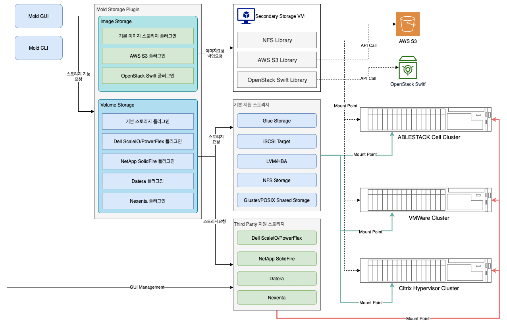

Mold GUI 또는 CLI를 이용해 ABLESTACK Cell, VMWare, Citrix Hypervisor 등의 호스트에 스토리지를 연결하고, 가상머신을 위한 볼륨을 만들거나, 가상머신의 데이터를 백업하는 등의 스토리지 요청을 플러그인에 요청하게 됩니다. 

스토리지 플러그인은 크게 다음과 같이 구성됩니다. 

- 이미지 스토리지 플러그인 : ISO, Template 등의 이미지와 가상머신 디스크의 스냅샷 백업 등을 저장하고 관리하기 위한 플러그인
- 볼륨 스토리지 플러그인 : 가상머신용 디스크를 제공하기 위한 스토리지 플러그인

이미지 스토리지 플러그인은 이미지 및 백업 파일을 저장하기 위해 기본적으로 NFS 스토리지를 스테이징 스토리지로 사용합니다. 그리고 부수적으로 NFS 스토리지의 장애에 대비하고, 원격지에 이미지를 최종적으로 저장하기 위해 AWS S3에 데이터를 복제하거나 OpenStack Swift에 데이터를 복제하여 관리할 수 있습니다. 

!!! warning "NFS Staging Storage"
    Mold는 이미지 및 백업 파일을 저장하고 관리하기 위해 반드시 1개 이상의 NFS 스토리지를 필요로 합니다. 불의의 사고에도 신속하게 시스템을 복구하기 위해 백업 파일은 HCI 클러스터와는 별도로 구성하는 것이 좋습니다. 

    여러 개의 NFS Storage를 백업 스토리지로 사용하는 경우에도 실제 스테이징 스토리지는 1개로 구성되며, 나머지는 복제본을 저장하기 위한 역할을 하게 됩니다. 

    AWS S3, OpenStack Swift 등은 Staging Storage의 역할을 수행할 수 없으며, NFS 스토리지가 모두 불능 상태인 경우 원격지에 백업 이미지를 복제하고, 복구하기 위한 수단으로 사용합니다. 

볼륨 스토리지 플러그인은 가상머신에 블록 디스크를 제공하기 위한 플러그인입니다. 기본적으로 Mold는 Glue 스토리지 외에 NFS, iSCSI, LVM, GlusterFS 등의 다양한 표준 스토리지를 지원합니다. 또한 써드파티 플러그인으로 Dell의 PowerFlex, NetApp의 SolidFire 등의 다양한 소프트웨어 정의 스토리지를 지원할 뿐 아니라, Mold 내에서 GUI를 통해 해당 스토리지를 관리할 수 있는 기능도 제공합니다. 

이미지 스토리지 및 볼륨 스토리지는 모두 호스트에 마운트 될 수 있어야 합니다. 예를 들어 NFS를 이미지 또는 볼륨 스토리지로 사용하는 경우 해당 스토리지가 각각의 호스트에 마운트 되어 경로로 표시될 수 있어야 하며, NFS에 대한 각종 명령이 실행될 수 있어야 합니다. 

!!! info "볼륨 스토리지 마운트 포인트의 중요성"
    HCI 기반, 또는 일반 가상화 기반 환경에서 볼륨 스토리지는 매우 중요합니다. 이미 등록된 볼륨 스토리지는 항상 가상화 호스트에 마운트 되어 있어야 하며, 만약 마운트가 비정상적인 경우 호스트가 비정상으로 표시됩니다. 

    또한 마운트 포인트에 Hang이 발생하는 경우 해당 호스트에서 실행 중인 모든 가상머신의 IO가 중단되고, 설정에 따라 호스트가 자동으로 재시작될 수 있습니다. 호스트에서 비정상적인 상태가 모니터링되는 경우 반드시 스토리지의 상태를 확인해야 합니다. 

## 네트워크 관리

Mold는 다양한 형식의 가상 네트워크를 지원할 뿐 아니라, 다양한 하드웨어와의 연동을 통해 물리적인 네트워크 영역(Underlay Network) 및 가상 네트워크 영역(Overlay Network)을 GUI에서 모두 관리할 수 있도록 기능을 지원합니다. 

Mold는 Zone 단위로 물리적인 네트워크 구성을 지원하며 물리적인 네트워크 형식은 다음과 같습니다. 

- Basic Network : 사용자의 네트워크가 물리적으로 단일 네트워크로 구성되어 있는 경우 사용
- Advanced Network : 사용자의 네트워크가 물리적으로 다수의 네트워크로 구성되어 있는 경우 사용

이러한 물리적인 네트워크 구성을 이용해 Mold는 가상머신이 사용할 수 있는 다양한 형식의 가상 네트워크를 제공합니다.

!!! info "Overlay/Underlay Network"
    클라우드/가상화 환경에서 자주 접하게 되는 네트워크 용어 중 하나는 바로 Overlay Network, Underlay Network입니다. 

    클라우드 환경에서는 물리적인 네트워크를 Underlay Network라고 부릅니다. 즉, 하이퍼바이저의 아래에 위치한 네트워크라는 의미로, 실제 서버의 NIC에 연결된 네트워크를 의미합니다. 

    하이퍼바이저에 의해서 만들어져 제공되는 네트워크는 Overlay Network라고 부릅니다. Mold는 웹 콘솔을 통해 가상화 네트워크에 대한 통제를 제공하게 되며, 사용자는 웹 콘솔을 이용해 완벽하게 네트워크를 통제할 수 있게 됩니다. 

### Basic Network

Mold의 Zone을 구성할 때, 사용자는 ABLESTACK을 이용한 Zone의 네트워크를 어떻게 구성해야 할지 결정해야 합니다. 

Basic Network는 사용자의 네트워크 환경이 단일 네트워크로 구성되어 있는 경우 적용할 수 있는 물리적인 구성 방법을 제공합니다. 

Basic Network 구성상에서 Mold는 1개의 가상 네트워크를 제공할 수 있으며, 이 네트워크는 사용자의 물리적인 네트워크와 동일한 네트워크를 공유합니다. 

다음의 그림은 일반적인 Basic Network의 구성을 예시로 보여줍니다. 

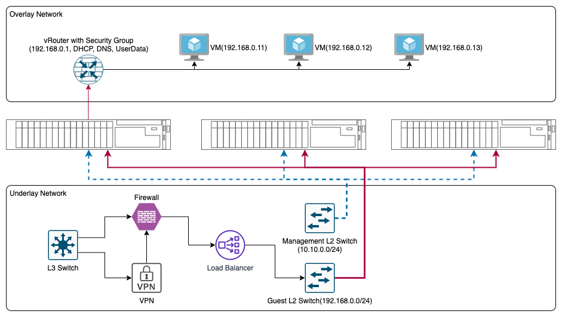

Basic Network는 L3, VPN, Firewall Load Balancer 등의 네트워크 인프라가 Underlay에 위치하는 구조입니다. 즉, 사용자가 기존의 네트워크 인프라를 물리적으로 보유하고 있고, 이러한 인프라를 이용해서 가상화 네트워크를 구성하고자 할 때 사용할 수 있습니다. 

가상네트워크는 사용자의 기존 환경의 네트워크를 공유하는데 위의 그림의 예와 같이 192.168.0.0/24 대역의 네트워크가 사용자의 환경에 존재한다면 해당 네트워크를 사용하게 됩니다. Basic Network는 사용자가 기존에 보유하고 있는 단일 네트워크만 사용할 수 있습니다. 

가상화 네트워크인 Overlay Network 영역에는 가상 라우터가 가상머신의 형태로 제공되는데 다음의 기능을 지원합니다. 

- DHCP 서버 : 사용자가 생성한 가상머신에 자동으로 IP 등의 정보를 설정하고 관리합니다. 
- DNS 서버 : 가상 네트워크 내의 가상머신의 네임 서버 역할을 제공합니다. 
- User Data : 가상머신 생성 시 Cloud-Init 자동화 스크립트 및 설정 정보를 넘길 때 사용하는 데이터를 가상머신에 제공합니다. 

가상머신의 사용자 간 격리 및 가상머신 간의 격리는 Security Group을 사용합니다. 

### Advanced Network

Mold의 Zone을 구성할 때, 사용자의 네트워크가 여러 개로 이루어진 경우, 그리고 가상머신들이 여러 개의 물리적인 네트워크를 사용해야 하는 경우 Advanced Network를 구성하여 적용할 수 있습니다.

Advanced Network 구성상에서 Mold는 다수의 가상 네트워크를 제공할 수 있으며, 사용자가 어떻게 각각의 가상네트워크를 구성하고 격리하고자 하느냐에 따라 Advanced Network는 크게 두 가지 방식으로 나눠 구성이 가능합니다. 

| 격리방식      | VLAN Only        | VLAN 및 Security Group    |
| ----------- | -------------   | -----------------        |
| 방화벽        | Virtual Router  | Security Group           |
| 로드밸런서     | Virtual Router  | Physical                 |
| VPN         | Virtual Router  | Physical                 |
| 포트 전송     | Virtual Router  | Physical                  |
| 정적 NAT     | Virtual Router  | Physical                  |
| 소스 NAT     | Virtual Router  | Physical                  |
| UserData    | Virtual Router  | Virtual Router            |
| DNS/DHCP    | Virtual Router  | Virtual Router            |

다음의 그림은 가상네트워크의 격리방식을 VLAN만을 이용해 Advanced Network를 구성할 때의 예시를 보여줍니다. 

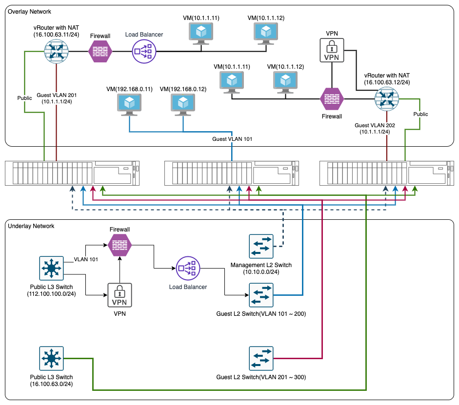

위의 그림처럼, 사용자의 물리적인 네트워크 환경은 2개의 퍼블릭 네트워크(인터넷 연결)로 구성되어 있고, 그 중 하나는 방화벽 및 로드밸런서 등의 모든 네트워크 자원이 물리적으로 구성되어 있는 네트워크입니다. 그리고 나머지 하나는 인터넷으로 연결된 망과 외부와는 단절된 L2 네트워크로만 구성되어 있는 네트워크입니다. 그리고 각각의 네트워크의 게스트 네트워크는 모두 VLAN을 지원하도록 설정되어 있습니다. 

이러한 물리적인 네트워크를 이용하면 가상네트워크는 매우 다양한 형태로 생성할 수 있습니다. 위의 그림에서 표시된 네트워크는 다음과 같습니다. 

- 가상라우터로 만들어진 L3 네트워크와 방화벽, 로드밸런서를 포함한 가상네트워크로 라우터는 퍼블릭 네트워크와 게스트 네트워크에 연결되어 인터넷 게이트웨이 역할을 함
- 가상라우터로 만들어진 L3 네트워크와 방화벽, VPN을 포함한 가상네트워크로 라우터는 퍼블릭 네트워크와 게스트 네트워크에 연결되어 인터넷 게이트웨이 역할을 함
- 물리적으로 구성된 L3 네트워크 및 방화벽, 로드밸런서의 환경에서 VLAN으로 연결된 가상네트워크

VLAN으로 격리된 Advanced Network는 가장 유연한 네트워크 구성 기능을 사용자에게 제공합니다. 

다음의 그림은 가상네트워크의 격리방식을 VLAN 및 Security Group을 이용해 Advanced Network를 구성할 때의 예시를 보여줍니다. 

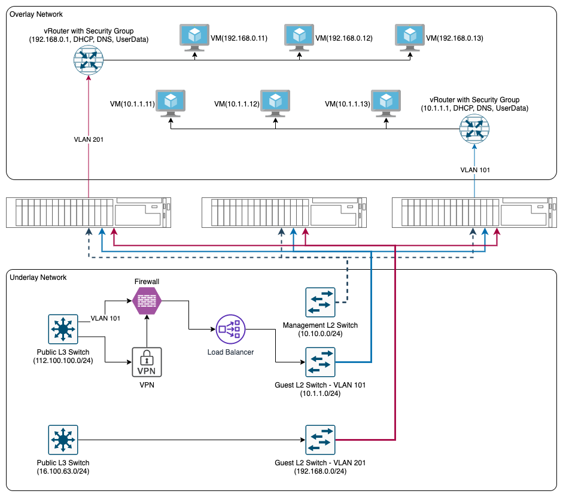

위의 그림처럼, 사용자의 물리적인 네트워크 환경은 2개의 퍼블릭 네트워크(인터넷 연결)로 구성되어 있고, 그 중 하나는 방화벽 및 로드밸런서 등의 모든 네트워크 자원이 물리적으로 구성되어 있는 네트워크입니다. 그리고 나머지 하나는 인터넷 연결만 제공하고 나머지 네트워크 인프라는 없는 간단한 구조입니다. 

이러한 물리적인 네트워크를 이용해 가상네트워크를 만들되, 해당 네트워크는 Security Group을 이용해 사용자 간, 가상머신 간에 격리됩니다.

위의 그림에 표시된 가상 네트워크는 총 2개입니다. 하나는 L3, 방화벽, 로드밸런서 등이 모두 물리적으로 구성된 네트워크와 자원을 공유하는 네트워크이고, 또 다른 하나는 단순한 물리적 인프라로 구성된 네트워크와 자원을 공유하는 네트워크입니다. 

Security Group으로 격리된 Advanced Network는 사용자의 물리적 네트워크와 동일한 구조로 가상네트워크를 생성하고, 네트워크 자원을 격리하기 때문에, 관리자의 네트워크 관리가 편하고, 모든 가상머신 간의 높은 수준의 접근 제어를 적용할 수 있다는 장점이 있습니다. 

### 마이크로 세그멘테이션

현대의 인프라 환경은 빅데이터 및 AI 분석 등의 환경 적용으로 인해 데이터센터 내에 수많은 물리적 서버 및 가상머신으로 구성되는 경우가 많습니다. 

전통적인 데이터센터는 종적 트래픽(North-South Traffic)이 많았지만, 현대의 데이터센터는 수많은 서버로 이루어지고 상호 간의 클러스터링 구성이 이루어지기 때문에 횡적 트래픽(East-West Traffic)이 대부분을 차지하고 있습니다. 

이러한 환경에서 데이터센터의 한 호스트가 공격받아 무력화되는 경우 해당 호스트와 횡적 트래픽으로 연관되어 있는 모든 서버 및 가상머신이 공격의 대상이 될 수 있고, 이는 데이터센터 운영의 심각한 보안 위협이 될 수 있습니다. 

Mold는 위에서 설명한 다양한 가상머신 격리 방법을 이용해 이러한 횡적 공격을 효과적으로 방어할 수 있을 뿐 아니라, 이러한 방어 정책은 UI를 통해 확인할 수 있고, 관리할 수 있습니다. 특히 Security Group의 경우 미리 정책을 만들어 놓고, 각각의 가상머신마다 미리 정의된 Security Group을 적용함으로써, 가상머신 내에서의 방화벽 설정이 아니라, 하이퍼바이저 및 가상 네트워크상에서의 가상머신 간의 격리를 효과적으로 적용함으로써 현대적인 데이터센터 환경에서도 보안 위협에 효과적으로 대응할 수 있는 환경을 제공합니다. 

이러한 기술을 '마이크로 세그멘테이션'이라고 부르는데, 적용되는 보안 기술은 보편적으로 사용되는 NAC(Network Access Control)이지만, 마이크로 세그멘테이션의 가장 중요한 특징은 '자동화 및 오케스트레이션 툴, 그리고 사용자 인터페이스가 결합된 사용하기 쉬운 구현'을 가진 네트워크 세그멘테이션으로, 중앙 정책을 만들어 놓고, 이를 각각의 개별 시스템으로 분산하여 적용하는 보안기술이라는 점입니다.

다음의 그림은 Mold의 마이크로 세그멘테이션 기술에 대한 아키텍처를 보여줍니다. 

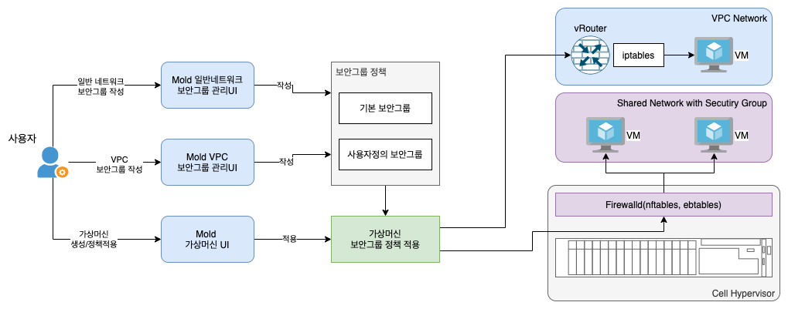

Mold는 다음과 같은 방식의 Micro Segmentation을 지원합니다. 

- 하이퍼바이저 세그멘테이션 : 위의 그림에서 Mold 일반 네트워크 보안그룹을 이용할 때 사용하는 방식으로 Cell Hypervisor의 Firewalld 및 ebtables 등을 이용해 호스트 및 가상머신의 접근 정책을 관리합니다. 하이퍼바이저 정책은 가상머신이 다른 호스트로 이관될 때 자동으로 이동 적용됩니다. 
- 네트워크 세그멘테이션 : 위의 그림에서 Mold VPC 보안그룹을 이용할 때 사용하는 방식으로 사용자별로 만들어진 VPC 네트워크를 위한 가상 라우터의 iptables를 이용해 North-South, East-West Traffic의 모든 정책을 관리하고 적용합니다. 

## 백업 관리

Mold는 시스템의 안정적 운영을 제공하고, 불의의 사고에 대비하기 위해 다양한 형태의 가상머신 백업을 지원하도록 설계되어 있습니다. 

Mold가 지원하는 백업 정책은 다음과 같습니다. 

- Snapshot 백업 : 외부의 NFS 스테이징 스토리지에 가상머신의 스냅샷 이미지를 백업합니다. 사용자가 수동으로, 또는 스케줄에 의한 자동 백업을 지원합니다. 
- Veeam 백업 : 써드파티 백업 솔루션은 Veeam을 이용해 VMWare Hypervisor를 기반으로 구성된 ABLESTACK Mold에 대해 가상머신의 수동, 자동 백업을 지원합니다. 

### 스냅샷 백업

스냅샷이란 특정 시간의 디스크의 상태를 나타내며, Mold는 가상머신에 연결된 디스크 볼륨에 대해 스냅샷을 생성하는 시점의 디스크 상태를 기록하게 됩니다. 

이 때, Mold의 설정에 따라 생성된 스냅샷의 시점 정보를 이용해 디스크 볼륨의 해당 시점까지의 데이터를 Mold에 연결된 2차(Secondary) 스토리지에 전송하여 이미지로 백업하게 되고, 백업한 이미지는 Mold UI를 이용해 디스크 볼륨으로 다시 복원할 수 있습니다. 

다음의 그림은 Mold의 스냅샷 백업 아키텍처를 설명합니다. 

ABLESTACK Cell 기반의 HCI 환경에서 스냅샷을 사용하기 위해서는 다음의 항목에 대한 설정을 Mold의 전역 설정 기능을 이용해 활성화해야 합니다. 

- kvm.snapshot.enabled : Cell의 KVM에 대한 스냅샷 기능을 활성화합니다. 기본값 : false
- snapshot.backup.to.secondary : 가상머신에 대한 볼륨 스냅샷 정보를 로컬에만 유지할지, 스냅샷의 데이터를 Secondary Storage로 백업할지를 결정합니다. 기본값 : true

설정을 완료한 후 사용자는 가상머신의 볼륨을 선택하여 수동으로 스냅샷을 생성하여 백업하거나, 정기 스냅샷 정책을 만들어 스케줄에 의해 스냅샷을 생성하여 백업할 수 있습니다. 

가상머신에 대한 스냅샷이 생성되면 해당 스냅샷 정보를 이용해 해당 시점의 데이터를 추출한 뒤, 호스트에 Secondary Storage를 NFS로 마운트하고 해당 위치에 데이터 파일을 저장하여 백업합니다. 

백업한 데이터는 사용자가 원할 때 언제든지 해당 볼륨에 복원하거나, 별도의 볼륨을 만들어 사용할 수 있습니다. 

### Veeam 백업

Mold는 VMWare 기반의 하이퍼바이저를 사용하여 ABLESTACK을 구성한 사용자 환경에 대해 Veeam 플러그인을 이용한 백업을 지원합니다. 

위의 기능을 사용하기 위해서는 먼저 하이퍼바이저를 VMWare로 설치해야 하고, Veeam Backup & Recovery Enterprise Edition을 설치해야 합니다. ABLESTACK Veeam Backup Plubin은 Veeam B&R 9.5 u4b Enterprise Edition에서 테스트 되었습니다.

다음의 그림은 Mold의 Veeam 백업 아키텍처를 설명합니다. 

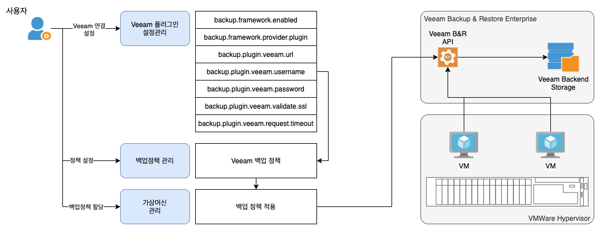

ABLESTACK을 VMWare 하이퍼바이저와 함께 구성한 경우 Veeam 백업/복구 솔루션을 사용할 수 있으며, 해당 기능을 사용하기 위해서는 플러그인 설정 정보를 먼저 등록해 줘야 합니다. 글로벌 설정에서 다음의 항목을 설정할 수 있습니다. 

- backup.framework.enabled : 백업 프레임워크를 활성화할지의 여부를 설정합니다. 기본값 : false
- backup.framework.provider.plugin : 백업 프레임워크 사용 시 어떤 플러그인을 사용할지를 설정합니다. Veeam을 사용할 경우 veeam으로 값을 변경합니다. 기본값 : dummy
- backup.plugin.veeam.url : Veeam 백업 서버의 주소를 설정합니다. 기본값 : `https://localhost:9393/api`
- backup.plugin.veeam.username : Veeam 백업 서버의 백업/복구 작업을 위한 사용자입니다. 기본값 : administrator
- backup.plugin.veeam.password : Veeam 백업 서버의 사용자에 대한 비밀번호입니다. 
- backup.plugin.veeam.validate.ssl : Veeam 백업 서버 연결 시 ssl 인증서에 대한 유효성을 검증할지를 결정합니다. 기본값 : false
- backup.plugin.veeam.request.timeout : Veeam 백업 서버에 요청을 전송할 때 응답이 올 때까지 대기할 시간을 지정합니다. 기본값 : 300초

글로벌 설정을 통해 백업 서버가 연결되면, 해당 서버를 이용한 백업 정책을 만들 수 있습니다. 

그리고 만들어진 백업 정책을 각각의 가상머신별로 설정하여 백업을 수행하도록 할 수 있으며, 백업 내역을 확인할 수 있고, 또 Mold UI에서 백업된 디스크를 복원할 수 있습니다. 

백업을 요청하게 되면 Veeam 서버는 VMWare 호스트 상에 있는 가상머신의 볼륨에 대한 백업을 실시하고, 해당 데이터는 Veeam 서버의 백엔드 스토리지로 저장됩니다. 

## 고가용성 제공

고가용성이란 IT 서비스를 위해 구성된 인프라 중 일부에 장애가 발생해도 운영 중인 서비스는 중단되지 않고 연속성을 보장하는 기술을 말합니다. 

고가용성을 설명할 때 가장 중요한 용어는 단일실패지점(Single Point of Failure)라는 기술 용어입니다. 용어를 풀어보면 하나의 실패로 인해 모든 시스템이 중단되는 지점을 말합니다.

이러한 단일실패 지점을 제거하기 위해 가장 많이 사용하는 기술은 바로 이중화 기술입니다. 예를 들어 전원을 이중화하거나, 스위치와 NIC를 이중화하거나, 서버를 이중화하는 등의 작업을 하게 됩니다. 

Mold는 단순한 이중화가 아닌 분산 개체기술을 이용해 단일실패 지점을 제거하고, 일부 구성요소의 장애에도 서비스가 지속적으로 이루어질 수 있도록 가상머신 및 호스트에 대한 고가용성을 제공합니다. 

고가용성 기능을 통해 다음의 장애가 발생하는 경우에는 자동으로 장애 조치가 이루어집니다. 

- 가상머신이 사용자의 명령 없이 중지되는 경우 가상머신을 다시 실행합니다.
- 예기치 않게 호스트가 중지되는 경우 호스트에서 실행되는 가상머신을 다른 호스트에서 실행합니다.
- 특정 호스트에서 Glue 스토리지 접근이 불가능한 경우 호스트를 자동으로 재부팅하고, 해당 호스트에 있는 가상머신은 다른 호스트에서 실행합니다. 
- Mold GUI를 실행 중인 어플라이언스가 중지되거나 실행 중인 호스트가 중지되면 자동으로 다른 호스트에서 어플라이언스를 실행해 Mold 서비스를 무중단으로 제공합니다. 

다음의 그림은 Mold의 고가용성 아키텍처를 설명합니다. 

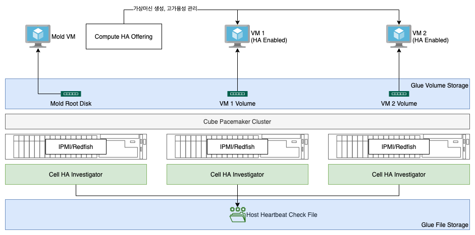

가상머신에 대한 고가용성 정책은 'Compute Offering"에서 가상머신의 HA 설정을 적용함으로써 가능합니다. HA 설정이 적용된 가상머신은 'Cell HA Investigator'에 의해 가상머신이 실행 중인지 계속 점검하고, 가상머신이 정지된 것이 확인되면 자동으로 가상머신을 다시 시작하게 됩니다. 

호스트에 대한 고가용성은 Glue File Storage와 호스트의 IPMI 또는 Redfish API를 이용해 제공합니다. 

호스트의 HA Investigator는 매 1분마다 Glue File Storage에 Heartbeat 파일을 기록하여 호스트가 스토리지에 잘 연결되어 있는지, 그리고 호스트가 정상인지를 확인합니다. 그리고 IPMI/Redfish API를 이용해 호스트의 전원 상태를 점검합니다. 이 두 가지의 확인 과정을 통해 호스트의 정상 여부를 확인하고, 다음과 같이 처리합니다. 

- 스토리지 Heartbeat가 비정상이면 해당 호스트를 재부팅(Fencing)하고, 해당 호스트에 있는 가상머신을 다른 호스트로 이관합니다.
- 호스트 전원상태가 비정상이면 해당 호스트에 있는 가상머신을 다른 호스트로 이관합니다. 

Mold VM에 대한 고가용성은 Cube의 Pacemaker를 이용하여 HA 클러스터를 구성함으로써 기능을 제공합니다. 

Mold VM이 실행 중인 호스트가 셧다운 되거나 Mold VM이 중지되면 자동으로 다른 호스트에서 Mold VM을 시작하여 지속적으로 ABLESTACK을 관리할 수 있도록 연속성을 제공합니다. 

## 호스트 롤링 업데이트

Mold는 ABLESTACK의 소프트웨어 스택의 업데이트가 필요하고, 그 업데이트가 호스트의 재부팅을 요구하는 경우에 서비스가 중단되지 않고 호스트를 업데이트할 수 있도록 호스트 롤링 업데이트 기능을 지원합니다. 

또한 Mold는 호스트 롤링 업데이트 시 처리해야 할 작업을 사용자가 직접 정의하여 사용자 환경에 맞는 관리 작업이 가능하도록 커스터마이징 할 수 있도록 설계되어 있습니다. 

다음의 그림은 Mold의 호스트 롤링 업데이트 아키텍처를 설명합니다.

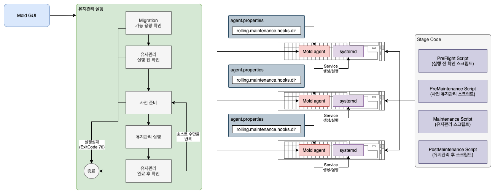

Mold를 이용해 호스트에 대한 롤링 유지 관리를 실행하면, 위의 그림에서 표시된 절차에 따라 유지관리가 실행됩니다. 유지관리 실행 단계는 다음과 같습니다. 

- 용량 확인 : 유지관리를 실행할 호스트의 가상머신이 다른 호스트로 이관될 수 있도록 남아 있는 용량을 확인합니다. (Mold가 정의)
- 유지관리 실행 전 확인 : 유지관리 작업을 하기 전에 확인하도록 사용자가 정의한 사항을 확인합니다. (사용자가 정의)
- 사전 준비 : 유지관리 작업을 하기 전에 사용자가 정의한 작업(안전한 서비스 종료 및 HCI 어플라이언스 종료 등)을 수행합니다. (사용자가 정의)
- 유지관리 실행 : 유지관리 모드로 진입한 후 사용자가 정의한 유지관리 작업(소프트웨어 업그레이드 등)을 실행합니다. 실행이 완료되면 가상머신이 모두 다른 호스트로 이관되고 호스트가 재부팅됩니다. (사용자가 정의)
- 유지관리 완료 후 확인 : 유지관리 실행 후 호스트가 실행되면 정상적으로 업데이트가 실행되었는지 사용자가 정의한 확인 작업을 실행합니다. (사용자가 정의)

이러한 실행 단계에 맞는 스크립트는 각 호스트의 `agent.properties` 파일의 `rolling.maintenance.hooks.dir`에 정의 되어 있는 디렉토리에서 스크립트를 찾습니다. 각 단계별 사용자 정의 스크립트의 파일명은 다음과 같아야 합니다. 

- 유지관리 실행 전 확인 : `PreFlight`, `PreFlight.py`, `PreFlight.sh` 중 하나
- 사전 준비 : `PreMaintenance`, `PreMaintenance.py`, `PreMaintenance.sh` 중 하나
- 유지관리 실행 : `Maintenance`, `Maintenance.py`, `Maintenance.sh` 중 하나
- 유지관리 완료 후 확인 : `PostMaintenance`, `PostMaintenance.py`, `PostMaintenance.sh` 중 하나

각 단계별로 이러한 스크립트를 찾으면 해당 스크립트를 Mold Agent는 `systemd` 서비스로 생성한 뒤 스크립트를 실행하고, 그 결과를 사용자에게 전달합니다.

이러한 '사용자화가 가능한' 호스트 롤링 업데이트를 통해 사용자 환경에 맞는 시스템 유지보수가 가능해지고, 또 소프트웨어 업데이트가 안전하게 이루어질 수 있게 됩니다. 
## API 및 인터페이스

Mold는 웹 기반의 GUI 외에 다양한 방식의 사용자 인터페이스를 제공합니다. 제공되는 사용자 인터페이스는 다음과 같습니다. 

- HTTP GET/POST 쿼리 문자열 방식의 API
- 명령행 인터페이스

Mold GUI는 모두 Mold API, 즉 HTTP GET/POST 쿼리 문자열 방식의 API를 백엔드로 사용하여, 해당 API를 호출함으로써 구현되어 있습니다. 

따라서 사용자가 기업 내의 시스템과 ABLESTACK의 기능을 통합하고자 하는 경우 이러한 API 를 이용하여 기능을 개발할 수 있습니다. 

Mold는 GUI 외에 별도의 CLI를 제공합니다. 사용자는 명령행 도구를 이용해 웹 페이지를 사용하지 않고, 직접 명령행 실행을 통해 가상머신 등의 모든 기능을 관리할 수 있습니다. 
