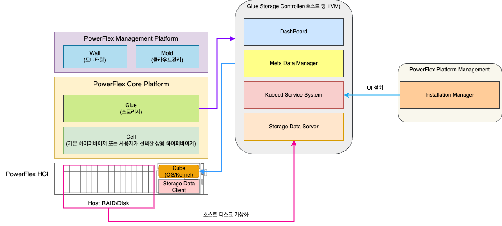
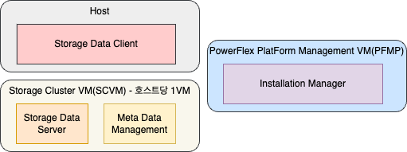
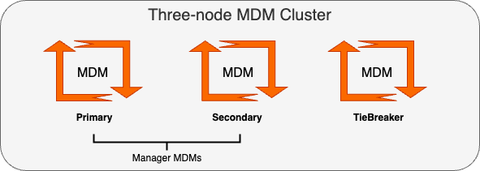
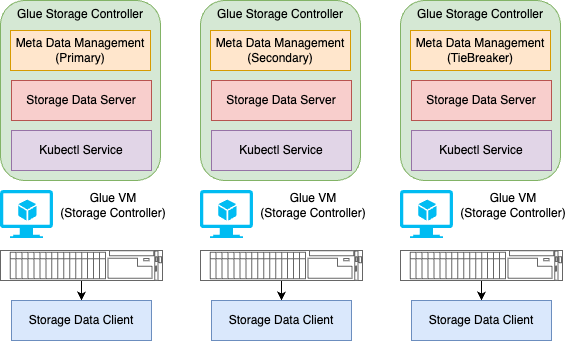
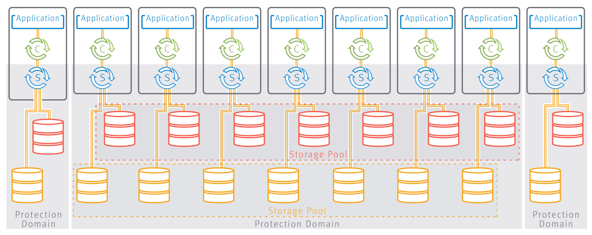
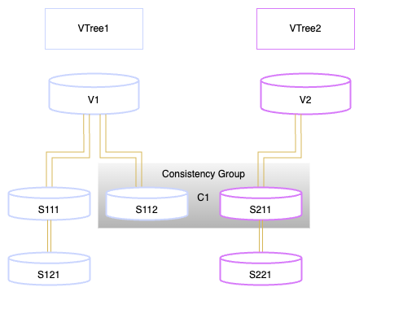

Glue는 접착제, 풀을 뜻하는 단어로, ABLESTACK 통합 스토리지 플랫폼의 이름입니다. 호스트에 있는 디스크를 이용해 통합된 저장공간을 제공하고, 다양한 형태로 스토리지 서비스를 제공하는 HCI 스토리지의 특성을 잘 설명할 수 있는 단어로, 통합 스토리지라는 의미를 담고 있습니다.

Glue는 PowerFlex HCI를 구성함으로써 데이터센터에서 필요로 하는 모든 스토리지 서비스를 제공하는 것을 목표로 설계, 개발되었습니다.

## Glue의 설계 목표

Glue는 PowerFlex HCI를 실현하기 위한 핵심 구성요소로, PowerFlex에 가상머신용 볼륨 스토리지, HA 지원을 위한 Heartbeat 스토리지, 파일시스템 등 다양한 저장소를 제공하는 구성요소입니다. 사용자는 실제로는 Mold를 사용하지만, 이 Mold가 일할 수 있는 기반을 제공해주는 플랫폼입니다. 즉, 사용자는 Glue가 어떻게 서비스 되는지에 대한 관심이 크게 없다는 것입니다. 따라서 이러한 관점에서 Glue는 다음과 같은 목표로 지속적인 플랫폼 개발 및 업그레이드를 계획하고 실행합니다.

- 사용자 관점에서 투명한 스토리지 환경을 제공 (스토리지 아키텍처가 사용자 환경에 영향을 미치지 않음)
- 간결하고 직관적인 웹 기반 관리 환경 제공
- 다양한 스토리지 게이트웨이를 통해 높은 활용성 제공
- 고성능, 고효율 스토리지 제공
- 신뢰도 높은 모니터링 및 자가 복구를 통한 안정성 제공

본 문서에서는 이러한 설계 목표를 달성하기 위한 Glue의 아키텍처 및 각종 기능, 사용법 등에 대한 간단한 소개를 제공합니다.

## 아키텍처 개요

Glue는 PowerFlex HCI의 핵심 구성요소로 HCI의 스토리지를 제공하기 위한 플랫폼입니다.

다음의 그림은 PowerFlex HCI의 전체 구성요소 중 Glue가 제공하는 기능을 아키텍처로 표현합니다.

Glue는 분산 스토리지 아키텍처 기반의 고성능 블록 스토리지를 기반으로 다양한 스토리지 게이트웨이를 지원하는 스토리지 플랫폼입니다. Glue의 아키텍처 특징을 몇 가지로 정리해 보면 다음과 같습니다.

- 분산 아키텍처 기반의 블록 스토리지
- 클러스터 기반의 스토리지 컨트롤러
- 무중단 확장 및 고가용성 지원
- 동적 클러스터 관리 및 자원 최적화
- 데이터 복제 방식 및 삭제 코딩 방식
- 압축 및 중복제거를 통한 스토리지 효율성 극대화
- 데이터 로컬리티 및 자동 티어링 기능
- 다양한 스토리지 게이트웨이 제공

## 블록 스토리지

Glue 스토리지 클러스터는 고성능과 확장성을 갖춘 분산 블록 스토리지 플랫폼을 제공합니다.

Glue 스토리지 클러스터는 분산 블록 스토리지를 통해 신뢰할 수 있는 고성능 데이터 저장과 고가용성을 보장하며, 다음과 같은 주요 컴포넌트로 이루어져 있습니다

- Storage Data Server(SDS)
- Meta Data Manager(MDM)
- Storage Data Client(SDC)
- Installation Manager

**Storage Data Server(SDS)** 는 데이터를 물리적 디스크에 분산 저장하는 데몬으로, 블록 스토리지 요청을 처리합니다. 각 SDS는 여러 개의 블록 장치로 구성되어 있고, 데이터가 분산되어 저장되어 성능과 가용성을 높입니다.

**Meta Data Management(MDM)** 은 클러스터의 상태, 데이터 분산 정보 등을 관리하는 주요 구성 요소로, 모든 노드 간의 상태와 데이터 배치 정보를 유지하고 업데이트합니다. 이를 통해 클라이언트가 데이터 요청 시 정확한 경로를 안내받고 빠르게 데이터에 접근할 수 있습니다. MDM은 클러스터링 기술을 통해 고가용성을 유지하며, 하나 이상의 MDM 인스턴스가 장애 발생 시 대체 역할을 수행합니다.

**Storage Data Client(SDC)** 는 클라이언트와 SDS 간의 데이터 통신을 담당하며, 클라이언트가 SDS로부터 데이터에 접근하도록 돕는 역할을 합니다. SDC는 저지연 데이터 전송을 지원하여 고성능 스토리지 서비스를 제공합니다.

**Installation Manager** 는 클러스터 구성, 모니터링, 오케스트레이션을 위한 엔드포인트 역할을 하며, 사용자에게 CLI, REST API, 웹 대시보드 등의 인터페이스를 제공합니다.

Glue 스토리지 클러스터는 클라이언트가 어떤 방식으로 PowerFlex 블록 스토리지에 연결되는지와 관계없이, 클라이언트의 데이터 요청을 수신하고 이를 신뢰성 있는 자동화된 분산 블록 스토리지에 저장합니다.이 분산 블록 스토리지는 여러 개의 Storage Data Server(SDS)를 통해 구성되며, 각 SDS는 데이터의 일부를 담당하여 클러스터 전반에 걸쳐 데이터를 분산 저장합니다. SDS는 클러스터 내에서 고성능 데이터 접근과 무중단 데이터 복구를 보장합니다.

각 데이터 블록은 Storage Data Server(SDS)에 분산 저장됩니다. PowerFlex는 일반적으로 호스트의 물리적 디스크를 하나의 SDS에 할당하여, 물리적 디스크와 논리적 블록 장치를 1:1로 매핑합니다. SDS는 매핑된 디스크에 클라이언트가 전송한 데이터를 8MB 크기의 블록 단위로 나누어 처리하며, 데이터의 복제 및 쓰기 작업을 동시에 수행하여 성능과 가용성을 보장합니다. 데이터를 디스크에 기록할 때는 블록 스토리지의 구조에 맞춰 효율적으로 관리되며, 필요 시 빠르게 읽기 작업을 수행할 수 있도록 최적화됩니다.

## MDM 클러스터

MDM은 PowerFlex의 모니터링 및 구성 에이전트 역할을 하며 주로 관리에 사용됩니다.

마이그레이션, 재구축 및 모든 시스템 관련 기능을 비롯한 관리에 주로 사용됩니다. I/O는 MDM을 통해 실행되지 않습니다.

MDM 클러스터는 기본 MDM, 보조 MDM 및 tiebreaker MDM의 조합으로 구성됩니다. 클러스터의 일부에 속하지 않는 대기 MDM도
있습니다.

1. MDM : MDM 패키지가 설치된 서버입니다. 설치 중 MDM에 Manager 또는 tiebreaker(기본값) 역할이 할당될 수 있습니다. 나중에 MDM을
다시 설치하지 않으면 이 역할을 변경할 수 없습니다. MDM에는 고유한 MDM ID가 있으며 고유한 이름을 지정할 수 있습니다.
MDM을 클러스터에 포함시키려면 먼저 대기 MDM으로 상향 이동해야 합니다.
2. 대기 MDM 및 tiebreaker : MDM과 tiebreaker는 시스템에 대기로 추가할 수 있습니다. 특정 시스템에 추가된 대기 MDM 또는 tiebreaker는 이 시스템에 연결
되거나 종속됩니다.
대기 MDM이 클러스터 구성원으로 상향 이동되면 Manager MDM 또는 tiebreaker MDM의 포지션을 맡도록 요청할 수 있습니다
3. Manager MDM : 클러스터에서 기본 또는 보조 역할을 수행할 수 있는 MDM입니다. Manager MDM에는 고유한 시스템 ID가 있으며 고유한 이름을
지정할 수 있습니다. Manager는 클러스터의 스탠바이가 되거나 구성원이 될 수 있습니다.
4. Tiebreaker MDM : 기본 MDM을 결정하는 데 도움을 주는 역할만 하는 MDM입니다. tiebreaker는 클러스터의 대기가 되거나 구성원이 될 수 있습니
다. tiebreaker MDM은 Manager가 아닙니다.
3노드 클러스터에는 tiebreaker가 1개 있고, 5노드 클러스터에는 tiebreaker가 2개 있습니다. 이를 통해 클러스터의 MDM 수가 항상
홀수가 되어 주 MDM을 선택할 때 항상 과반수를 넘는 쪽이 있게 됩니다.

### 시스템 안정성
MDM 프록시 기능은 네트워크 안정성을 강화합니다.

PowerFlex 아키텍처에서는 작업을 제어하고 관리하기 위해 각 SDC가 MDM에 완전히 연결되어 있어야 합니다. SDC가 MDM에 도달
할 수 없는 경우 SDC는 연결 해제됨 상태가 되며, 어느 시점에서는 완전한 I/O 실패로 이어질 수 있습니다.

PowerFlex를 사용하면 MDM 가상 IP 기능을 사용하지 않는 클러스터에서 보조 MDM을 모든 제어 트래픽에 대한 프록시로 사용할 수
있으므로 네트워크 장애 발생에 대비한 이중화 수준을 더욱 높일 수 있습니다.

이러한 상황이 발생하고 MDM 프록시가 사용 중이면 관리 API가 적절한 알림을 보냅니다.

### 가상 IP 주소
MDM 클러스터에 대한 가상 IP 주소를 정의할 수 있습니다.

클러스터에 추가 MDM을 포함하도록 기존 시스템을 확장할 수 있습니다. 새 MDM은 기존 가상 IP 주소에 매핑되어야 합니다.

MDM 클러스터의 변경 사항을 반영하려면 모든 SDC를 다시 구성해야 합니다. 그렇지 않으면 SDC가 MDM 클러스터와 통신할 수 없으며 볼륨에 액세스할 수 없습니다.

최대 4개의 MDM 가상 IP 네트워크가 지원됩니다.

## 가상머신 스토리지 컨트롤러

스토리지 컨트롤러는 PowerFlex HCI 클러스터를 구성하는 호스트에 1대씩 만들어집니다. 설치하는 과정에서 PFMP(PowerFlex Manager PlatForm) 가상머신에 Glue의 컨테이너 이미지가 내장되어 있습니다. PFMP 가상머신에서 스토리지 가상머신에 배포 한 후, 각 쿠버네티스 서비스가 실행됩니다.

**Kubectl Service** 는 각 가상머신에서 수 많은 역할을 가진 컨테이너로 실행되며, Glue 스토리지 대시보드, 웹 서비스, 인증 등 Glue 스토리지를 관리하기 위한 서비스로, 모든 스토리지 컨트롤러에서 동작합니다.

**Storage Data Server** 는 각 가상머신에서 설치되어 실행되며, 여러 SDS가 함께 작동하여 로컬 스토리지를 추상화하고, 스토리지 풀을 유지하며, 볼륨을 SDC(Storage Data Client)에 제공합니다. 각 SDS 노드는 하나의 장애 단위이며, 데이터의 분산 메시-미러 복제본은 동일한 장애 단위에 배치되지 않습니다.

**Meta Data Management** 는 각 가상머신에서 설치되어 실행되며, 시스템 내의 다른 소프트웨어 구성 요소와 함께 상주하지만, 데이터 경로 외부에 있고, 스토리지 클러스터 상태와 구성을 감독합니다. 시스템이 변경될 때 데이터 재조정 및 재구축/재보호를 조율합니다.

**Strorage Data Client** 는 각 호스트에서 설치되어 진행되며, 운영 체제, 애플리케이션 또는 하이퍼바이저에 프로튼엔드 볼륨 액세스를 제공하는 클라이언트 커널 드라이버입니다. PowerFlex 볼륨을 로컬 블록 디바이스로써 제공합니다. SDC는 스토리지 풀을 관리하는 모든 SDS에 대한 피어-투-피어 연결을 유지합니다. 전용 PowerFlex 데이터 전송 프로토콜과 블록 SCSI 명령 간 변환을 수행합니다.

## 스토리지 정의

Glue 스토리지를 구성할 때에는 보호 도메인, 스토리지 풀, 장애 세트 등의 개념을 고려해야 합니다. 이 두 요소는 물리 계층을 가상 스토
리지 계층에 함께 연결합니다.

### 보호 도메인

보호 도메인은 서로 백업하는 일련의 SDS로 구성된 논리적 개체입니다. 보호 도메인은 설치 중에 추가하고 설치 후 수정할 수 있습니
다.
각 SDS는 하나의 보호 도메인에만 속합니다. 따라서 정의상으로 각 보호 도메인은 고유한 SDS 세트입니다. 그림 3에서는 3개의 보호
도메인이 있습니다. 완전히 묘사된 가운데의 보호 도메인은 각각 2개의 스토리지 디바이스가 포함된 7개의 SDS로 구성되어 있습니
다.
보호 도메인에서 권장되는 최대 노드 수는 128개입니다. 이를 통해 다음과 같은 이점이 실현됩니다.

- 성능 최적화
- 이론적 MTBF(Mean Time Between Failure) 문제 감소
- 서로 다른 보호 도메인에서 다중 장애 발생 시 가용성을 유지할 수 있음

설치 중에 보호 도메인을 추가할 수 있습니다. 또한 설치 후 모든 관리 클라이언트에서 보호 도메인을 수정할 수 있습니다.

### 스토리지 풀

스토리지 풀은 보호 도메인에 있는 물리적 스토리지 디바이스 세트입니다. 볼륨은 동일한 스토리지 풀에 상주하는 모든 디바이스에
걸쳐 분산됩니다. 마그네틱 스토리지 풀(HDD용) 또는 고성능 스토리지 풀(SSD용)을 정의할 수 있습니다. 스토리지 풀은 중간(1MB)
또는 미세(4KB) 세분성 데이터 레이아웃을 지원하며 영(0) 채우기(SDS 디바이스의 모든 비트를 영(0)으로 채우는 프로세스)를 사용
하거나 사용하지 않도록 설정할 수 있습니다.

스토리지 풀을 사용하면 PowerFlex에서 여러 스토리지 계층을 관리할 수 있습니다. 각 스토리지 디바이스는 하나의 스토리지 풀에만
속합니다.

볼륨이 가상화 계층에서 구성되는 경우 동일한 스토리지 풀에 상주하는 모든 디바이스 사이에 볼륨이 분산됩니다. 각 볼륨 블록은 서
로 다른 두 SDS에 두 개의 복제본을 갖습니다. 이러한 가상화 계층을 통해 단일 지점 장애에 따른 데이터 가용성을 유지할 수 있습니
다. 장애 세트가 구성된 경우 각 복제본도 다른 장애 세트에 있게 됩니다. 2개의 네트워크 장애는 모든 스토리지 풀에서 I/O 오류가 발
생할 수 있는 상태로 모든 도메인을 렌더링합니다.

아래 그림은 2개의 스토리지 풀을 보여줍니다.

각 스토리지 풀에 미디어 유형 설정을 할당해야 합니다. 지원되는 유형은 HDD, SSD 및 Transitional입니다(마이그레이션 흐름을 고려).
보호 도메인의 모든 SDS에 하드 드라이브 1개와 SSD 1개의 두 가지 물리적 드라이브가 연결되어 있다면 다음과 같이 2개의 스토리지
풀을 정의해야 합니다.

- 마그네틱 스토리지 풀 - 보호 도메인 내 모든 HDD로 구성
- 고성능 스토리지 풀 - 보호 도메인에서 스토리지 용도로 사용되는 모든 SSD로 구성됩니다.

!!! note
    - 다른 유형의 SSD를 혼합하여 사용하는 것은 권장되지 않습니다. SAS SSD, SATA SSD, NVMe SAS SSD 등 각 유형에 대해
    별도의 스토리지 풀을 생성하는 것이 좋습니다.
    - 동일한 스토리지 풀의 장애 유닛 크기 간에 큰 차이가 있는 경우 PowerFlex가 최적의 성능을 발휘하지 못할 수 있습니다.
    예를 들어, 디바이스 중 하나의 용량이 나머지 디바이스보다 훨씬 크다면 성능에 영향을 미칠 수 있습니다. 디바이스를 추가한 후 SCLI 명령 modify_sds_device_capacity를 사용하여 PowerFlex에 사용할 수 있는 디바이스 용량을 정의할
    수 있습니다.

스토리지 풀은 HDD 또는 SSD 미디어에 대해 다음과 같은 데이터 레이아웃을 지원합니다.

1. MG(Medium Granularity): 공간 할당이 1MB 단위로 이루어짐.
    - HDD 및 SSD 미디어 지원
    - 데이터 무결성을 위한 영구 체크섬을 포함
2. FG(Fine Granularity):
    - 가속을 위해 SSD 미디어와 SDPM 또는 NVDIMM이 필요함
    - 4KB 단위로 공간 할당됨
    - 데이터 무결성을 위한 영구 체크섬을 포함
    - 디스크에 저장된 데이터의 크기를 줄이는 데이터 압축을 지원
    - 씬 프로비저닝(thin provisioning) 및 영(0)으로 채우기가 된 볼륨을 지원

각 스토리지 풀은 다음 모드 중 하나로 작동할 수 있습니다.

- 영(0) 채우기 활성화됨

    이전에 기록되지 않은 영역에서의 모든 읽기가 영(0)을 반환합니다. 일부 애플리케이션은 이 동작에 좌우될 수 있습니다. 또한 영
    (0)으로 채우기를 사용하면 볼륨에서 읽기 작업 시 이전에 해당 볼륨에서 삭제된 정보가 반환되지 않습니다.
    이 동작은 해당 영역을 영(0)으로 먼저 채워야 하기 때문에 볼륨의 모든 영역에 맨 처음 쓰기를 할 때 약간의 성능 오버헤드를 발
    생시킵니다.
    FG는 항상 영(0)으로 채워집니다.

- 영(0) 채우기 비활성화됨(MG의 경우에만 기본 설정)

    이전에 기록되지 않은 영역에서의 읽기가 알 수 없는 내용을 반환합니다. 이 내용은 후속 읽기 시 변경될 수 있습니다.
    일부 애플리케이션은 이전에 기록되지 않은 영역에서 읽을 때 스토리지가 영(0) 또는 일관된 데이터를 반환할 것이라고 가정합니다.
    이러한 애플리케이션을 사용하려면 영(0)으로 채우기를 활성화해야 합니다.
    설치 중에 스토리지 풀을 추가할 수 있습니다. 또한 대부분의 관리 클라이언트에서 설치 후 스토리지 풀을 수정할 수 있습니다.

### 볼륨
애플리케이션에서 볼륨을 액세스할 수 있도록 설정하려면 먼저 볼륨을 추가하고 구성해야 합니다.
이 섹션에서 설명하는 볼륨 추가 및 매핑 프로세스는 시작 프로세스의 일부로서 애플리케이션이 볼륨에 액세스하기 위해 선행되어야
하는 필수 프로세스입니다. 또한 가상화 계층의 유지 보수 작업을 수행할 때 추가 볼륨을 생성하고 매핑할 수도 있습니다.
볼륨을 생성할 때 캐싱 옵션을 구성하거나 이후에 읽기 RAM 캐시 기능을 변경할 수 있습니다. 캐싱 기능을 활성화하려는 경우 시스
템의 백엔드에서도 해당 스토리지 풀 및 SDS에 대해 캐싱 기능이 활성화되어 있어야 합니다.
볼륨 이름은 다음 규칙에 따라 정의합니다.

- 32자 미만
- 영숫자 및 구두점만 사용
- 객체 유형 내에서 고유한 이름

PowerFlex 객체에는 CLI 명령에서 해당 객체를 식별하는 데 사용할 수 있는 고유 ID가 할당됩니다. 쿼리를 사용하거나 PowerFlex
Manager에서 오브젝트의 속성 시트를 통해 ID를 검색할 수 있습니다. 각 볼륨의 작동 역할과 관련된 의미 있는 이름으로 볼륨 이름을
지정하는 것이 좋습니다.

### 스냅샷
PowerFlex에서 스냅샷, 즉 볼륨의 즉각적인 복사본을 생성할 수 있습니다. 스냅샷은 스토리지 시스템에 의해 노출되는 모든 볼륨으로
조작할 수 있습니다. 동시에 생성된 스냅샷은 정합성 보장 그룹을 형성하며 하나의 그룹으로 조작할 수 있습니다.
PowerFlex 스토리지 시스템을 사용하면 기존 볼륨의 스냅샷을 볼륨당 최대 128개까지 생성할 수 있습니다. 스냅샷은 씬 프로비저닝
되며 매우 빠르게 생성됩니다.
생성된 스냅샷은 시스템에서 매핑되지 않은 새 볼륨이 되며 PowerFlex 스토리지 시스템에서 표시하는 다른 볼륨과 동일한 방식으로
조작할 수 있습니다

한 볼륨에서 생성된 모든 스냅샷과 관련된 구조를 일컬어 볼륨 트리 또는 간단히 vTree라고 합니다. 시스템에서 스냅샷을 생성할 때 2
개 이상의 볼륨을 지정할 수 있습니다. 함께 생성된 모든 스냅샷은 정합성 보장 그룹을 형성합니다. 이러한 스냅샷은 모두 동시에 생
성되었다는 점에서 정합성이 보장됩니다. 따라서 모든 스냅샷 구성원에 포함된 데이터 간에 컨텍스트 관계가 있을 경우 해당 세트가
의미를 가집니다. 정합성 보장 그룹을 통해 전체 세트를 조작할 수 있습니다.
전체 정합성 보장 그룹을 제거할 경우 함께 생성된 모든 스냅샷이 제거됩니다. 분홍색 S211은 V2의 스냅샷입니다. S112와 S211이 함께
생성되었기 때문에 이 둘은 C1로 지정된 정합성 보장 그룹을 구성합니다.

!!! note
    - 정합성 보장 그룹은 편의상의 용도로만 사용됩니다. 정합성 보장 그룹을 보존하기 위해 PowerFlex에서 지원하는 보호 수단은없습니다. 예를 들어 정합성 보장 그룹의 구성원인 스냅샷을 제거할 수 있습니다.
    - 시스템에서 상위 스냅샷 제거를 지원합니다. 상위 스냅샷을 하위 스냅샷에 병합할 수 있습니다.
    - 논리적 용량이 축소되지 않을 수 있으므로 스냅샷이 포함된 볼륨은 잘라내지 않는 것이 좋습니다.

## 보호 및 로드 밸런싱
PowerFlex는 RAID-1 메시 미러링된 레이아웃에 사용자 데이터를 유지합니다. 각 데이터 조각은 2개의 장애 유닛에 저장됩니다. 복제
본은 용량 및 예상 네트워크 로드 측면에서 각 장애 유닛의 균일한 로드를 보장하는 알고리듬에 따라 스토리지 디바이스를 통해 배포
됩니다. 재구축 및 재조정 프로세스는 완전히 자동화되지만 구성 가능합니다.

### 재구축
PowerFlex는 장애에 대한 응답으로 재구축 프로세스를 시작합니다. 전방 재구축은 다른 서버에 데이터의 새 복제본을 만드는 것을 의
미합니다. 후방 재구축은 여러 복제본 중 하나를 다시 동기화하는 것을 의미합니다.
서버, 디바이스 또는 네트워크 장애와 같은 장애가 발생할 경우 PowerFlex는 즉시 데이터 보호 프로세스를 시작합니다. 이 프로세스
를 재구축이라고 하며, 두 가지 유형으로 구분됩니다.

- 전방 재구축은 새 서버에 데이터의 또 다른 복제본을 생성하는 프로세스로, 스토리지 풀의 모든 디바이스는 다대다(many-to-many) 방식으로 함께 작동하며 장애가 발생한 모든 스토리지 블록의 새 복제본을 생성합니다. 이 방법을 사용하면 매우 빠르게 재
구축이 완료됩니다.
- 후방 재구축은 복제본 중 하나를 재동기화하는 프로세스로, 복제본에 액세스할 수 없던 기간 동안 데이터에 이루어진 변경 사항
만 이 복제본에 전달합니다. 이 프로세스는 복구 시 네트워크를 통해 전송되는 데이터의 양을 최소화합니다.

PowerFlex는 수행할 재구축의 유형을 자동으로 선택합니다. 따라서 사용자 데이터가 완전히 보호되지 않는 시간을 최소화하기 위해
추가 데이터가 전송되는 경우가 발생합니다.

### 재구축 임계치 조절
재구축 임계치 조절 정책은 SDS 디바이스를 액세스할 때 애플리케이션 I/O에 대한 재구축 I/O의 우선 순위를 결정합니다. 재구축 임
계치 조절 정책으로는 재구축 I/O에 대한 제한 없음, SDS 디바이스당 동시 I/O 제한, Favor Application I/O, 동적 대역폭 스로틀링 등이
있습니다.
재구축 스로틀링은 스토리지 풀에 대한 재구축 우선순위 정책을 설정합니다. 이 정책은 SDS 디바이스에 액세스할 때 재구축 I/O과 애
플리케이션 I/O 간의 우선 순위를 결정합니다. 애플리케이션 입출력은 중단 없이 이루어집니다.
재구축 임계치 조절을 적용하면 시스템이 일부 데이터의 단일 복제본으로 인한 위험에 노출되는 시간이 길어지는 한편 애플리케이션
에 미치는 영향이 줄어듭니다. 둘 사이의 적절한 균형을 선택해야 합니다.
다음과 같은 우선순위 정책이 적용될 수 있습니다.

- 제한 없음: 재구축 I/O에 대한 제한이 없습니다.
    모든 재구축 입출력이 추가 대기 없이 즉시 디바이스에 전송됩니다.
    노트: 재구축 I/O는 비교적 규모가 크므로 이 정책을 설정하면 재구축 속도가 높아지지만 애플리케이션 I/O에 미치는 영향이
    최대화됩니다.

- 동시 I/O 제한: SDS 디바이스당 동시 재구축 I/O 수를 제한합니다(기본값).
    재구축 입출력이 사전 정의된 동시 입출력 수로 제한됩니다. 이 제한에 도달하면 다음번에 들어오는 재구축 I/O가 현재 실행되는
    재구축 I/O가 완료될 때까지 대기합니다. 이 정책을 설정하면 최상의 신뢰성을 유지하며 재구축이 신속하게 완료되지만 호스트
    애플리케이션에 영향을 미칠 위험이 있습니다.

- Favor Application I/O: 재구축 시 대역폭과 동시 I/O를 모두 제한합니다.

즉, 대역폭과 동시 입출력 수 측면에서 모두 재구축 입출력이 제한됩니다. 동시 재구축 입출력 수와 재구축에 사용되는 대역폭이
사전 정의된 제한을 초과하지 않는 한 재구축 입출력이 처리됩니다. 둘 중 하나라도 임계값에 도달하면 동시 입출력 수와 대역폭
이 모두 임계값 미만으로 떨어질 때까지 재구축 입출력이 대기됩니다. 예를 들어 이 값을 "1"로 설정하면 모든 시점에 디바이스에
서 동시 재구축 I/O가 한 건만 처리되어 애플리케이션 I/O가 최대 한 건의 재구축 I/O만 대기하게 됩니다.
이 정책을 사용하기 위한 사전 요구 사항인 Limit Concurrent I/Os 옵션에 추가로 대역폭이 제한됩니다.

- 동적 대역폭 임계치 조절: 이 정책은 Favor Application I/O와 비슷하지만 거의 사용되지 않는 기간을 최대한 낮은 값으로 정의하여
    애플리케이션 I/O가 처리되는 간격을 늘립니다. 이 거의 사용되지 않는 기간은 애플리케이션 입출력이 발생하지 않은 특정 간격
    으로 정의됩니다. 재구축 대역폭 및 동시 입출력에 대한 제한은 여전히 적용됩니다.

- 기본값:
    - 재구축에 대한 기본 정책: 동시 I/O 제한
    - 재구축 시 동시 I/O 제한: 동시 I/O 1개

### 리밸런스
PowerFlex에서 스토리지 풀의 디바이스 간에 사용자 데이터가 분산되지 않은 것을 탐지하면 활용도가 가장 높은 디바이스에서 활용
도가 가장 낮은 디바이스로 데이터 복제본이 이동하도록 균형을 복원하는 프로세스를 시작합니다.

재조정은 데이터 복제본 중 하나를 다른 서버로 이동하는 프로세스로, 사용자 데이터가 스토리지 풀의 장애 유닛에 걸쳐 균등하게 분
산되지 않은 것을 PowerFlex에서 탐지할 때 실행됩니다. 이는 SDS 추가/제거, 디바이스 추가/제거 또는 장애 복구 등 여러 가지 조건
으로 인해 발생할 수 있습니다. PowerFlex는 가장 많이 사용되는 디바이스에서 가장 적게 사용되는 디바이스로 데이터 복제본을 옮깁
니다.

재구축 및 재조정 모두 네트워크, CPU, 디스크를 포함한 시스템 리소스에 대해 애플리케이션 I/O와 경쟁합니다. PowerFlex는 이러한
리소스 사용을 제어할 수 있는 다양한 매개변수를 제공합니다. 이 시스템은 빠른 재구축 또는 재조정과 애플리케이션 I/O에 미치는
영향 최소화 간에 균형을 유지하도록 사전에 튜닝되어 있지만, 사용자가 재구축 및 재조정 동작을 매우 세밀하게 제어할 수 있습니다.

### 재조정 임계치 조절
재조정 임계치 조절 정책은 SDS 디바이스를 액세스할 때 애플리케이션 I/O에 대한 재조정 I/O의 우선 순위를 결정합니다.
재조정 스로틀은 스토리지 풀에 대한 재조정 우선순위 정책을 설정합니다. 이 정책은 SDS 디바이스에 액세스할 때 재조정 I/O와 애플
리케이션 I/O 간의 우선순위를 결정합니다. 애플리케이션 입출력은 중단 없이 이루어집니다. 재조정은 재구축과 달리 시스템의 신뢰
성에 영향을 미치지 않으므로 영향을 줄이는 것이 위험하지 않습니다.

다음과 같은 우선 순위 정책이 적용될 수 있습니다.

- 제한 없음: 재조정 I/O에 대한 제한이 없습니다.
모든 재조정 입출력이 추가 대기 없이 즉시 디바이스에 전송됩니다. 재조정 입출력은 비교적 규모가 크므로 이 정책을 설정하면
재조정 속도가 높아지지만 애플리케이션 입출력에 미치는 영향이 최대화됩니다.

- 동시 I/O 제한: SDS 디바이스당 동시 재조정 I/O 수를 제한합니다.
재조정 입출력이 사전 정의된 동시 입출력 수로 제한됩니다. 이 제한에 도달하면 다음 번에 들어오는 재조정 입출력이 현재 실행
되는 재조정 입출력이 완료될 때까지 대기됩니다. 예를 들어 이 값을 "1"로 설정하면 모든 시점에 디바이스에서 재조정 I/O가 한
건만 처리되어, 최악의 경우 애플리케이션 I/O가 최대 한 건의 재조정 I/O만 수신하게 됩니다.

- Favor Application I/O: 재조정 시 대역폭과 동시 I/O를 모두 제한합니다.
즉, 대역폭과 동시 입출력 수 측면에서 모두 재조정 입출력이 제한됩니다. 동시 재조정 입출력 수와 재조정에 사용되는 대역폭이
사전 정의된 제한을 초과하지 않는 한 재조정 입출력이 처리됩니다. 둘 중 하나라도 제한 값에 도달하면 이러한 제한 값 미만으로
떨어질 때까지 재조정 입출력이 대기됩니다.
Limit Concurrent I/Os 옵션에 추가로 대역폭 제한이 적용됩니다.

- 동적 대역폭 임계치 조절: 이 정책은 Favor Application I/O와 비슷하지만 거의 사용되지 않는 기간을 최대한 낮은 값으로 정의하여
애플리케이션 I/O가 처리되는 간격을 늘립니다. 이 거의 사용되지 않는 기간은 애플리케이션 입출력이 발생하지 않은 특정 간격
으로 정의됩니다. 재조정 대역폭 및 동시 입출력에 대한 제한은 여전히 적용됩니다.

- 기본값:
    - 재조정을 위한 기본 정책: Favor Application I/O
    - 재조정 동시 I/O 제한: SDS 디바이스당 동시 I/O 1개
    - 재조정 대역폭 제한: 10,240KB/s

### 체크섬 보호
PowerFlex는 전송 중 페이로드에 대한 체크섬 값을 계산하고 검증하여 전송 중인 데이터를 보호합니다. 체크섬 보호가 모든 I/O에 적
용됩니다.
이 기능은 PowerFlex를 통한 전송 중 페이로드를 변경하는 오류를 해결합니다. PowerFlex는 양쪽에서 페이로드에 대한 체크섬 값을
계산하고 검증하여 전송 중인 데이터를 보호합니다.

- 쓰기 작업 시 SDC가 애플리케이션에서 쓰기 요청을 받으면 체크섬이 계산됩니다. 이 체크섬은 각 SDS가 스토리지 디바이스에 데
이터를 기록하기 직전에 검증됩니다.
- 읽기 작업 시 SDS 디바이스로부터 데이터를 읽으면 체크섬이 계산되고 데이터가 애플리케이션에 반환되기 전에 SDC에서 체크
섬이 검증됩니다. 검증하는 측에서 불일치가 감지되면 재시도가 시작됩니다. 체크섬은 섹터(1/2KB) 단위로 수행됩니다.
- 압축이 포함된/제외된 FG(Fine Granularity)가 있는 풀에는 기본적으로 영구 체크섬이 있습니다. 이는 변경할 수 없습니다.
각 I/O는 압축을 거치며, 체크섬은 디스크에 기록되기 전에 계산됩니다. 체크섬은 다음과 같이 두 가지 유형이 있습니다.
    - FG(Fine Granularity) 레이아웃은 데이터 무결성을 보장하기 위해 처리 전후에 체크섬 데이터를 저장함(압축되거나 압축되지않음)
    - 메타데이터에 대한 시스템 체크섬도 있습니다.

이 기능은 애플리케이션, 재구축, 재조정, 마이그레이션 등 모든 I/O에 적용됩니다. 또한 체크섬은 RMcache(Read Memory Cache)에
도 저장되므로 SDS 메모리에 유지되는 모든 블록이 메모리 손상으로부터 보호됩니다. 체크섬 기능은 보호 도메인 레벨에서 활성화
하고 스토리지 풀 레벨에서 정의할 수 있습니다. 이 기능은 T10 DIF를 지원합니다.