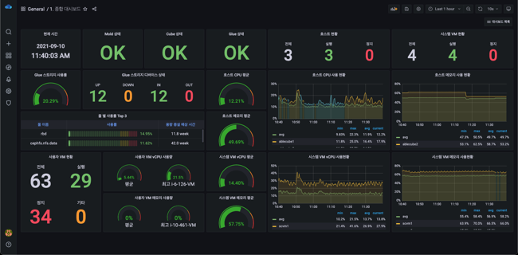

Wall은 '벽', '성벽' 등의 뜻을 가진 단어로 건물 또는 도시의 내부에 있는 사람, 건물 등을 감시하고, 보호하는 목적으로 만들어집니다. ABLESTACK의 Wall은 HCI 인프라와 가상머신, 그리고 각종 애플리케이션을 모니터링하고, 필요시 알람을 제공하는 등의 감시 및 보호를 위한 모니터링 플랫폼입니다.

Wall은 ABLESTACK 설치 시 마법사에 의해 설치되는 모니터링 플랫폼으로, ABLESTACK을 구성하는 호스트 및 호스트에서 실행되는 서비스, 그리고 가상머신에 대한 실시간 모니터링 및 알람을 제공합니다.

## Wall의 설계 목표

Wall은 오픈소스 대시보드 프로젝트인 Grafana를 커스터마이징 하여 제공됩니다.

Wall은 시계열 데이터베이스인 Prometheus를 기반으로 데이터를 쿼리하고, 시각화 하고, 경고하는 모니터링 플랫폼입니다. Wall은 유연한 대시보드를 통해 모든 데이터를 생성, 탐색 및 공유할 수 있습니다.

### 플랫폼 제공 목적

Wall은 ABLESTACK을 기반으로 클라우드 서비스를 제공하는 관리자 및 해당 서비스를 사용해 가상자원을 배포하는 사용자에 대해 다음과 같은 목적을 위해 제공됩니다.

* **관리자**
    * 전반적인 ABLESTACK 인프라에 대한 대시보드 제공
    * ABLESTACK을 구성하는 Cube Host에 대한 실시간 모니터링 및 알람
    * ABLESTACK을 구성하는 각종 컨트롤 가상머신에 대한 실시간 모니터링 및 알람
    * ABLESTACK 상에서 실행 중인 가상머신의 실행 상태에 대한 모니터링 및 알람
    * 관리자 레벨에서 실행 중인 각종 애플리케이션에 대한 모니터링

* **사용자**
    * 사용자가 생성한 가상머신에 대한 실시간 모니터링
    * 사용자 레벨에서 실행 중인 각종 애플리케이션에 대한 모니터링

Wall은 위와 같은 관리자 및 사용자에 대한 모니터링 제공을 위해 ABLESTACK을 설치하면서 기본적으로 구성되는 플랫폼과 서비스 형식으로 실행되는 사용자의 요청에 의해서 실행되는 플랫폼으로 나누어 제공됩니다.

### 주요 특징 및 기능

Wall은 효과적인 모니터링 및 알람 제공을 위해 다음과 같은 주요 특징을 보유하고 있습니다.

* 패널 단위의 데이터 통합 : 다양한 모니터링 요소를 데이터소스로부터 가여와 시각화하고, 원하는대로 커스터마이징 할 수 있습니다.
* 조직별 모니터링 관리 : 조직별로 모니터링 영역을 관리할 수 있으며, 누구나 볼 수 있도록 권한을 조정할 수 있습니다.
* 유연성 및 다용성 : 다양한 데이터소스로 시각화를 할 수 있고, 다양한 대시보드를 사용자가 직접 만들 수 있습니다.
* 다양한 플러그인 : 다양한 애플리케이션에 대한 모니터링을 위한 플러그인을 제공합니다.

Wall은 배포와 동시에 다음과 같은 모니터링 기능을 지원합니다.

* 대시보드 : ABLESTACK을 구성하는 모든 구성요소에 대한 통합 현황을 보여줍니다.
* 호스트 종합 현황 : ABLESTACK을 구성하는 호스트에 대한 정보를 요약하여 보여줍니다.
* 호스트별 상세 현황 : 각각의 호스트에 대한 상세 현황을 보여줍니다.
* 스토리지센터 가상머신 상세 현황 : 스토리지 컨트롤러 가상머신의 상세 현황을 보여줍니다.
* 클라우드센터 가상머신 상세 현황 : 클라우드센터 가상머신의 상세 현황을 보여줍니다.
* 사용자 가상머신 종합 현황 : 사용자 가상머신의 현황을 요약하여 보여줍니다.
* 사용자 가상머신별 상세 현황 : 각각의 사용자 가상머신의 현황을 상세하게 보여줍니다.

Wall은 다음의 자원에 대한 이메일 알람을 기본적으로 제공합니다. 기본값으로 설정되어 있는 알람 임계치는 다음과 같습니다.

| 자원구분      | 항목             | 알람 임계치                |
| ----------- | -------------   | -----------------        |
|

## 아키텍처

### 소프트웨어 구성

### 네트워크 구성

### 사용자 서비스 구성

## 동작 방식

### 관리자 모니터링

### 임계치 알람

### 사용자 애플리케이션 모니터링