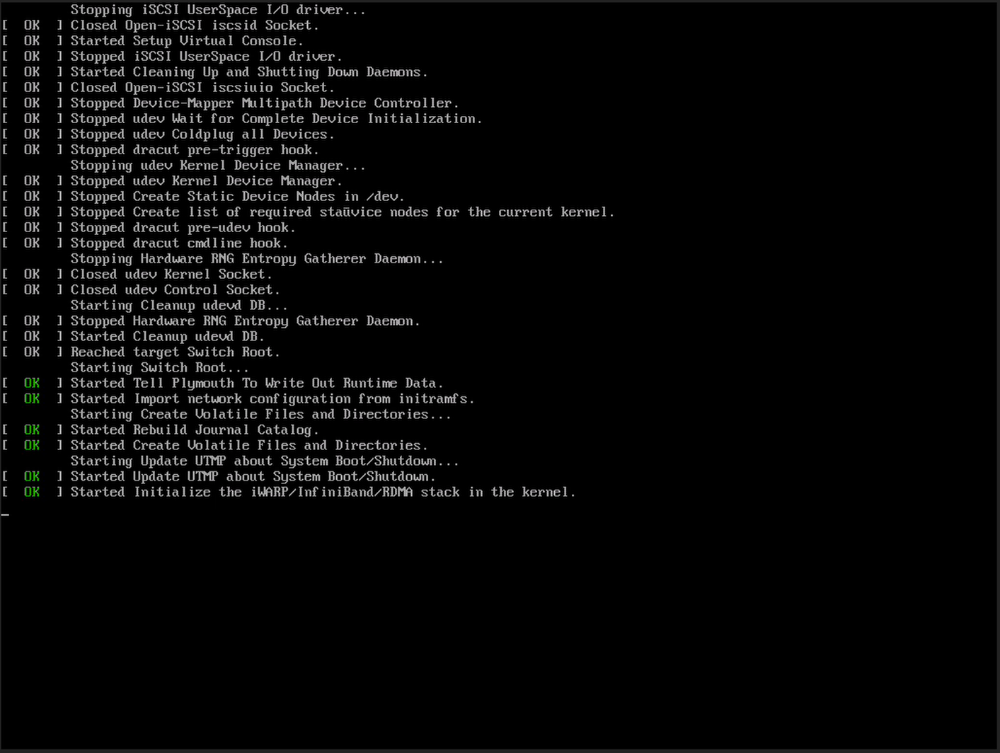
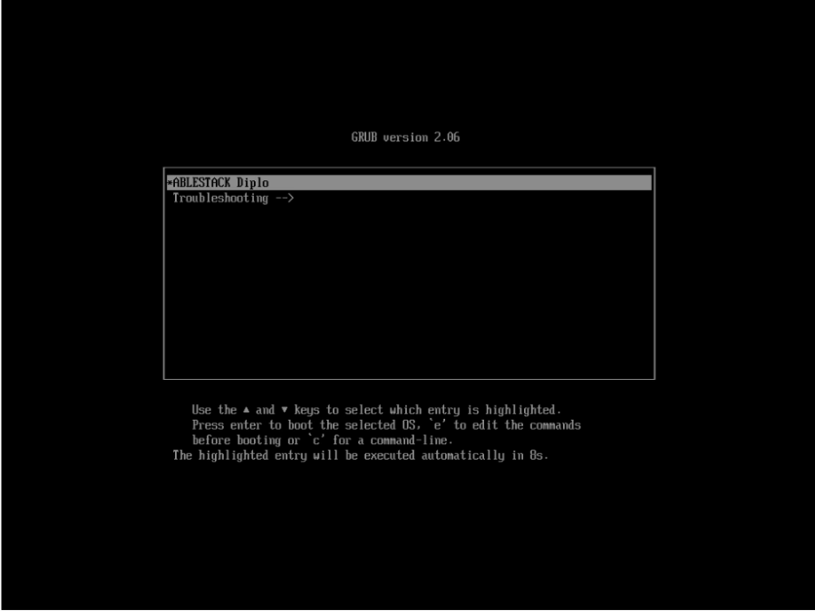
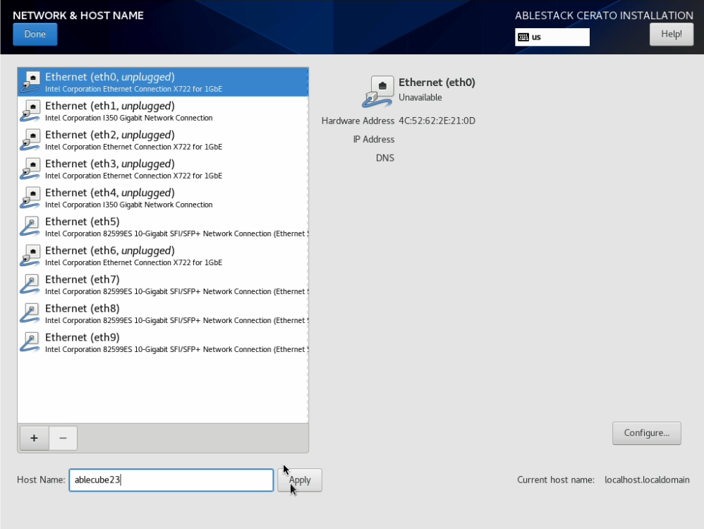
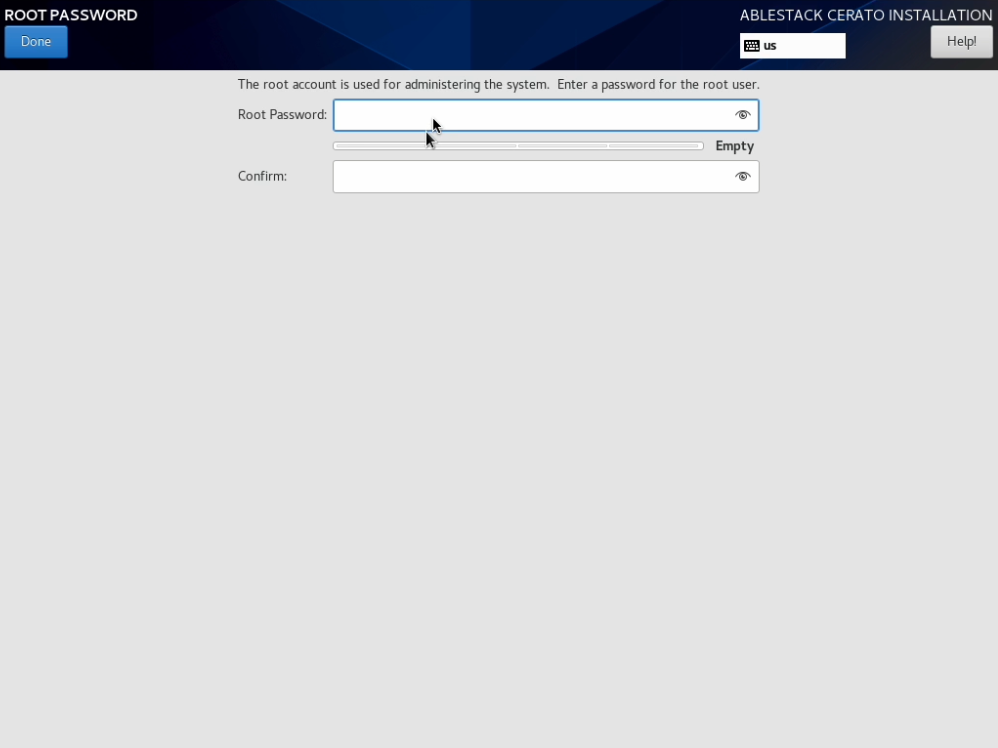
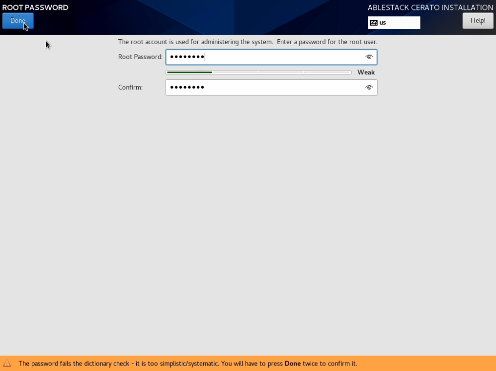
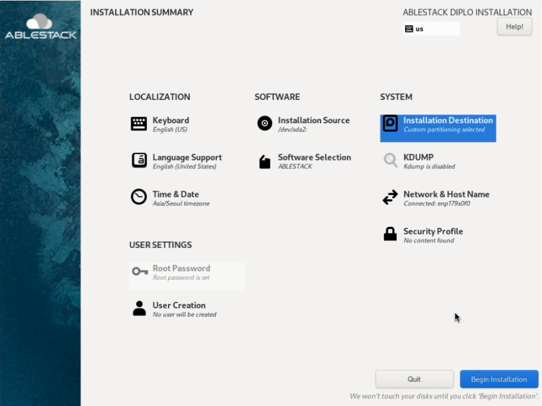
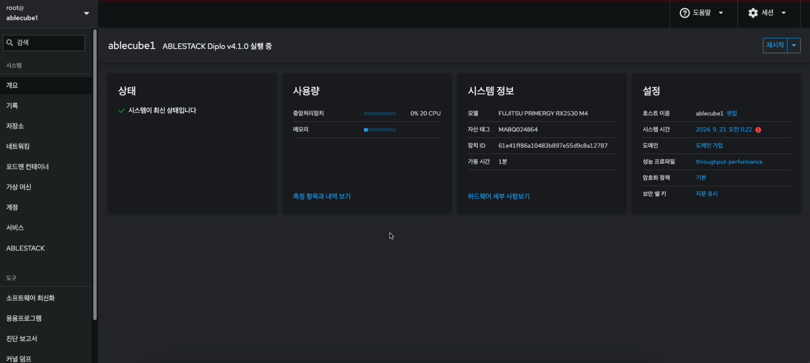
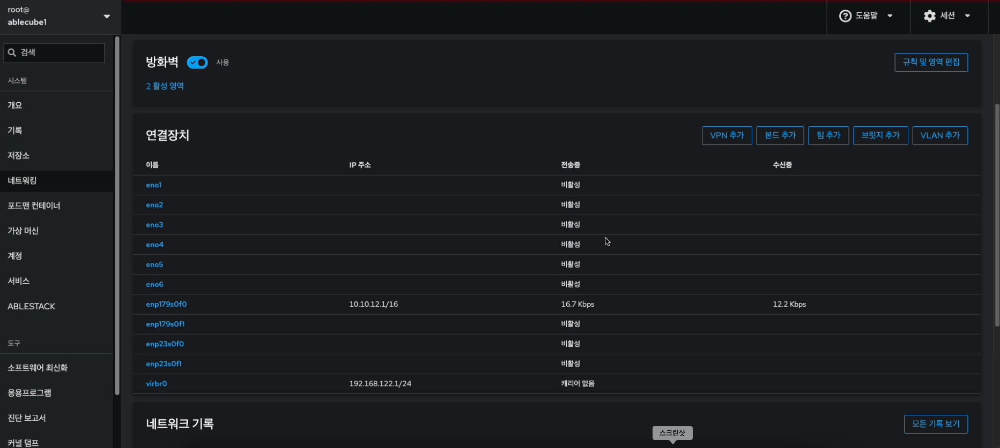
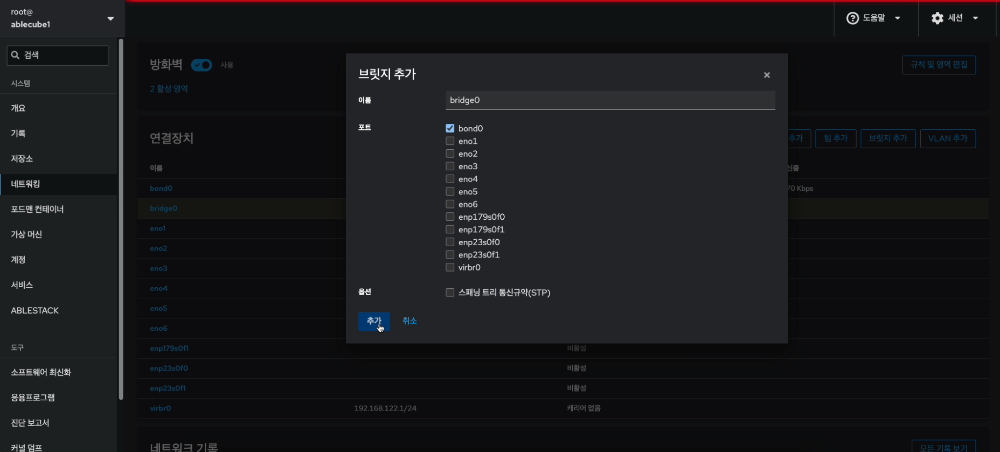
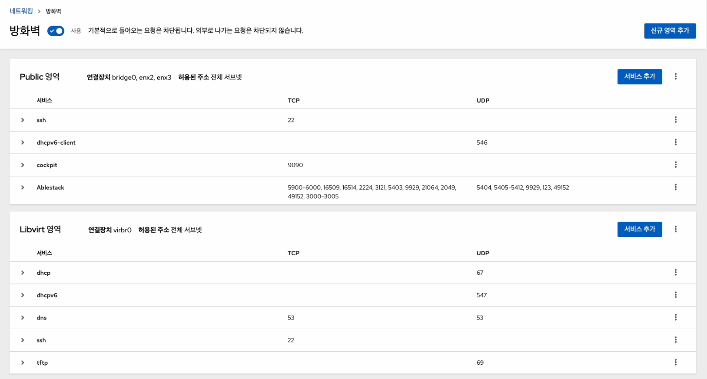

!!! danger
    이 문서는 기술지원 용도의 문서입니다. 기술지원 엔지니어가 아닌 사용자가 조작할 때 시스템에 문제가 발생할 수 있습니다.

# ABLESTACK Cube 설치진행
ABLESTACK Cube를 설치 진행 가이드 입니다.  
해당 가이드는 기본적으로 Linux 계열의 OS 설치 경험이 없어도 설치 할 수 있는 쉬운 사용자 경험을 제공 하나 기본적인 Linux 계열의 OS 이해도를 가지고 있으면 조금더 쉽게 설치가 가능합니다. 

!!! info
    - 해당 문서는 사용자의 네트워크 환경 및 설정 정보를 고려하지 않고 작성된 문서 입니다. 이 문서를 기준으로 활용을 하셔야 하며 수정 및 변경 할 부분은 **강조** 표시를 해두었습니다.
    - ABLESTACK Cube 설치시 ABLESTACK Cell이 동시에 설치가 진행되며, ABLESTACK Cell의 설치가이드는 따로 제공 되고 있지 않습니다. 

!!! 사전준비내용 info
    - ABLESTACK 설치용 ISO 또는 ABLESTACK 설치용 USB  
    - 호스트의 Manage Network 대역에 접근 가능한 Desktop 또는 Notebook
    - Manage Network IP(ABLESTACK은 Manage Network IP를 호스트 1대당 3개의 IP를 필요로 하고 있습니다.)

!!! tip
    ABLESTACK 설치용 ISO파일을 노트북이나 데스크탑에 가지고 있는 상태에서 호스트의 IPMI Port에 통신이 가능하면 IPMI Console을 이용하여 3대의 호스트에 ABLESTACK Cube를 동시에 설치 가능합니다.

## ABLESTACK Cube 설치 진행 가이드

1. ABLESTACK ISO 또는 USB를 이용한 부팅 화면 입니다.
    { align=center }
   
2. 부팅 완료 후 ABLESTACK 설치 메뉴 화면 입니다.  
    정상적으로 ISO 또는 USB를 이용하여 정상적으로 부팅되면 아래와 같은 이미지의 화면으로 전환됩니다.
    { align=center }
   
    !!! Check
        화면에서 **Install ABLESTACK Bronto (v2.0.0)** 메뉴가 보이는지 확인해야합니다. 해당 메뉴가 보이면 ABLESTACK Cube 정상적으로 설치를 하실 수 있습니다.
        만약에 해당 메뉴가 보이지 않는다면 정상적으로 부팅이 안된경우 이므로 다시한번 부팅을 진행하셔야 합니다.
        다시 한번 부팅해도 해당 메뉴가 보이지 않는다면 ISO의 손상을 의심하셔야 합니다.
   
3. ABLESTACK Cube 구성 화면 입니다.
    { align=center }  

    !!! info
        ABLESTACK Cube는 기본적인 정보는 자동으로 설정이 되어 있습니다.  
        **설치 대상, 네트워크 및 호스트 이름, Root 암호** 항목에 대해서만 설정하시면 됩니다.  
        - Keyboard, 언어 지원, 시간 및 날짜, 설치 소스, 소프트웨어 선택, KDUMP, 보안 정책 항목은 수정하실 필요가 없습니다.
   
    !!! Tip
        설정정보 입력시 '네트워크 및 호스트 이름' > '설치 대상' > 'Root 암호' 순서대로 설정하시는것을 추천드립니다.  
        이유는 설치 대상의 파티션 구성시 호스트의 이름이 설정 정보에 입력이 되기 때문입니다.
   
4. 네트워크 및 호스트 이름 구성변경 화면
    - ABLESTACK Cube 구성화면에서 **네트워크 및 호스트 이름** 을 클릭하면 해당 화면으로 이동됩니다. 
 
    { align=center }
    
   
    !!! note 
        네트워크의 목록 및 장치명 등은 물리적 네트워크의 구성과 하드웨어 벤더사에 따라 다르게 표기될 수 있습니다.
   
        아래 설정은 순서는 상관없이 진행이 가능합니다.
    1. 호스트 이름 설정  
        { align=center }
        * Host name에 hostname을 입력합니다.
        !!! Tip
            일반적으로 호스트명은 "ablecube1"과 같이 ablecube + 호스트넘버링 형태로 지정하면 향 후 관리가 용이합니다. 
        * 적용 버튼을 클릭하여 Host name을 적용합니다.
        * 적용된 Host name이 정상적으로 현재 호스트 이름에 표시 되는지 확인합니다.
    2. NIC 자동활성화 설정 및 IP 셋팅 
        * 네트워크 목록에서 관리 네트워크를 선택합니다.
        !!! note
            해당 네트워크는 관리네트워크로 사용할 네트워크 입니다.  
            연결(케이블링)된 네트워크 인터페이스 중 관리네트워크로 구성할 네트워크를 선택합니다.
        
        { align=center }

        * 우측 하단의 설정버튼을 클릭하여 편집 화면을 띄운 후 **일반** 설정탭으로 이동합니다.
        * **Connect automatically with priority** 항목을 체크합니다.
        !!! info
            해당 설정은 호스트 재부팅 시에도 해당 NIC가 자동으로 활성화(ONBOOT=yes) 하기 위함입니다. 
            만일 해당 설정을 적용하지 못했거나 재부팅 후 NIC가 활성화 되지 않을 경우에는 호스트에 직접 접속해서 해당 NIC를 활성화 시켜야 합니다.
        
        
        { align=center }

        * **IPv4** 설정탭으로 이동합니다.
        * **Method** 선택박스에서 **수동** 으로 변경합니다.
        * **Add** 버튼 클릭하여 **IP주소, 넷마스크, 게이트웨이, DNS Server** 를 입력하고 버튼을 클릭합니다.
        * 저장 후 **완료** 버튼을 클릭하여 네트워크 및 호스트 이름 구성을 완료 합니다.
        !!! note
            위 이미지 및 IP 정보는 예제 입니다.  
            해당 IP 셋팅은 ABLESTACK을 구성하는 사이트 환경에 맞춰서 IP를 변경해야 하며 사이트에서 사용하는 DNS server가 별도로 있을경우 해당 DNS server로 변경가능합니다.

    3. NIC enable 
        { align=center }
        * 우측상단 활성화버튼을 **켬** 으로 변경합니다.
    
          
5. 설치 대상 구성 화면
    - ABLESTACK Cube 구성화면에서 **설치 대상** 을 클릭하면 해당 화면으로 이동됩니다.  

    { align=center }
    
    !!! note
        디스크 장치 목록은 디스크 구성 및 종류,수량에 따라 다르게 표시될 수 있습니다. 
    * 디스크 목록 중 ABLSTACK Cube OS 가 설치될 디스크를 선택하시고 나머지 디스크는 모두 선택을 해제합니다.
  
    !!! check
        설치 대상 디스크 이외의 모든 디스크는 반드시 선택 해제를 해야합니다. 
        스토리지 구성단계에서 해당 디스크를 사용할 수 없게 될 수도 있습니다.
  
    * 저장소 구성항목을 **Custom** 을 선택한 후 완료를 클릭합니다. 
       
    { align=center }

    * **여기를 클릭하여 자동으로 생성합니다. (C)** 을 클릭하면 해당화면으로 이동됩니다    

    1. 파티션 구성 화면 1-2
        { align=center }
        * 해당 화면은 파티션을 구성하는 화면입니다.  
        * **/home** 파티션 선택 후 아래 **-** 버튼을 클릭하여 home 파티션을 삭제합니다.
    2. 파티션 구성 화면 2-2
        { align=center }
        * **/(root파티션)** 파티션 선택 후 **희망 용량 (C):** 의 입력 값에 1000 GiB(총용량 보다 많은 사이즈)를 입력 후 **설정 업데이트 (U)** 버튼을 클릭하여 파티션 용량 재설정 합니다.
        * 파티션 구성 완료 후 **완료(D)** 버튼을 클릭하여 파티션 설정을 마무리 합니다.
    
    !!! Tip
        **/(root파티션)** 파티션의 **희망 용량** 입력시 하단 왼쪽에 나와있는 **사용 가능한 공간** 의 용량을 입력하면 필수 구성 파티션을 제외한 나머지 용량이 **/(root파티션)** 에 할당이 됩니다.

6. Root 암호 설정 화면
    { align=center }
    - ABLESTACK Cube 구성화면에서 **Root 암호** 를 클릭하면 해당 화면으로 이동됩니다.
    
    !!! caution
        root의 암호를 잊어버리게 되면 시스템에 로그인을 할 수가 없습니다.  
        해당 암호를 잊어버리면 별도의 절차를 이용하여 암호를 복구하셔야 합니다. 
        또한 해당 암호는 ABLESTACK Cube 웹콘솔에 로그인시 사용됩니다.

    - Root 암호 설정
        { align=center }
        - **Root 암호 (R):** 입력 창에 암호를 입력 하고 동일한 암호를 **확인 (C)** 입력 창에 입력합니다.
        - 암호를 입력하고 **완료(D)** 버튼을 눌러 Root 암호 설정을 마무리 합니다.
    
7. ABLESTACK Cube 구성 마무리
    { align=center }
    - ABLESTACK Cube 설정 완료 후 **설치 시작(B)** 버튼을 클릭하여 ABLESTACK 설치를 진행 합니다.
    
    { align=center }
    
    - 설치시간은 설치 환경에 따라 다소 상이할 수 있습니다.
    - 설치가 완료가 되면 자동으로 재부팅 절차가 진행되며 연결되여 있는 ABLESTACK ISO 또는 USB를 제거 한 후에 ABLESTACK Cube설치를 마무리 합니다.

    { align=center }
    - 설치가 정상적으로 완료되고 재부팅이 되면 ABLESTACK 콘솔 로그인 화면이 보이게 되며 이 후 과정은 웹을 통하여 진행됩니다.
  
## ABLESTACK Cube Network 셋팅

!!! info
    이 문서는 설치와 관련된 정보만 작성되여 있습니다.  
    Cube의 다른 메뉴의 정보는 "관리가이드 > Cube 가이드" 를 참조하시기 바랍니다.

1. ABLESTACK Cube 로그인
    { align=center }
    - ABLESTACK Cube 로그인 화면입니다. 
    - 접속 URL은 **호스트IP:9090** 입니다
    - 사용자 이름은 **root** 를 암호는 ABLESTACK Cube 설치시 입력한 암호를 입력하고 **로그인** 버튼을 클릭하면 로그인 하실 수 있습니다.
    
2. ABLESTACK Cube 메인 화면
    { align=center }
    - ABLESTACK Cube 로그인 후 화면입니다.
    
    

3. ABLESTACK Cube 네트워킹 구성
    { align=center }
    - ABLESTACK Cube 네트워킹 구성 화면입니다.  해당 화면에서 방화벽 설정 및 본드(bond), 브릿지(bridge), VLAN 구성을 진행합니다.
    
    !!! note 
        인터페이스 목록 및 IP주소 등은 물리적 네트워크의 구성과 하드웨어 벤더사 및 초기 설정한 IP주소에 따라 다르게 표기될 수 있습니다.
    
    !!! info
        해당 문서의 네트워크 구성은 기본적인 네트워크 구성입니다. 
        이 문서를 바탕으로 설치 사이트에 맞게 구성을 변경 및 IP 주소를 입력 하셔야 합니다.
        
        그리고 본드(bond) 구성이 필요한 경우 본드(bond)구성 완료 후 진행하셔야 합니다.
        현재 과정에서는 Management Network에 대한 본드 구성 혹은 Storage Network 구성이 Bridge일 경우에만 본드 구성을 진행하며
        Storage Network가 NIC pass-through 일 경우에는 SCVM 구성완료 후 해당 가상머신에서 본드 구성을 진행합니다.

        **본 설치 가이드는 Storage Network가 NIC pass-through 이며, 본드구성 없이 단일 NIC로 구성된 형태 입니다.**
   
    1. Management Network 브릿지 설정
        { align=center }
        - 화면 중간 버튼그룹 중 **브릿지 추가** 버튼을 클릭하면 보이는 화면이며, 브릿지를 설정하는 팝업 화면입니다.
        - 브릿지 이름을 **bridge0** 을 입력해주고, 포트는 **Management NIC(Cube OS 설치 시 Management IP를 설정했던 포트(인터페이스))** 를 선택하고 **적용** 버튼을 클릭합니다.
        
        !!! info
            해당 과정은 물리적인 Management Network를 SystemVM 및 다른 가상머신에서 사용할 수 있게 브릿지를 하는 과정입니다.
            
            브릿지의 IP 설정은 ABLESTACK Cube 구성하면서 입력된 IP 정보가 상속되여 자동으로 설정됩니다.
    
    2. Public Storage Network 설정
        { align=center }
        - Public Storage Network 설정하기 위한 절차 입니다. 네트워킹 화면에서 **Public Storage** 로 사용할 NIC를 클릭하여 들어온 화면입니다.  

        
        1. Public Storage Network IP 설정
            { align=center }
            - IPv4 항목의 **편집** 버튼을 눌러 들어온 IPv4 설정 화면입니다.
            - 주소 입력 창의 오른쪽에 있는 **자동(DHCP)** 선택 박스를 눌러 **수동** 으로 변경을 합니다.
            - **Adress** 입력창에 **100.100.1.1** 을 입력하고, **접두 길이 또는 넷마스크** 입력창에 **24** 를 입력하고 **적용** 버튼을 클릭합니다.
            !!! note
                Storage Network에서 사용하는 IP는 내부적으로만 통신하기 위한 IP입니다.
                
                일반적으로 ABLESTACK에서는 100.100.OOO(Management와 동일한 C클래스를 사용).OOO(호스트와 동일한 Host ID 사용)로 구성됩니다.
                만약 스위치를 혼용해서 사용하고 해당 IP 대역이 기존 내부 네트워크와 겹쳐서 충돌이 발생될 수 있을 경우에는 사용하지 않는 대역으로 변경해야 합니다.

        2. Public Storage Network MTU 설정
            { align=center }
            - MTU 항목의 **편집** 버튼을 눌러 들어온 MTU 설정 화면입니다.
            - 라디오 버튼을 **설정** 으로 선택하고 입력값을 **9000** 으로 입력 후에 **적용** 버튼을 클릭합니다.

        3. Public Storage 자동연결 및 활성화 설정
            { align=center }
            - **자동으로 연결** 체크박스 체크 및 NIC 활성화 라디오 버튼 활성화

    3. 방화벽 설정
        { align=center }
        - 방화벽을 설정하기 위한 절차 입니다. 네트워킹 화면에서 방화벽 세션에서 **규칙 및 영역 편집** 을 클릭하여 들어온 화면입니다.
        
         

        1. ABLESTACK 방화벽 설정
            { align=center }
            - 방화벽 설정 화면에서 **서비스 추가** 버튼을 클릭하여 들어온 화면 입니다.
            - 서비스 목록에서 **Ablestack** 체크를 선택하고 **서비스 추가** 버튼을 클릭하여 방화벽을 추가합니다.
            - 인터넷이 안되는 환경에서 scvm, ccvm의 gateway는 필수가 아닌 선택으로 입력될 수 있도록 변경하였습니다.

!!! info
    ABLESTACK 클러스터는 최소 3식이상의 호스트로 구성되어야 합니다.
    이 문서에서는 3식의 호스트를 기준으로 가이드가 되어있으며 만약 4식이상의 호스트로 구성된다면 호스트 구성 작업을 반복하면 됩니다.
    ABLESTACK Cube 설치 진행절차는 2번, 3번 호스트도 동일합니다. 위 설치 절차를 2번, 3번 호스트에도 진행하시기 바랍니다.

!!! check
    ABLESTACK Cube 및 ABLESTACK Cell의 설치 및 구성이 끝났습니다.
    ABLESTACK Glue 및 ABLESTACK Mold는 ABLESTACK 메뉴에서 구성이 가능하며, 다음 설치 가이드를 보고 따라가시면 됩니다.