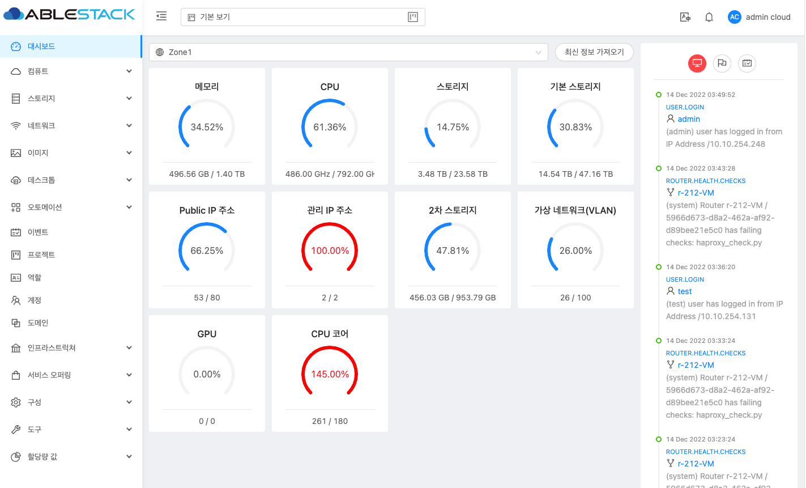
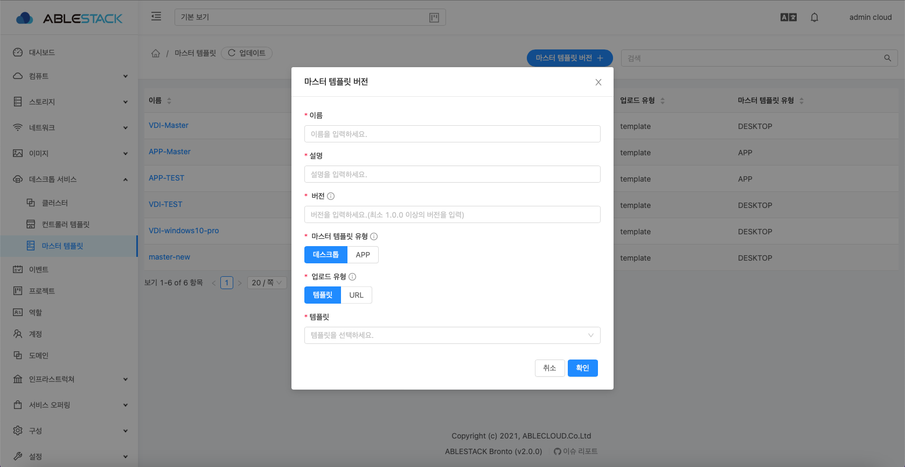

!!! danger
    이 문서는 기술지원 용도의 문서입니다. 기술지원 엔지니어가 아닌 사용자가 조작할 때 시스템에 문제가 발생할 수 있습니다.

# ABLESTACK Works 구성진행
ABLESTACK Works 설치 진행 가이드 입니다.  
ABLESTACK Mold 의 **데스크톱 서비스** 를 이용하여 진행이 되며 **데스크톱 서비스** 메뉴는 **Mold > 구성 > 글로벌 설정** 에서 **cloud.desktop.service.enabled** 항목을 
**true** 로 값을 변경 하고 ABLESTACK Mold 를 재시작 하면 **데스크톱 서비스** 메뉴가 활성화 됩니다. 

## Mold 에서의 데스크톱 서비스 배포

[//]: # (![Wall 모니터링 구성]&#40;../assets/images/install-guide-wall-deploy.png&#41;{ align=center })

[//]: # (- 모니터링센터를 구성하기 위한 화면입니다. 상단 상태 리본의 모니터링센터 구성 링크를 클릭합나다.)

1. Mold 글로벌 설정 변경
    { align=center }
    - 구성 > 글로벌 설정 화면에서 **cloud.desktop.service.enabled** 검색하여나오는 항복의 값을 false 에서 true 로 변경
    - ABLECLOUD Mold 재기동 진행
    { align=center }
    - 데스크톱 서비스 메뉴 활성화 화면

2. 컨트롤러 템플릿 생성
    { align=center }  
    { align=center }
    - **이름** 입력창에는 컨트롤러 템플릿 이름을 입력 합니다.
    - **설명** 입력창에는 컨트롤러 템플릿 설명을 입력 합니다.
    - **버전** 입력창에는 컨트롤러 템플릿 버전을 입력 합니다.
    - **업로드 유형** 선택창에서는 템플릿 또는 URL 을 선택 합니다.
        - **템플릿** 선택은 기존에 Mold 에 등록된 템플릿에서 컨트롤러 템플릿을 선택 할 수 있습니다.
            - **DC 템플릿** 선택창에서는 Mold 에서 등록된 DC 용 템플릿을 선택 할 수 있습니다.
            - **Works 템플릿** 선택창에서는 Mold 에서 등록된 Works 용 템플릿을 선택 할 수 있습니다.
        - **URL** 선택은 웹에서 컨트롤러 템플릿을 다운로드 하여 등록 할 수 있습니다.
            - **Zone** 선택은 Mold 인프라스트럭쳐에서 구성된 Zone 을 선택 할 수 있습니다.
            - **하이퍼바이저** 선택은 Mold 인프라스트럭쳐에서 구성된 Zone 의 하이퍼 바이저를 선택 할 수 있습니다.
            - **형식** 등록 하는 템플릿의 형식을 선택 할 수 있습니다.
            - **DC VM 템플릿 업로드 URL** 입력창에는 DC 용 템플릿 다운로드 URL 을 입력 할 수 있습니다.
            - **DC VM OS 유형** 선택창은 DC 용 템플릿의 OS 타입을 선택 할 수 있습니다.
            - **Works VM 템플릿 업로드 URL** 입력창에는 Works 용 템플릿 다운로드 URL 을 입력 할 수 있습니다.
            - **Works VM OS 유형** 선택창은 Works 용 템플릿의 OS 타입을 선택 할 수 있습니다.
    - 입력 및 선택 항목을 확인 후 에 **다음** 버튼을 클릭하여 컨트롤러 템플릿을 등록 합니다.

3. 마스터 템플릿 생성
   { align=center }
   { align=center }
    - **이름** 마스터 템플릿 이름을 입력 합니다.
    - **설명** 마스터 템플릿 설명을 입력 합니다.
    - **버전** 마스터 템플릿 버전을 입력 합니다.
    !!! info
        버전 입력 양식은 **숫자** 와 **점(.)** 으로 입력 가능하며, 최소 **1.0.0** 이상의 버전을 입력 하여야 합니다.
    - **마스터 템플릿 유형** 데스크톱 또는 APP 을 선택 할 수 있습니다.
    - **업로드 유형** 선택창에서는 템플릿 또는 URL 을 선택 합니다.
        - **템플릿** 선택은 기존에 Mold 에 등록된 템플릿에서 컨트롤러 템플릿을 선택 할 수 있습니다.
            - **템플릿** 선택창에서는 Mold 에서 등록된 Desktop 용 템플릿을 선택 할 수 있습니다.
        - **URL** 선택창에서는 웹에에서 다운로드 가능한 Desktop 용 템플릿을 등록 할 수 있습니다.
            - **URL** 입력창에는 웹에서 Desktop 템플릿을 다운로드 주소를 입력 합니다.
            - **Zone** 선택창에는은 Mold 인프라스트럭쳐에서 구성된 Zone 을 선택 합니다.
            - **하이퍼바이저** 선택창에는 Mold 인프라스트럭쳐에서 구성된 Zone 의 하이퍼 바이저를 선택 합니다.
            - **형식** 입력창에는 등록 하는 템플릿의 형식을 선택 합니다.
            - **OS 유형** 선택창은 Desktop 용 템플릿의 OS 타입을 선택 할 수 있습니다.
    - 입력 및 선택 항목을 확인 후 에 **다음** 버튼을 클릭하여 컨트롤러 템플릿을 등록 합니다.
    
4. 데스크톱 클러스터 배포
    { align=center }
    - **이름** 입력창에는 배포할 데스크톱 클러스터의 이름을 입력 합니다.
    - **설명** 입력창에는 배포할 데스크톱 클러스터의 설명을 입력 합니다.
    - **AD 도메인명** 입력창에는 배포할 데스크톱 클러스터의 Activity Domain 명을 입력 합니다.
    - **컨트롤러 템플릿 버전** 선택창에는 컨트롤러 템플릿 메뉴에서 등록한 템플릿을 선택 합니다.
    - **컴퓨트 오퍼링** 선택창에는 배포할 클러스터의 오퍼링을 선택 합니다.
    - **네트워크** 선택창에는 클러스터를 배포할 네트워크를 선택 합니다.
    !!! info
        데스크톱 클러스터는 **isolated** 네트워크에서만 배포가 가능하며, 1개의 네트워크에는 1개의 데스크톱 클러스터만 배포 할 수 있습니다.
    - **Works VM IP** 입력창에는 Works VM의 IP를 입력 합니다.
    - **DC VM IP** 입력창에는 DC VM의 IP를 입력 합니다.
    !!! info
        Works VM, DC VM 의 IP 는 위에서 선택한 네트워크 선택창에서 선택한 네트워크의 CIDR 의 범위안에 IP 를 입력 해야합니다.
    - 입력 및 선택 항목을 확인 후에 **다음** 버튼을 클릭하여 데스크톱 클러스터 배포를 진행 합니다.

[//]: # ()
[//]: # (5. 모니터링센터 대시보드 구성 진행)

[//]: # (    ![모니터링센터 대시보드 구성 진행]&#40;../assets/images/install-guide-wall-deploy-execute.png&#41;{ align=center })

[//]: # (    - 모니터링센터 대시보드 구성을 진행하는 화면입니다.)

[//]: # (    - **실행** 버튼을 클릭하여 모니터링센터 구성을 진행합니다.)

[//]: # ()
[//]: # (6. 모니터링센터 구성 진행 단계 확인)

[//]: # (    ![모니터링센터 구성 진행 단계 확인]&#40;../assets/images/install-guide-wall-deploy-progress.png&#41;{ align=center })

[//]: # (    - 모니터링센터 대시보드 구성 진행 현황을 확인하는 화면입니다.)

[//]: # ()
[//]: # (    !!!info)

[//]: # (        구성 진행 중 실패할 경우 X 버튼을 클릭하여 모니터링센터 구성 마법사를 닫으신 후, 상단 상태 리본의 모니터링센터 구성 링크를 클릭하여 처음부터 다시 진행가능 합니다.)

[//]: # ()
[//]: # (7. 모니터링센터 구성 진행 완료)

[//]: # (    ![모니터링센터 구성 진행 완료]&#40;../assets/images/install-guide-wall-deploy-complete.png&#41;{ align=center })

[//]: # (    - 모니터링센터 대시보드 구성 완료 화면입니다.)

[//]: # ()
[//]: # (8. 모니터링센터 구성 완료)

[//]: # (    ![모니터링센터 구성 완료]&#40;../assets/images/install-guide-wall-deploy-end.png&#41;{ align=center })

[//]: # (    - 모니터링센터 구성 진행 완료 후 화면입니다.)

[//]: # (    - **모니터링센터 대시보드 연결** 버튼을 클릭하여 모니터링센터 대시보드 Wall 웹콘솔로 접근 가능합니다.)

[//]: # ()
[//]: # (9. Wall 웹 콘솔 접속)

[//]: # (    ![모니터링센터 구성 완료]&#40;../assets/images/install-guide-wall-login.png&#41;{ align=center })

[//]: # (    - wall_mngt_ip:3000/login 으로 접속하시면 로그인 페이지를 확인할 수 있습니다.)

[//]: # (    )
[//]: # (10. Wall 메인 대시보드 )

[//]: # (    ![모니터링센터 구성 완료]&#40;../assets/images/install-guide-wall-main-page.png&#41;{ align=center })

[//]: # (    - 로그인 완료 후에 메인 대시보드 화면이 나타납니다.)

[//]: # (    - Wall 모니터링센터 구성이 완료되면, 해당 화면이 출력 됩니다.)