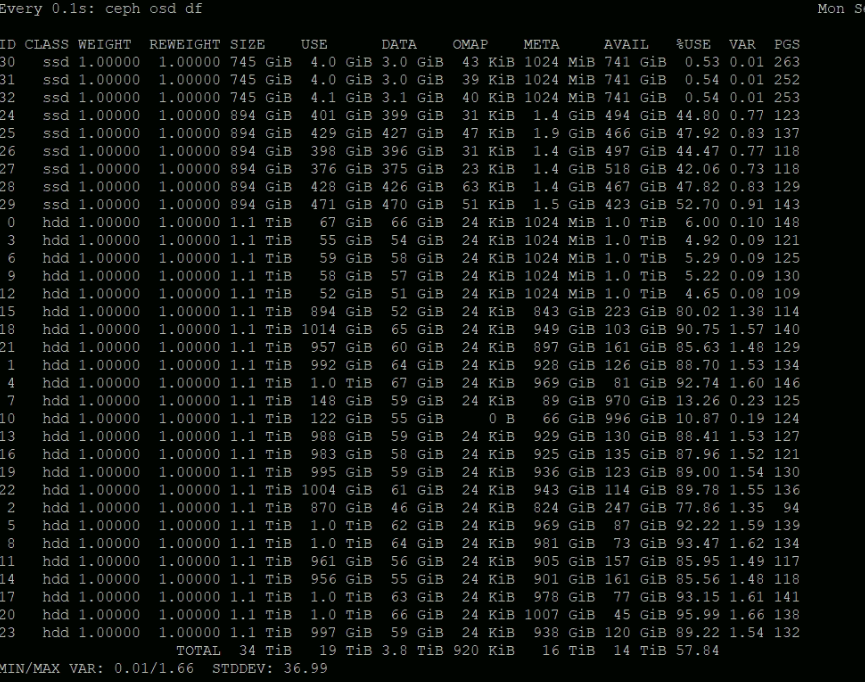

# 문제유형

### 2차스토리지 연결이 안되는 현상

[<span style="color:#ff9900;">문제유형</span>]

<span style="color:gray;font-weight:bold">
초기 구성 혹은 운영 중 Secondary Storage VM Agent 상태가 "disconnect" 혹은 "Alert" 상태가 되어 2차 스토리지와 관련된 작업에 에러가 있거나 2차 스토리지 용량 표기가 안되는 현상
</span>

{ align=center }

 ssvm에 접속해서
 
 (접속하는 방법은 웹에서 웹콘솔로 접속하거나 ssvm 이 있는 호스트에 접속해서 virsh console s-oo-oo 로 접속) 

tail -f /var/log/cloud.log 를 확인하여 다음과 같은 에러메시지가 나온다면

에러메시지
!!! error
    Unable to start agent: Resource class not found: com.cloud.storage.resource.PremiumSecondaryStorageResource due to: java.lang.ClassNotFoundException: com.cloud.storage.resource.PremiumSecondaryStorageResource 

[<span style="color:#ff9900;">조치방법</span>]

/var/cache/cloud/cmdline  파일을 vi 편집기로 연 후에

!!! info "원본 cmdline 파일 내용"
    template=domP type=secstorage host=10.10.1.10 port=8250 name=s-4-VM zone=1 pod=11
    guid=s-4-VM workers=5 <span style="color:red">resource=com.cloud.storage.resource.PremiumSecondaryStoraa
    geResource</span> instance=SecStorage sslcopy=false role=templateProcessor mtu=1500 ethh
    2ip=10.10.1.22 eth2mask=255.255.0.0 gateway=10.10.0.1 public.network.device=eth22
    eth0ip=169.254.154.163 eth0mask=255.255.0.0 eth1ip=10.10.1.14 eth1mask=255.255..
    0.0 mgmtcidr=10.10.0.0/16 localgw=10.10.0.1 private.network.device=eth1 internall
    dns1=10.10.0.1 dns1=8.8.8.8 nfsVersion=nulll

resource 태그값을 수정
<span style="color:red">resource=com.cloud.storage.resource.PremiumSecondaryStorageResource</span>

-> <span style="color:blue">resource=org.apache.cloudstack.storage.resource.NfsSecondaryStorageResource</span>

!!! info "수정된 cmdline 파일 내용"
    template=domP type=secstorage host=10.10.1.10 port=8250 name=s-4-VM zone=1 pod=11
    guid=s-4-VM workers=5 <span style="color:blue">resource=org.apache.cloudstack.storage.resource.NfsSecondaryStorageResource</span> instance=SecStorage sslcopy=false role=templateProcessor mtu=1500 ethh
    2ip=10.10.1.22 eth2mask=255.255.0.0 gateway=10.10.0.1 public.network.device=eth22
    eth0ip=169.254.154.163 eth0mask=255.255.0.0 eth1ip=10.10.1.14 eth1mask=255.255..
    0.0 mgmtcidr=10.10.0.0/16 localgw=10.10.0.1 private.network.device=eth1 internall
    dns1=10.10.0.1 dns1=8.8.8.8 nfsVersion=nulll

혹은 다음의 스크립트 실행 - 해당부분을 바꿔주는 스크립트
``` shell
sed -i 's$resource=com.cloud.storage.resource.PremiumSecondaryStorageResource$resource=org.apache.cloudstack.storage.resource.NfsSecondaryStorageResource$' /var/cache/cloud/cmdline
```

수정한 후에 에이전트 재실행

``` shell
 systemctl restart cloud
```

### 디스크 장애(불량)으로 교체하는 방법

[<span style="color:#ff9900;">문제유형</sapn>]

<span style="color:gray;font-weight:bold">
디스크의 하드웨어 장애 혹은 논리적인 장애로 인하여 OSD가 정상적이지 않아 해당 OSD가 down 혹은 out 되고, 재시작이 안되는 현상
</span>

[<span style="color:#ff9900;">조치방법</span>]

SCVM에 접속하여 다음의 절차를 진행하여 교체

1. 장애가 발생한 OSD out
    ``` shell
    cehp osd out osd.{osd_id}
    ```
2. 해당 OSD 서비스를 정지
    ``` shell
    systemctl stop ceph-osd@{osd_id}
    ```
3. 해당 OSD를 포멧
    ``` shell
    ceph-volume lvm zap /dev/{device_id} --destroy
    ```
    
    !!! info
        해당 OSD가 어떤 디바이스인지 알기 위해서는 "ceph-volume lvm list"를 통하여 osd.id의 devices 정보를 확인
(osd 정보가 남아있을 경우 다음 4,5 절차 진행)       

4. 장애가 발생한 OSD를 제거
    ``` shell
    ceph osd rm osd.{osd_id}
    ```
5. 제거한 OSD를 Crushmap에서 제거   
    ``` shell
    ceph osd crush rm osd.{osd_id}
    ```
6. 제거한 OSD를 Auth에서 제거
   ``` shell
   ceph auth rm osd.{osd_id}
   ```

    !!! note
        디스크를 추가 시에는 해당 초기 구성방법에 따라 Raid에 인식이 되어야 하며 OS 상에서도 인식이 되어야 합니다
        경우에 따라서는 호스트 혹은 scvm의 재기동이 필요합니다.      
    
7. 추가된 디스크를 OSD로 배포
    
    !!! info
        7번의 절차는 ceph 계정으로 실행하여야 합니다. "su - ceph "

    ``` shell
    ceph-deploy osd create –-data /dev/{device_id} --bluestore {scvm이름}
    ```
    해당 작업 중에 다음과 같은 에러가 발생하는 경우에는
    !!! error
        [ceph_deploy.osd][DEBUG ] Deploying osd to scvm3 </br>
        [ceph_deploy.osd][ERROR ] RuntimeError: config file /etc/ceph/ceph.conf exists with different content; use --overwrite-conf to overwrite </br>
        [ceph_deploy][ERROR ] GenericError: Failed to create 1 OSDs
    "/etc/ceph/ceph.conf" 파일을 ceph 계정 홈 디렉토리(현재작업중인 디렉토리)로 복사(이미 있는경우 덮어쓰기)한 후에 다시 실행 합니다.    

8. 배포된 OSD를 풀에 추가
    ``` shell
    ceph osd crush move osd.{osd_id} host={host명}
    ```

    !!! info
        host명은 "ceph osd tree" 의 결과에서 host 항목의 이름입니다

9.  OSD에 가중치 할당(구 버전에서만 적용)
    ``` shell
    ceph osd crush reweight-subtree {pool-name} 1
    ```
10. 자동으로 밸런싱이 실행되며 완료 됩니다

### 기본스토리지 추가 시 RBD RADOS 시크릿 키 에러 발생 시

[<span style="color:#ff9900;">문제유형</span>]

<span style="color:gray;font-weight:bold">
기본스토리지 RBD 프로토콜 형태로 추가 시 RADOS 시크릿 오류로 추가가 되지 않는 현상
</span>

[<span style="color:#ff9900;">조치방법</span>]

RADOS 시크릿 키에 특수기호(/)가 포함될 경우 오류가 발생하며 이와 같은 경우에는 RADOS 시크릿 키를 새로 생성하여 입력하여야 합니다.

정상적인 시크릿 키 형식(예) : AQAi2gBhhph/HBAAf5MgATyuQPI6KaiBooyXzw== </br>
오류가 발생하는 시크릿 키 형식(예) : AQAY2gBhk7i<span style="color:red">/</span>OhAAoEUC5<span style="color:red">/</span>A9It2P2jQsJcJbMg==

시크릿 키를 새로 생성하는 방법은 다음과 같습니다.
!!! note
    기존에 생성되어 있는 admin 사용자는 수정 및 삭제가 불가능합니다.</br>
    새로운 사용자명으로 시크릿 키를 생성하고 만약 새로 생성된 시크릿 키에서도 특수기호(/)가 포함되어 있다면 해당 사용자명을 삭제 후 다시 생성하시면 됩니다

1. glue 관리 콘솔(scvm에 ssh로) 접속 합니다
2. 다음의 명령어롤 통하여 시크릿키 생성합니다.
``` shell
ceph auth get-or-create client.사용자명 mon 'allow *' osd 'allow *' mds 'allow *' mgr 'allow *'
```
3. 생성된 키를 확인 합니다.
``` shell
[client.ablecube]
	key = AQDkcBNhsEsFKBAAyuchQ6S+wfXaYk0S1M98vw==
```
4. 만일 생성된 키에 특수 문자(/)가 포함이 되어 있으면 다음의 명령어를 통하여 사용자를 삭제한 후 다시 생성합니다.
``` shell
ceph auth del client.사용자명
```
5. 생성된 시크릿 키를 복사하여 기본 스토리지 추가 시 사용합니다.
6. 기본 스토리지 추가 시 **RADOS 사용자** 항목에는 새로 생성한 사용자를 입력합니다.

### OSD META 용량이 (near)Full이 발생하는 경우

[<span style="color:#ff9900;">문제유형</span>]

<span style="color:gray;font-weight:bold">
실제 데이터 사용은 미비하나 META가 비정상적으로 많이 사용되어 OSD의 (near)Full 이 발생하는 현상
</span>

{ align=center }


[<span style="color:#ff9900;">조치방법</span>]

다음의 명령어를 통하여 OSD의 META Data를 정리합니다

``` shell
ceph tell osd.{osd.id} compact
```

만일 모든 OSD를 전체 정리가 필요하다면 다음의 명령어를 통하여 한번에 적용합니다.

``` shell
ceph tell osd.\* compact
```

### 스토리지 클러스터 상태가 reclaim 관련 Warn 인 경우

[<span style="color:#ff9900;">문제유형</span>]

<span style="color:gray;font-weight:bold">
스토리지 클러스터의 상태가 Warn 이고, 메시지가 "mons are allowing insecure global_id reclaim"로 나오는 경우
</span>

{ align=center }

Ceph 14.2.20 릴리스와 함께 Ceph 인증 프레임워크에서 보안 취약점이 해결되어 클러스터가 패치되면서 경고가 표시되는 현상

[<span style="color:#ff9900;">조치방법</span>]

다음의 명령어를 통하여 경고메시지를 예외처리 합니다.

``` shell
ceph config set mon mon_warn_on_insecure_global_id_reclaim false
ceph config set mon mon_warn_on_insecure_global_id_reclaim_allowed false
```
향 후 버전패치가 완료되는 경우에는 다음의 명령어를 통하여 경고를 활성화 합니다

``` shell
ceph config set mon mon_warn_on_insecure_global_id_reclaim true
ceph config set mon mon_warn_on_insecure_global_id_reclaim_allowed true
ceph config set mon auth_allow_insecure_global_id_reclaim false
```