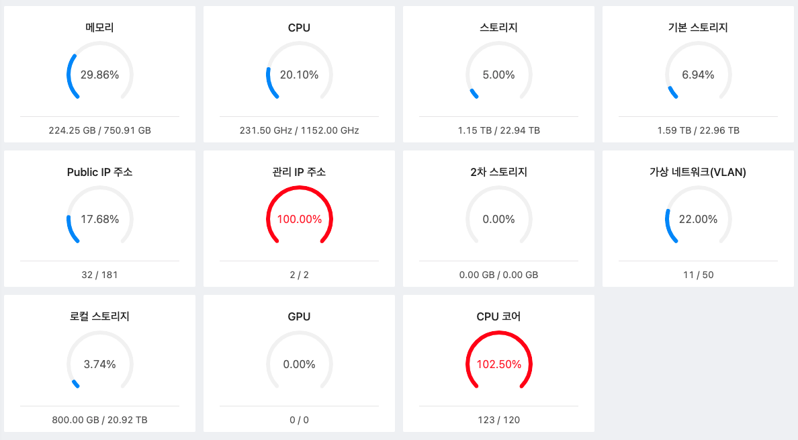

# 문제유형

### 2차스토리지 연결이 안되는 현상

{ align=center }

[에러 확인 방법]
 
 ssvm에 접속해서
 
 (접속하는 방법은 웹에서 웹콘솔로 접속하거나 ssvm 이 있는 호스트에 접속해서 virsh console s-oo-oo 로 접속) 

tail -f /var/log/cloud.log 를 확인하여 다음과 같은 에러메시지가 나온다면

에러메시지
!!! error
    Unable to start agent: Resource class not found: com.cloud.storage.resource.PremiumSecondaryStorageResource due to: java.lang.ClassNotFoundException: com.cloud.storage.resource.PremiumSecondaryStorageResource 

[조치방법]

/var/cache/cloud/cmdline  파일을 vi 편집기로 연 후에

!!! info "원본 cmdline 파일 내용"
    template=domP type=secstorage host=10.10.1.10 port=8250 name=s-4-VM zone=1 pod=11
    guid=s-4-VM workers=5 <span style="color:red">resource=com.cloud.storage.resource.PremiumSecondaryStoraa
    geResource</span> instance=SecStorage sslcopy=false role=templateProcessor mtu=1500 ethh
    2ip=10.10.1.22 eth2mask=255.255.0.0 gateway=10.10.0.1 public.network.device=eth22
    eth0ip=169.254.154.163 eth0mask=255.255.0.0 eth1ip=10.10.1.14 eth1mask=255.255..
    0.0 mgmtcidr=10.10.0.0/16 localgw=10.10.0.1 private.network.device=eth1 internall
    dns1=10.10.0.1 dns1=8.8.8.8 nfsVersion=nulll

resource 태그값을 수정
<span style="color:red">resource=com.cloud.storage.resource.PremiumSecondaryStorageResource</span>

-> <span style="color:blue">resource=org.apache.cloudstack.storage.resource.NfsSecondaryStorageResource</span>

!!! info "수정된 cmdline 파일 내용"
    template=domP type=secstorage host=10.10.1.10 port=8250 name=s-4-VM zone=1 pod=11
    guid=s-4-VM workers=5 <span style="color:blue">resource=org.apache.cloudstack.storage.resource.NfsSecondaryStorageResource</span> instance=SecStorage sslcopy=false role=templateProcessor mtu=1500 ethh
    2ip=10.10.1.22 eth2mask=255.255.0.0 gateway=10.10.0.1 public.network.device=eth22
    eth0ip=169.254.154.163 eth0mask=255.255.0.0 eth1ip=10.10.1.14 eth1mask=255.255..
    0.0 mgmtcidr=10.10.0.0/16 localgw=10.10.0.1 private.network.device=eth1 internall
    dns1=10.10.0.1 dns1=8.8.8.8 nfsVersion=nulll

혹은 다음의 스크립트 실행 - 해당부분을 바꿔주는 스크립트
``` shell
sed -i 's$resource=com.cloud.storage.resource.PremiumSecondaryStorageResource$resource=org.apache.cloudstack.storage.resource.NfsSecondaryStorageResource$' /var/cache/cloud/cmdline
```

수정한 후에 에이전트 재실행

``` shell
 systemctl restart cloud
```

### 디스크 장애(불량)으로 교체하는 방법

SCVM에 접속하여 다음의 절차를 진행하여 교체

1. 장애가 발생한 OSD out
    ``` shell
    cehp osd out osd.{osd_id}
    ```
2. 해당 OSD 서비스를 정지
    ``` shell
    systemctl stop ceph-osd@{osd_id}
    ```
3. 해당 OSD를 포멧
    ``` shell
    ceph-volume lvm zap /dev/{device_id} --destroy
    ```
    
    !!! info
        해당 OSD가 어떤 디바이스인지 알기 위해서는 "ceph-volume lvm list"를 통하여 osd.id의 devices 정보를 확인
(osd 정보가 남아있을 경우 다음 4,5 절차 진행)       

4. 장애가 발생한 OSD를 제거
    ``` shell
    ceph osd rm osd.{osd_id}
    ```
5. 제거한 OSD를 Crushmap에서 제거   
    ``` shell
    ceph osd crush rm osd.{osd_id}
    ```

    !!! note
        디스크를 추가 시에는 해당 초기 구성방법에 따라 Raid에 인식이 되어야 하며 OS 상에서도 인식이 되어야 합니다
        경우에 따라서는 호스트 혹은 scvm의 재기동이 필요합니다.      
    
6. 추가된 디스크를 OSD로 배포
    ``` shell
    ceph-deploy osd create –data /dev/{device_id} --bluestore {scvm이름}
    ```

    !!! info
        6번의 절차는 ceph 계정으로 실행하여야 합니다. "su - ceph "

7. 배포된 OSD를 풀에 추가
    ``` shell
    ceph osd crush move osd.{osd_id} host={host명}
    ```

    !!! info
        host명은 "ceph osd tree" 의 결과에서 host 항목의 이름입니다

8. OSD에 가중치 할당(구 버전에서만 적용)
    ``` shell
    ceph osd crush reweight-subtree {pool-name} 1
    ```
9. 자동으로 밸런싱이 실행되며 완료 됩니다