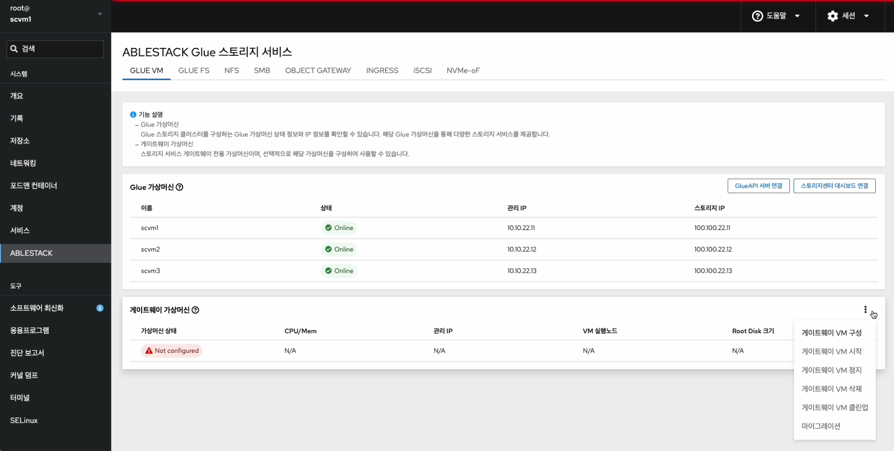
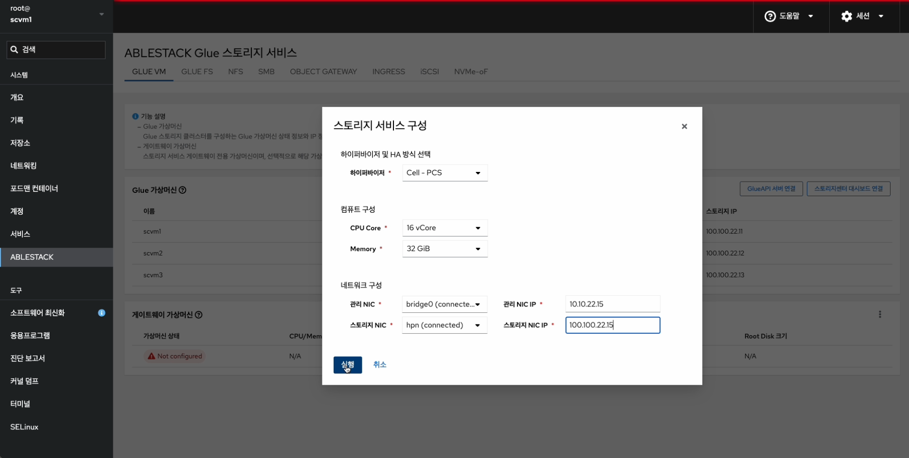
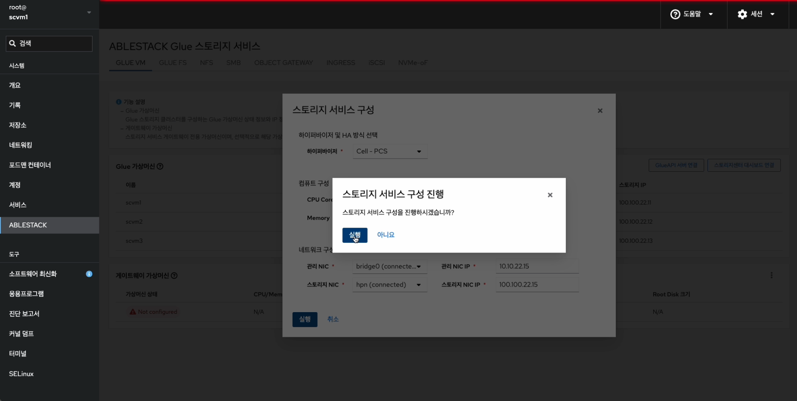
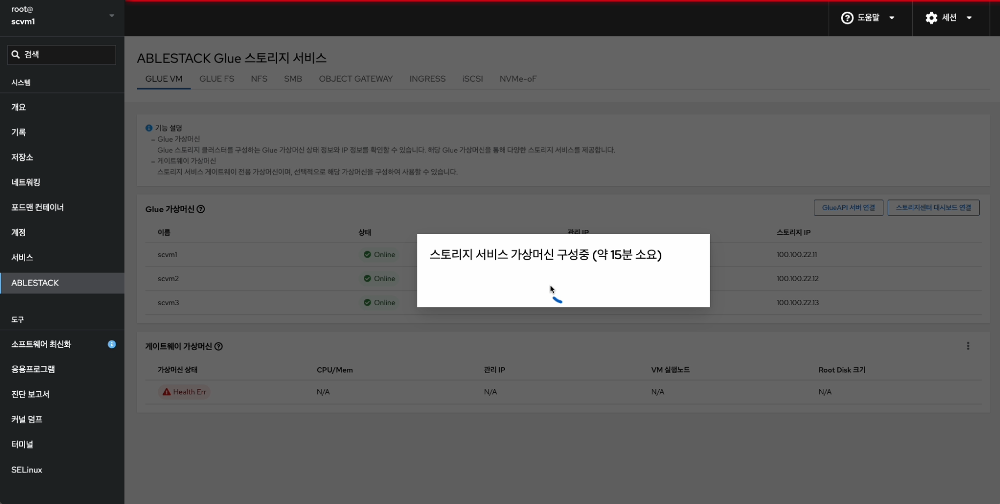
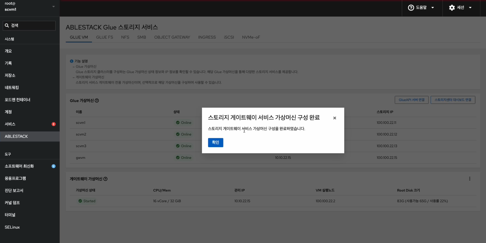
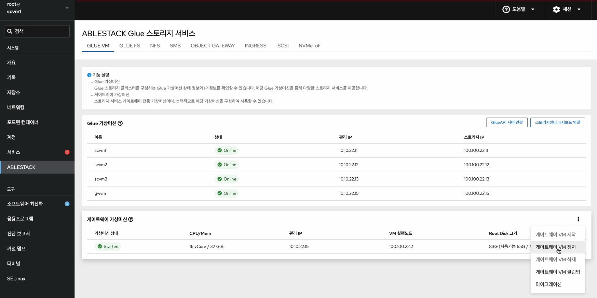
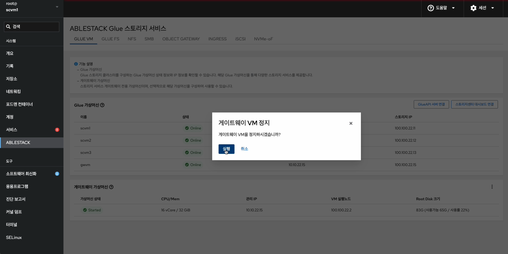
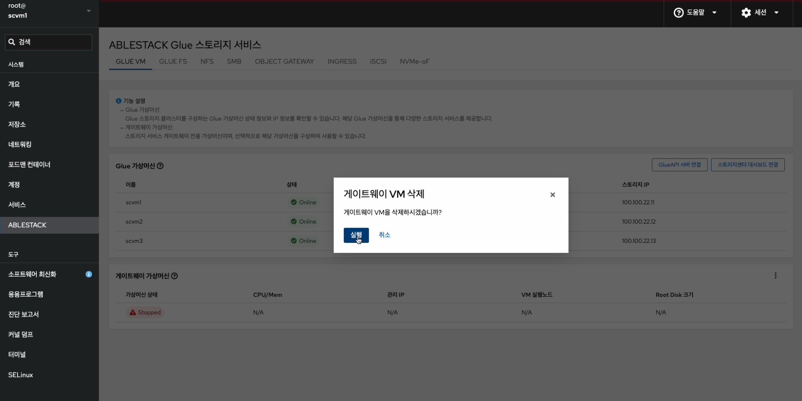
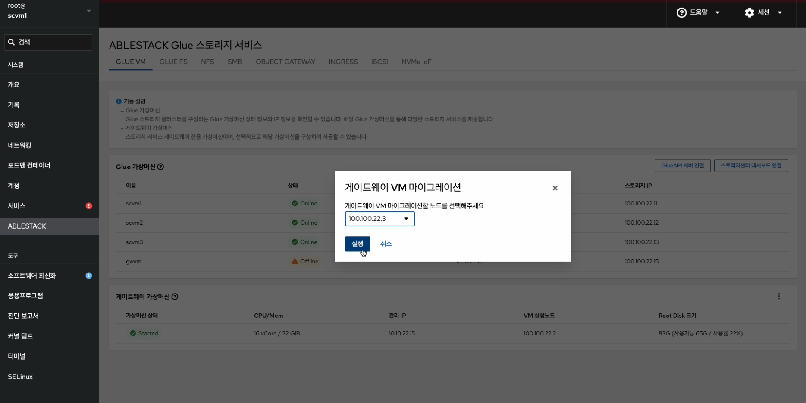
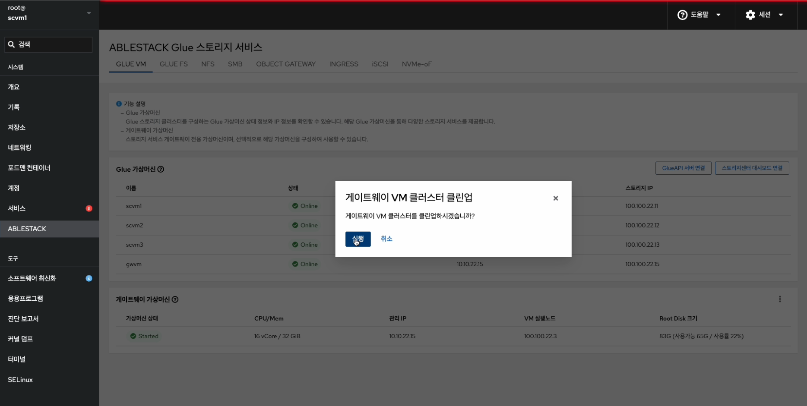

!!! note
    ABLESTACK Glue Service는 호스트가 아닌 Storage Center Virtual Machine(SCVM)에서 제공되고 있습니다.

    접속할 경로는 기존에 구성된 Storage Center Virtual Machine(SCVM) IP로 접속 하시면 됩니다.

# 게이트웨이 가상머신 관리 및 기능
ABLESTACK Glue Service 에서의 게이트웨이 가상머신 관리 하는 가이드 입니다.
이 문서에서는 ABLESTACK Glue Gateway 용 가상머신 생성 및 해당 가상머신에서 제공되는 기능절차를 가이드 하고 있습니다.
ABLESTACK Cube의 웹콘솔로 진행되며, 웹 접속 IP는 별도의 표시를 하지 않고 진행됩니다.
기존에 구성된 IP 정보에 맞게 웹콘솔을 접속 하시면 됩니다.

## Storage Center VM ABLESTACK 기능 설명
스토리지 서비스 게이트웨이 전용 가상머신이며, 선택적으로 해당 가상머신을 구성하여 사용할 수 있습니다

## Storage Center VM ABLESTACK 메인 화면
{ align=center }
- 왼쪽 ABLESTACK 메뉴 클릭시 보이는 화면입니다.

## 게이트웨이 가상머신 생성

1. 개요
    { align=center }
    - 하단 게이트웨이 가상머신의 더보기란을 클릭하면 보이는 화면입니다.
    - **게이트웨이 VM 구성** 버튼을 눌러 게이트웨이 가상머신 구성 준비를 시작합니다.

2. 게이트웨이 가상머신 구성
    { align=center }
    - **하이퍼바이저** 정보를 선택 합니다.
    - **CPU Core** 정보를 선택 합니다.
    - **Memory** 정보를 선택 합니다.
    - **관리 NIC** 정보를 선택 합니다.
    - **관리 NIC IP** 정보를 입력 합니다.
    - **스토리지 NIC** 정보를 선택 합니다.
    - **스토리지 NIC IP** 정보를 입력 합니다.
    - 위 항목을 입력 및 확인 후에 **실행** 버튼을 클릭 합니다.

    !!! info
        현재 버전에서 하이퍼바이저는 KVM만 지원합니다.

3. 게이트웨이 가상머신 구성 진행
    { align=center }
    - 위 항목들을 입력 및 확인 후에 **실행** 버튼을 클릭 합니다.
    { align=center }
    - 진행 중인 화면입니다.

4. 게이트웨이 가상머신 구성 완료
    { align=center }
    - **확인** 버튼을 클릭합니다.
     { align=center }
    - 게이트웨이 가상머신이 구성된 화면입니다.

## 게이트웨이 가상머신 삭제

1. 게이트웨이 가상머신 정지
    { align=center }
    - 하단 게이트웨이 가상머신의 더보기란을 클릭하면 보이는 화면입니다.
    - **게이트웨이 VM 정지** 버튼을 눌러 게이트웨이 가상머신을 정지합니다.
    { align=center }
    - 위 항목들을 입력 및 확인 후에 **실행** 버튼을 클릭합니다.
    { align=center }
    - 게이트웨이 가상머신이 정지된 화면입니다.

2. 게이트웨이 가상머신 삭제
    { align=center }
    - 하단 게이트웨이 가상머신의 더보기란을 클릭하면 보이는 화면입니다.
    - **게이트웨이 VM 삭제** 버튼을 눌러 게이트웨이 가상머신을 삭제합니다.
    { align=center }
    - 위 항목들을 입력 및 확인 후에 **실행** 버튼을 클릭합니다.

3. 게이트웨이 가상머신 삭제 완료
    { align=center }
   - 게이트웨이 가상머신이 구성된 화면입니다.

## 게이트웨이 가상머신 마이그레이션

!!! info
    클라우드 센터 가상머신과 동일한 마이그레이션 기능을 게이트웨이 가상머신에서도 제공합니다.

1. 게이트웨이 가상머신 마이그레이션
    { align=center }
    - 하단 게이트웨이 가상머신의 더보기란을 클릭하면 보이는 화면입니다.
    - **마이그레이션** 버튼을 눌러 마이그레이션 구성 준비를 시작합니다.
    { align=center }
    - 게이트웨이 가상머신을 마이그레이션 할 노드를 선택합니다.
    - 위 항목들을 입력 및 확인 후에 **실행** 버튼을 클릭합니다.
    { align=center }
    - 게이트웨이 가상머신이 마이그레이션 된 화면입니다.

## 게이트웨이 가상머신 클린업

!!! info
    클라우드 센터 가상머신과 동일한 클린업 기능을 게이트웨이 가상머신에서도 제공합니다.

1. 게이트웨이 가상머신 클린업
    { align=center }
    - 하단 게이트웨이 가상머신의 더보기란을 클릭하면 보이는 화면입니다.
    - **게이트웨이 VM 클린업** 버튼을 눌러 클린업 준비를 시작합니다.
    { align=center }
    - 위 항목들을 입력 및 확인 후에 **실행** 버튼을 클릭합니다.