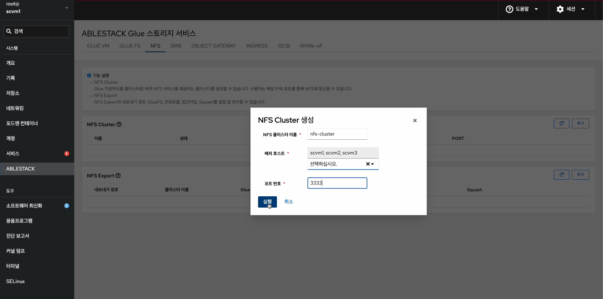
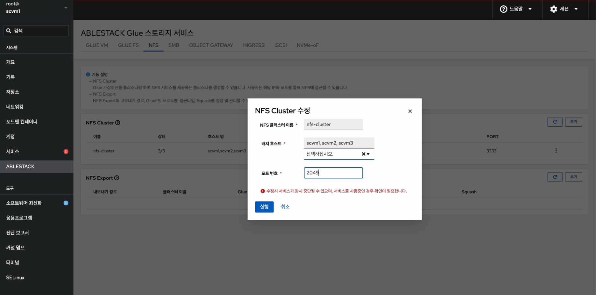
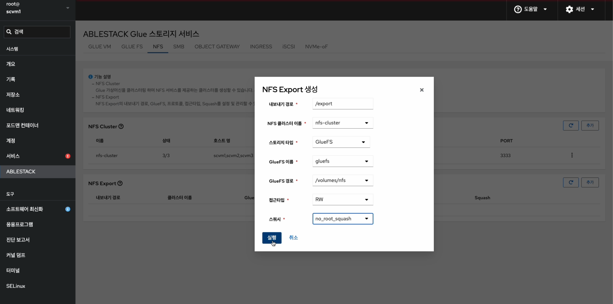
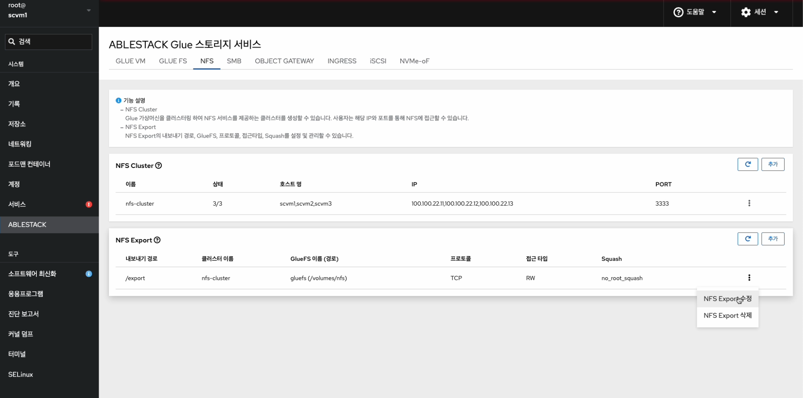
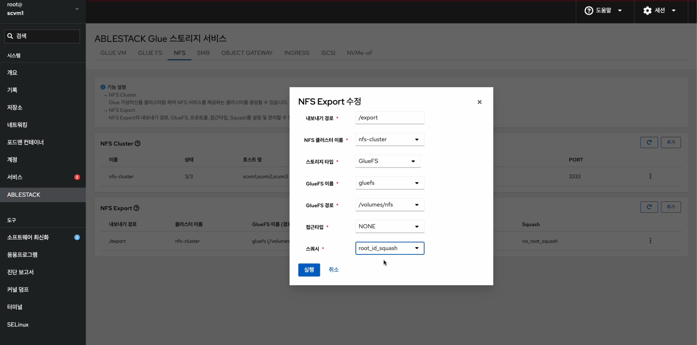
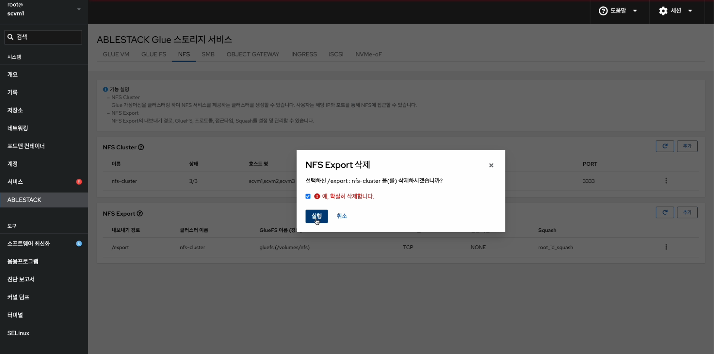
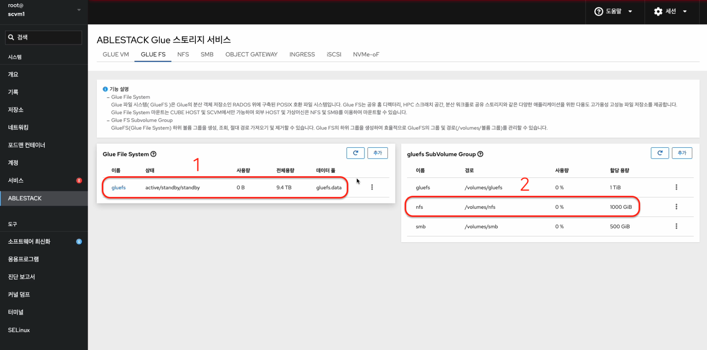
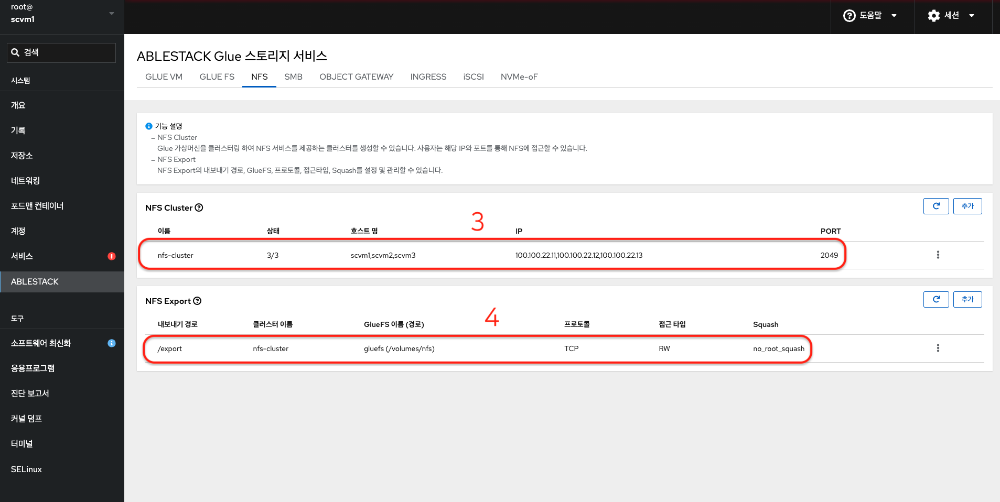

!!! note
    ABLESTACK Glue Service는 호스트가 아닌 Storage Center Virtual Machine(SCVM)에서 제공되고 있습니다.

    접속할 경로는 기존에 구성된 Storage Center Virtual Machine(SCVM) IP로 접속 하시면 됩니다.

# Glue NFS 관리
ABLESTACK Glue Service 에서의 Glue NFS 관리 하는 가이드 입니다.<br
이 문서에서는 ABLESTACK Glue Network File System Service 관리 및 제공되는 기능절차를 가이드 하고 있습니다.
ABLESTACK Cube의 웹콘솔로 진행되며, 웹 접속 IP는 별도의 표시를 하지 않고 진행됩니다.
기존에 구성된 IP 정보에 맞게 웹콘솔을 접속 하시면 됩니다.

## Glue NFS 기능 설명
Glue 가상머신을 클러스터링 하여 NFS 서비스를 제공하는 클러스터를 생성할 수 있습니다. 사용자는 해당 IP와 포트를 통해 NFS에 접근할 수 있습니다.
NFS Export의 내보내기 경로, GlueFS, 프로토콜, 접근타입, Squash를 설정 및 관리할 수 있습니다.

## Glue NFS 메인 화면
{ align=center }
- ABLESTACK 메인 화면에서 상단 NFS 메뉴를 클릭한 화면입니다.

!!! info
    ABLESTACK Glue NFS를 사용하려면 먼저 NFS Cluster 서비스를 생성하여 클러스터를 설정합니다. 그런 다음, NFS Export를 생성하여 공유 폴더를 정의하고 NFS 서비스를 이용할 수 있습니다.

!!! note
    서비스 생성, 수정, 삭제 시에는 약간의 지연이 발생할 수 있으며, 상태 및 최신 정보를 확인하려면 새로고침 버튼을 클릭해 주세요.

## Glue NFS Cluster 생성

!!! warning
    ABLESTACK Glue Network File System Cluster 서비스는 한 번에 여러 서비스를 사용하는 것보다 하나의 서비스를 선호합니다.

1. Glue NFS Cluster 구성
    { align=center }
    - **NFS Cluster** 카드란에 **추가** 버튼을 클릭합니다.
    { align=center }
    - **NFS 클러스터 이름** 정보를 입력 합니다.
    - **배치 호스트** 정보를 선택 합니다.
    - **포트 번호** 정보를 입력 합니다.
    - 위 항목들을 입력 및 확인 후에 **실행** 버튼을 클릭합니다.
    { align=center }
    - NFS 서비스가 구성된 화면입니다.

    !!! info
        스토리지 서비스에 등록된 호스트만 배치가 가능합니다.

## Glue NFS Cluster 수정

1. Glue NFS Cluster 수정
    { align=center }
    - NFS Cluster 각 정보의 더보기란을 클릭하면 보이는 화면입니다.
    - **NFS Cluster 수정** 버튼을 클릭합니다.
    { align=center }
    - **NFS 클러스터 이름** 을 확인 합니다.
    - 변경될 **배치 호스트** 정보를 선택합니다.
    - 변경될 **포트 번호** 정보를 입력합니다.
    - 위 항목들을 입력 및 확인 후에 **실행** 버튼을 클릭합니다.
    { align=center }
    - 수정된 화면입니다.


## Glue NFS Cluster 삭제

1. Glue NFS Cluster 삭제
    { align=center }
    - NFS Cluster 각 정보의 더보기란을 클릭하면 보이는 화면입니다.
    - **NFS Cluster 삭제** 버튼을 클릭합니다.
    { align=center }
    - **데이터가 삭제됩니다. 예, 확실히 삭제합니다.** 체크를 활성화 합니다.
    - 위 항목들을 입력 및 확인 후에 **실행** 버튼을 클릭합니다.
    { align=center }
    - 삭제가 된 화면입니다.

## Glue NFS Export 생성

!!! info
    Glue NFS Cluster Service의 상태가 모두 정상으로 실행 되는지 확인 후, 작업 하시길 바랍니다.

1. Glue NFS Export 생성
    { align=center }
    - NFS Export 카드란에 **추가** 버튼을 클릭합니다.
    { align=center }
    - **내보내기 경로** 정보를 입력합니다.
    - **NFS 클러스터 이름** 정보를 선택합니다.
    - **스토리지 타입** 정보를 선택합니다.
    - **GlueFS 이름** 정보를 선택합니다.
    - **GlueFS 경로** 정보를 선택합니다.
    - **접근 타입** 정보를 선택합니다.
    - **스쿼시** 정보를 선택합니다.
    - 위 항목들을 입력 및 확인 후에 **실행** 버튼을 클릭합니다.
    { align=center }
    - 생성된 화면입니다.

## Glue NFS Export 수정

1. Glue NFS Export 수정
    { align=center }
    - NFS Export 각 정보의 더보기란을 클릭하면 보이는 화면입니다.
    - **NFS Export 수정** 버튼을 클릭합니다.
    { align=center }
    - 변경될 **내보내기 경로** 정보를 입력합니다.
    - 변경될 **NFS 클러스터 이름** 정보를 선택합니다.
    - 변경될 **스토리지 타입** 정보를 선택합니다.
    - 변경될 **GlueFS 이름** 정보를 선택합니다.
    - 변경될 **GlueFS 경로** 정보를 선택합니다.
    - 변경될 **접근 타입** 정보를 선택합니다.
    - 변경될 **스쿼시** 정보를 선택합니다.
    - 위 항목들을 입력 및 확인 후에 **실행** 버튼을 클릭합니다.
    { align=center }
    - 변경된 화면입니다.

## Glue NFS Export 삭제

1. Glue NFS Export 삭제
    { align=center }
    - NFS Export 각 정보의 더보기란을 클릭하면 보이는 화면입니다.
    - **NFS Export 삭제** 버튼을 클릭합니다.
    { align=center }
    - **예, 확실히 삭제합니다.** 란에 체크를 활성화 합니다.
    - 위 항목들을 입력 및 확인 후에 **실행** 버튼을 클릭합니다.
    { align=center }
    - 삭제된 화면입니다.

## Glue NFS 실사용 방법

### Glue FS Service 확인 및 Glue NFS용 Subvolume Group 확인
1. Glue FS Service 확인 및 Glue NFS용 Subvolume Group 확인
    { align=center }
    - Glue FS Service 및 Glue NFS Subvolume Group을 확인하는 화면입니다.
    - Glue NFS 용 **이름** , **경로** , **할당 용량** 정보를 확인 합니다.

### Glue NFS Cluster Service 확인 및 Glue NFS Export 확인
2. Glue NFS Cluster Service 확인 및 Glue NFS Export 확인
    { align=center }
    - Glue NFS Cluster Service 및 Glue NFS Export를 확인하는 화면입니다.
    - Glue NFS Cluster Service의 **상태** , **호스트 명** , **PORT** 정보를 확인 합니다.
    - Glue NFS Export의 **내보내기 경로** , **접근 타입** , **Sqaush** 정보를 확인 합니다.

### 가상머신 작업
3.  가상머신 작업</br></br>
    Glue NFS를 사용할 자신이 작업하는 환경의 가상머신에 마운트를 위해 아래 절차를 수행합니다.

    먼저 가상머신에 nfs-utils 패키지가 존재해야 합니다.
    nfs-utils 패키지가 없다면, 설치를 진행합니다.
    ```shell title="패키지 설치"
    dnf install -y nfs-utils
    ```
    ```shell title="공유 폴더 생성 및 적절한 권한 부여"
    mkdir -p /mnt/shared_folder
    chmod -R 777 /mnt/shared_folder
    ```
    NFS 공유 폴더를 생성한 경로에 마운트를 합니다.
    예시로 내보내기 경로 = `/export` 입니다.
    해당 IP는 NFS Cluster Service의 배치 호스트 중 하나 입니다.
    ```shell title="공유 폴더에 NFS Export 마운트 작업"
    mount -t nfs 10.10.22.11=/export /mnt/nfs

    PORT가 변경 될 시

    mount -t nfs -o port=3333 10.10.22.11=/export /mnt/nfs
    ```
    ```shell title="마운트 확인"
    mount | grep /mnt/nfs
    또는
    df -h | grep /mnt/nfs
    ```