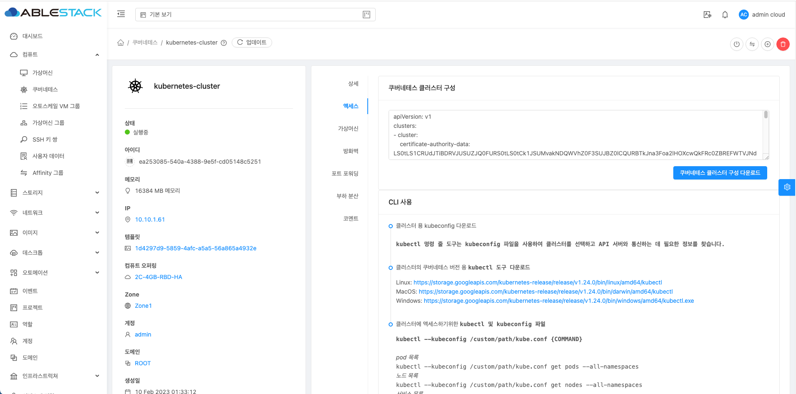

# Kubernetes Cluster 설정

Kubernetes Cluster의 Dashboard 설정 및 kubectl 명령어를 이용한 서비스 확인

## Kubernetes Dashboard 배포

Kubernetes 정보를 웹에서 확인 가능한 Dashboard를 배포하는 절차를 설명합니다.

!!! Info
    최신 Dashboard YAML 파일을 다운로드 하기 위해
    [Kubernetes 도움말](https://kubernetes.io/ko/docs/tasks/access-application-cluster/web-ui-dashboard/){:target='\_blank'} 을
    확인 하세요.

### Dashboard 배포용 YAML 파일 다운로드 및 배포

```bash
wget https://raw.githubusercontent.com/kubernetes/dashboard/v2.5.0/aio/deploy/recommended.yaml
```

### Dashboard 배포

```bash
kubectl apply -f recommended.yaml
```

## admin-user 사용자 생성

Dashboard 접속을 위한 사용자 생성 및 접속 방법에 대하여 설명합니다.

### dashboard-user.yaml 생성

```yaml  title="sudo vi dashboard-user.yaml" linenums="1"
apiVersion: v1
kind: ServiceAccount
metadata:
  name: admin-user
  namespace: kubernetes-dashboard
---
apiVersion: rbac.authorization.k8s.io/v1
kind: ClusterRoleBinding
metadata:
  name: admin-user
roleRef:
  apiGroup: rbac.authorization.k8s.io
  kind: ClusterRole
  name: cluster-admin
subjects:
- kind: ServiceAccount
  name: admin-user
  namespace: kubernetes-dashboard
---
apiVersion: v1
kind: Secret
metadata:
  name: admin-user-secret
  namespace: kubernetes-dashboard
  annotations:
    kubernetes.io/service-account.name: admin-user
type: kubernetes.io/service-account-token
```

### 사용자 배포

```bash
kubectl create -f dashboard-user.yaml
```

### 사용자 토큰 획득

아래 명령어를 이용하여 Dashboard 접속용 토큰을 확인 할 수 있습니다.

```bash
kubectl -n kubernetes-dashboard describe secret admin-user | grep token: | awk '{print $2}'
```

## Kubernetes Dashboard 접속

!!! Info
    ABLESTACK Mold에서 생성된 Kubernetes Dashboard에는 Mold에서 생성한 네트워크 외부에서는 직접 접속을 할 수 없습니다.
    직접 접속을 하기 위해서는 설정을 변경해야 접속 할 수 있습니다.

### dashboard 설정 수정

```yaml title="kubectl edit svc -n kubernetes-dashboard" linenums="1" hl_lines="11 18"
spec:
    clusterIP: 10.108.28.45
    clusterIPs:
    - 10.108.28.45
    externalTrafficPolicy: Cluster
    internalTrafficPolicy: Cluster
    ipFamilies:
    - IPv4
    ipFamilyPolicy: SingleStack
    ports:
    - nodePort: 32444
      port: 443
      protocol: TCP
      targetPort: 8443
    selector:
      k8s-app: kubernetes-dashboard
    sessionAffinity: None
    type: NodePort
  status:
    loadBalancer: {}
```

**네트워크 > 가상머신용 네트워크** 리스트 화면에서 네트워크 선택 후 **Public IP 주소** 탭에서 **새 IP 주소 가져오기** 버튼을 클릭 후 IP 선택 후 **확인** 버튼을 클릭 하여 새 IP 할당

{:class="imgCenter"}

**네트워크 > 가상머신용 네트워크** 리스트 화면에서 네트워크 선택 후 **Public IP 주소** 탭에서 새 IP 주소를 클릭 후 **부하 분산** 탭을 선택 합니다.
    **이름**, **Public 포트**, **사설포트** 및 가상머신을 추가 후 **확인** 버튼을 클릭 합니다.