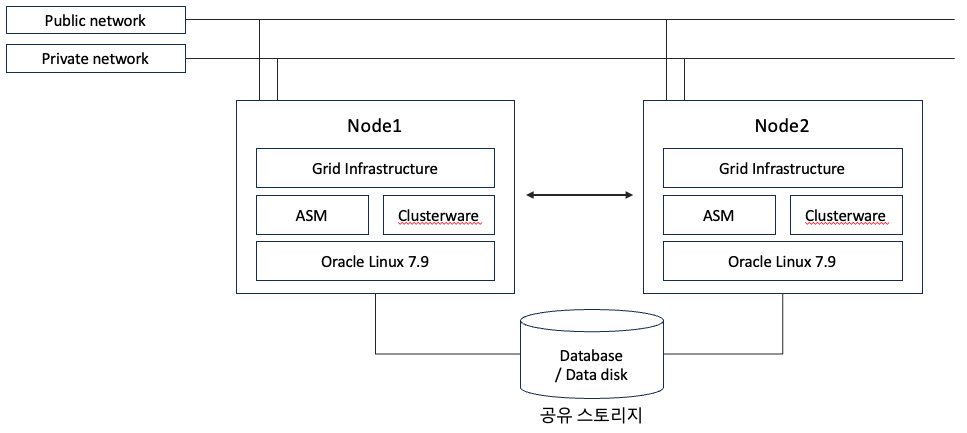

Oracle RAC는 Oracle Database를 구성할 때 고가용성을 보장하기 위해 2대 이상의 노드를 클러스터링 하여 하나의 DATABASE 처럼 사용가능하고, 
어떤 노드에 접속하여도 동일한 테이터를 실시간으로 조회, 변경, 저장할 수 있는 기능을 제공한다. 해당 RAC 구성 가이드에서는
ABLESTACK Mold 가상화 환경에서 Oracle RAC를 구성하는 방법을 제공합니다.

## 구성도
ABLESTACK Mold를 통해 Oracle RAC 구성하는 구조를 보여줍니다. RAC 구성을 위해 2개의 가상머신, 네트워크 용도에 따라 public, pricate 2개의 네트워크, 1개의 공유 스토리지 볼륨을 생성하여 구성하는 구성도입니다. (해당 가이드에서는 public network와 Private network
를 Isolated로 구성하였으며, 환경에 따라 L2 네트워크도 사용가능합니다.)

{: .center }

## Oracle RAC 구성요소
### Grid Infrastructure 
- Oracle Clusterware의 기반하에 여러 Database 서버를 묶어서 하나의 시스템처럼 동작하도록 지원
- Grid Infrastructure는 Oracle Custerware 및 ASM으로 구성되며 운영체제와 긴밀하게 통합된 소프트웨어 계층이며, 일반적으로 GI와 ASM을 소유하는 전용 OS 계정인 grid 계정을 사용

### 공유 스토리지 
- 각 Instance는 공유 Storage를 통해 물리적인 data를 공유하며 database에서 사용하는 ASM 및 CFS(Cluster File System)를 구성
- 공유 Storage에서 Database File은 모든 Node에 동등하게 동시에 엑세스 가능

### ASM (Automatic Storage Management)
- Oracle에서 만든 자동으로 스토리지를 관리하는 소프트웨어로써, 데이터 베이스에서 사용하는 모든 파일(Contorl File, Archive log file, Redolog File, DataDump File, DataFile, SPFILE 등) 에 대해 자동저장공간 관리를 제공

### Network 구성 요소
- Public IP
    - 각 Node에 대한 고유한 IP로 서버 주소와 동일하다. 일반적으로 Node 관리 목적으로 사용

- Service IP
    - 클라이언트에서 Database 서버의 Public IP를 사용하여 접속할 경우 장애가 발생한 Node에서 세션을 다른 Node로 옮기는데 많은 시간이 걸릴 수 있는데, VIP(Virtual IP)를 사용하여 클라이언트가 node에 장애가 발생했다는 것을 신속하게 인식할 수 있도록 함으로써 다른 Node로 재연결 시간을 향상
- Private IP(Cluster Interconnect)
    - Resource 동기화를 위해 Cluster에서 Heartbeat 프로세스를 위해서 사용하는 통신 경로
    - Instance에서 다른 Instance로 data를 전송(cache fusion)하는 용도로 사용 

- SCAN(Single Client Access Name)
    - GNS 및 DNS를 사용하여 정의할 수 있고, SCAN을 이용할 경우 Cluster 내 서버 수에 관계없이 Load balancing 및 고가용성을 고려하여 3개의 IP 주소를 권장 (해당 가이드에서는 scan을 사용하지 않음)

## 가상머신 구성 정보
아키텍처에서 보여지는 **이중화를 통한 고가용성 기능을 제공하는 리눅스 기반의 3계층 구조** 를 구성하는 데 필요한 가상머신 정보 예시는 다음과 같습니다.

- Node1 가상머신 사양

| 구분              |  내용                   | 비고                |
| :---------------:|:----------------------:|:------------------:|
| **운영체제**       | Oracle Linux 7.9       |  |
| **CPU**          | 8Core                  |  |
| **Memory**       | 16GB                   | 8GB 이상 |
| **Swap space**   | 16GB                   | 최소 메모리와 동일 |
| **OS Disk**      | 100GB                  |  |
| **Data Disk**    | 100GB                  | Node1, Node2 가상머신 공유 디스크 |

- Node2 가상머신 사양

| 구분              |  내용                   | 비고                |
| :---------------:|:----------------------:|:------------------:|
| **운영체제**       | Oracle Linux 7.9       |  |
| **CPU**          | 8Core                  |  |
| **Memory**       | 16GB                   | 8GB 이상 |
| **Swap space**   | 16GB                   | 최소 메모리와 동일 |
| **OS Disk**      | 100GB                  |  |
| **Data Disk**    | 100GB                  | Node1, Node2 가상머신 공유 디스크 |

## 구성 단계
Ablestack Mold를 활용한 Oracle RAC 구성하는 단계는 다음과 같습니다.

- 가상화 환경 (ISO 다운로드, 네트워크 생성, 오퍼링 생성, 템플릿 생성, 가상머신 생성, 공유 디스크 연결 등) 구성
- 가상머신 기본 설정 및 ASM 공유 스토리지 생성
- Grid Infrastructure 설치 및 구성
- Database 설치 및 DB 생성
- RAC 테스트
