ABLESTACK Mold는 다양한 운영체제의 가상머신을 지원합니다. 그 중 가장 많이 사용하는 운영체제 중 하나는 Ubuntu 입니다. 해당 운영체제는 Debian 계열의 운영체제입니다. 본 문서에서는 사용자가 해당 운영체제를 탑재한 가상머신을 만들고, 사용하는 방법을 설명합니다. 

!!! info "가이드를 활용할 수 있는 운영체제"
    본 문서는 Debian 계열의 운영체제를 사용하여 Mold에서 가상머신을 준비하고 활용하는 가이드로 다음의 버전의 운영체제의 가상머신에 적용할 수 있습니다.

    - Ubuntu 20.04 LTS(장기 지원 버전)
    - Ubuntu 22.04 LTS(장기 지원 버전)

## 가상머신 사용 준비 개요

ABLESTACK은 가상머신을 빠르게 배포하고 사용자에게 편리한 사용환경을 제공하기 위해 다양한 자동화 기능을 내장하고 있습니다. 이러한 기능을 모두 사용하기 위해서는 ABLESTACK Mold 환경에 적합한 가상머신 이미지 템플릿을 준비해야 합니다. 즉, 가상머신을 사용할 준비를 해야 하는데 다음의 단계로 구성됩니다. 

- 운영체제 이미지 준비 : ISO 형식의 설치 이미지를 준비합니다.
- 네트워크 준비 : 가상머신을 실행하기 위한 임시 네트워크를 준비합니다.
- ISO를 이용한 가상머신 생성 : ISO를 이용해 가상머신을 생성합니다. 
- 가상머신 템플릿 생성 : 생성된 가상머신을 이용해 가상머신 템플릿을 생성합니다. 

다음의 절차를 따라 가상머신 사용 준비를 수행합니다.

## 운영체제 이미지 준비

가상머신을 만들기 위해서는 운영체제가 필요합니다. 가상머신 운영체제는 ISO 형식의 이미지를 사용합니다. Ubuntu의 ISO 이미지는 다음의 공식 사이트에서 다운로드 하는 것을 권장합니다. 

```
https://ubuntu.com/download/
```

ISO 이미지는 다운로드할 이미지의 주소를 이용하여 Mold에 직접 등록할 수 있습니다. Mold UI에서 `이미지 > ISO` 화면으로 이동한 후 `ISO 등록` 버튼을 클릭하면 다음과 같은 대화상자가 표시됩니다. 

<center>
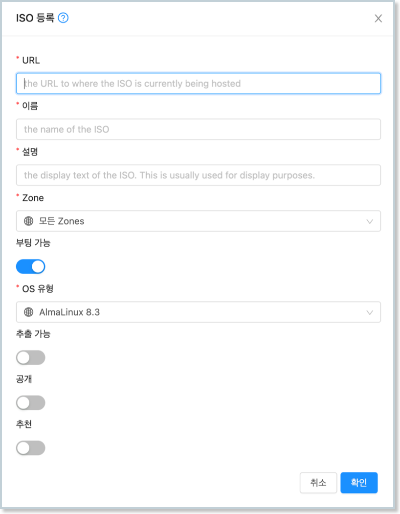{ width="400" }
</center>

ISO 등록 대화상자는 ISO 이미지를 URL로 등록하기 위한 항목을 필요로 합니다. 입력 항목은 다음과 같습니다. 

- URL : 이미지를 다운로드 하기 위한 온라인 주소 
- 이름 : ISO 이미지의 이름
- 설명 : ISO 이미지의 설명
- Zone : ISO 이미지를 사용할 ABLESTACK Zone
- 부팅가능 : ISO 이미지가 부팅 가능한 이미지인지의 여부(OS 이미지는 일반적으로 부팅 가능 이미지)
- OS 유형 : 이미지의 OS 이름 및 버전
- 추출 가능 : 이미지 추출 가능 여부(추출 가능으로 선택하면 관리자 및 사용자가 이미지를 다운로드 할 수 있음)
- 공개 : 이미지를 다른 사용자에게 공개할 것인지의 여부
- 추천 : 이미지를 추천 이미지 목록에 표시할 것인지의 여부

대화상자에서 필수항목 등에 필요한 값을 입력하여 운영체제 이미지를 등록합니다. 등록된 이미지는 `이미지 > ISO` 화면에서 목록을 통해 확인하거나, 해당 목록에서 상세 화면으로 이동하여 확인할 수 있습니다. 확인한 결과는 다음의 그림과 유사합니다. 

<center>
{ width="600" }
</center>

## 네트워크 준비

ISO 이미지를 이용해 가상머신을 생성하기 전에, 먼저 가상머신이 연결할 네트워크를 준비해야 합니다. ABLESTACK Mold는 다양한 형식의 네트워크를 선택적으로 만들어 가상머신에 연결할 수 있습니다. ABLESTACK Mold의 기본 네트워크 형식은 Isolated Network입니다. 

!!! info "가상머신을 위한 인터넷 가능 네트워크"
    가상머신을 설치할 때, 사용자가 원하는 애플리케이션 설치 및 패키지 설치를 위해 인터넷 연결이 필요할 수 있습니다. ABLESTACK Mold를 이용해 가상머신을 생성할 때에는 인터넷 연결이 가능한 네트워크를 사용하는 것을 권장합니다. 단, ISO에 있는 기본 패키지 만을 사용하는 경우에는 인터넷 연결을 필요로 하지 않습니다. 

가상머신에 연결할 네트워크를 준비하기 위해 `네트워크 > 가상머신용 네트워크` 화면으로 이동한 후 `네트워크 추가` 버튼을 클릭하여 "네트워크 추가" 대화상자를 표시합니다. 

<center>
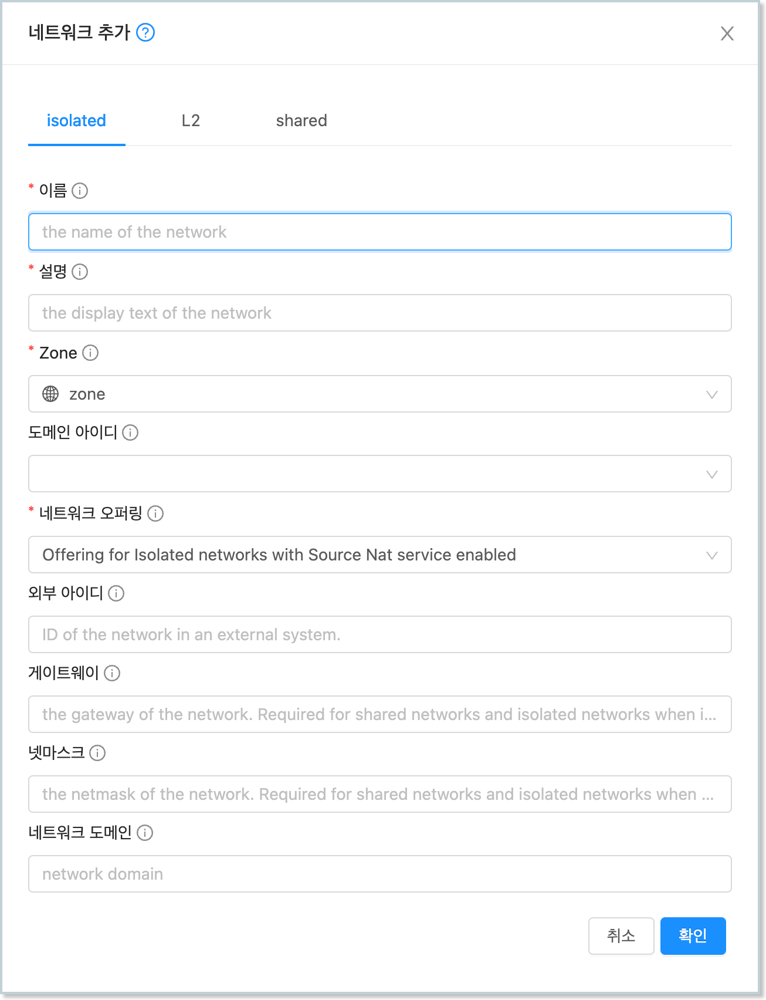{ width="400" }
</center>

"네트워크 추가" 대화 상자에서 "Isolated" 탭을 선택하면 다음과 같은 입력항목을 확인할 수 있습니다. 

- 이름 : 신규로 생성할 네트워크의 이름
- 설명 : 네트워크에 대한 설명
- Zone : 네트워크가 배포될 ABLESTACK의 Zone
- 도메인 아이디 : 네트워크를 사용할 도메인 아이디 (기본값 : 네트워크를 생성한 도메인)
- 네트워크 오퍼링 : 네트워크에 적용할 네트워크 제공 정책 (특별한 설정이 없다면 기본 정책이 적용됨)
- 외부 아이디 : 외부 시스템(Mold와 연결된 SDN, 외부 네트워크 장치) 내의 네트워크 ID
- 게이트웨이 : Isolated 네트워크의 vRouter의 사설 네트워크의 IP 주소(자동으로 생성)
- 넷마스크 : Isolated 네트워크의 사설 네트워크의 서브넷 마스크(자동으로 생성)
- 네트워크 도메인 : 네트워크의 도메인 주소(자동으로 생성, cloud.internal)

가상머신 준비를 위한 네트워크는 위의 항목 중, 이름과 설명만 입력하면 기본값이 설정되어 자동으로 생성됩니다. 다음의 그림은 네트워크 생성 결과는 `네트워크 > 가상머신용 네트워크`에서 조회한 결과의 예 입니다. 

<center>
{ width="600" }
</center>

## ISO를 이용한 가상머신 생성

ISO와 가상머신 생성용 네트워크가 준비되었다면 이제 ISO를 이용해 가상머신을 생성합니다. 가상머신의 생성을 위해 `컴퓨트 > 가상머신` 화면으로 이동해 `가상머신 추가` 버튼을 클릭하여 "새 가상머신" 마법사를 실행합니다. 가상머신 배포는 다음의 단계로 이루어집니다. 

1. 배포 인프라 선택 : 가상머신을 배포할 인프라 선택
2. 템플릿/ISO : 가상머신 생성에 사용할 이미지 선택
3. 컴퓨트 오퍼링 : 가상머신에 할당할 CPU, Memory 자원 선택
4. 디스크크기 : 가상머신의 루트 디스크 크기 선택
5. 네트워크 : 가상머신에 연결할 네트워크 선택
6. SSH키 쌍 : 가상머신에 할당할 SSH 키 쌍 정보 선택 (가상머신 준비 단계에서는 사용하지 않음)
7. 확장모드 : EFI, UserData 등의 확장 정보 선택
8. 상세 : 가상머신 기타 정보 입력

먼저 가상머신을 배포할 인프라를 선택합니다. "새 가상머신" 마법사의 배포 인프라 선택 단계의 화면은 다음과 같습니다. 

<center>
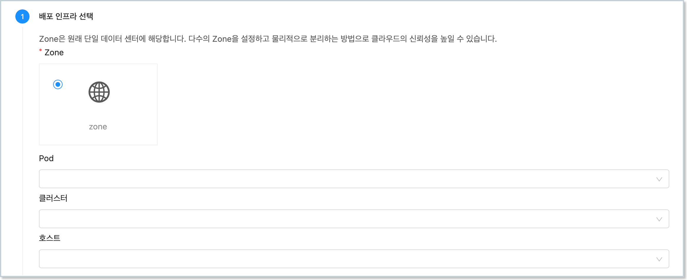{ width="600" }
</center>

가상머신은 사용자가 선택한 위치에 배포됩니다. 기본적으로 ABLESTACK의 기본 Zone이 선택되어 있고, 나머지 자원은 ABLESTACK이 자동으로 선택합니다. 별도의 배포 인프라를 선택해야 하는 경우, Pod, 클러스터, 호스트를 차례로 선택합니다. 

인프라를 선택한 후 가상머신 생성에 사용할 이미지를 선택합니다. 마법사의 템플릿/ISO 선택 화면은 다음과 같습니다. 

<center>
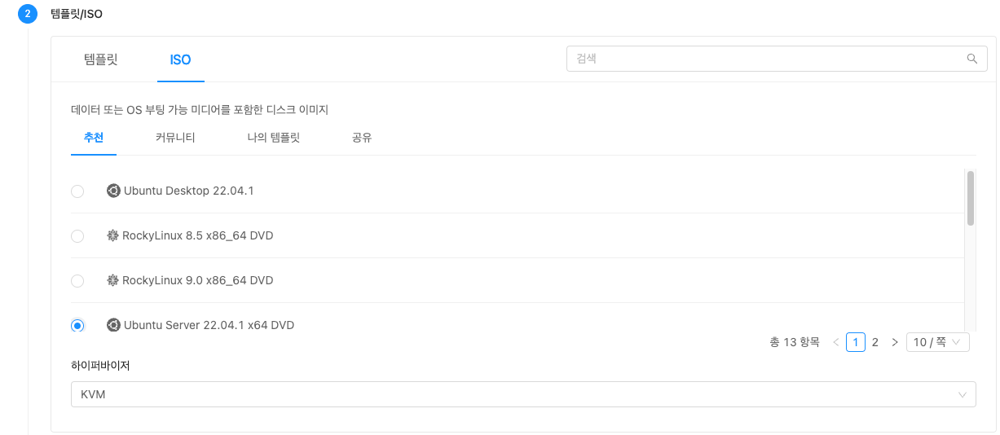{ width="600" }
</center>

템플릿/ISO 선택화면에서 "ISO" 탭을 선택하고 목록에서 가상머신 생성에 사용할 ISO 이미지를 선택합니다. 

해당 이미지를 사용하기 위해서는 ABLESTACK이 사용하고 있는 기반 하이퍼바이저를 지정해야 합니다. "하이퍼바이저" 항목에서 적합한 하이퍼바이저를 선택합니다. 만약 Cell 하이퍼바이저를 사용하고 있는 경우, KVM을 선택합니다. 

가상머신을 실행하기 위해서는 해당 가상머신을 실행하기 위한 적절한 컴퓨트 자원, 즉 CPU 및 메모리 자원이 필요합니다. "컴퓨트 오퍼링" 선택 단계에서 해당 자원을 선택합니다. 해당 화면은 다음과 같습니다. 

<center>
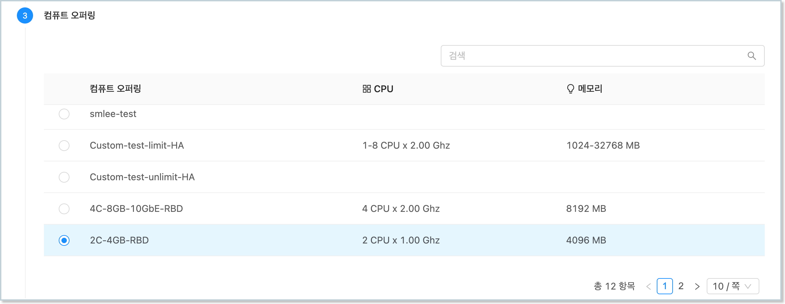{ width="600" }
</center>

Ubuntu 기반의 기본 가상머신 이미지를 생성하기 위해서는 2vCore의 CPU, 4GB 메모리면 충분합니다. 필요한 컴퓨트 자원을 선택합니다. 

가상머신에 ISO 이미지를 이용해 운영체제를 설치하려면 가상머신에 루트 디스크가 연결되어야 합니다. 루트 디스크를 선택하는 화면은 다음과 같습니다. 

<center>
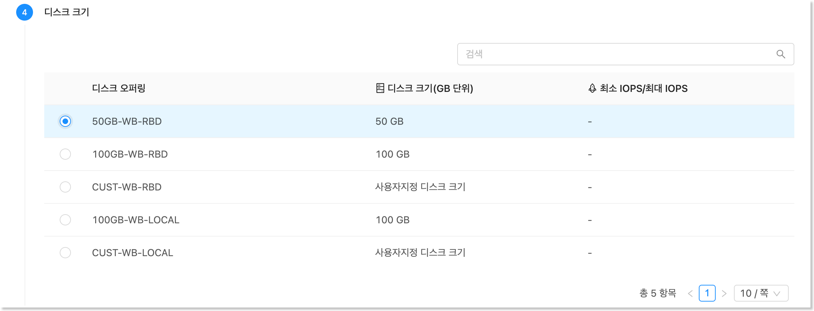{ width="600" }
</center>

가상머신의 디스크는 Ubuntu의 경우 20GB ~ 50GB 이내의 크기로 설정하여 생성하는 것을 권장합니다. "디스크 크기" 화면의 목록에서 적정한 디스크 오퍼링을 선택합니다. 

가상머신 실행을 이해서는 NIC의 연결이 필요합니다. NIC의 연결은 특정 네트워크에 연결되어야 합니다. 따라서 "네트워크" 화면에서 가상머신 NIC에 연결할 네트워크를 선택해야 합니다. 해당 화면은 다음과 같습니다. 

<center>
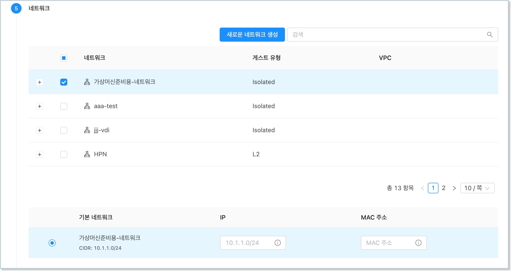{ width="600" }
</center>

"네트워크" 화면에 표시되는 목록 중, 가상머신 준비를 위해 생성한 네트워크를 선택합니다. 네트워크를 선택하면 선택된 네트워크에 대한 기본 정보 및 CIDR 정보, 그리고 IP 정보, MAC 주소 정보를 입력할 수 있습니다. 가상머신 준비를 위해서는 이러한 정보를 입력하지 않고 기본값을 사용합니다.  

!!! warning "가상머신 네트워크 선택 시 주의사항"
    가상머신에는 1개 이상의 NIC를 설치할 수 있습니다. 따라서 네트워크는 다중으로 선택할 수 있도록 체크박스로 되어 있습니다. 따라서 가상머신 준비용 네트워크를 선택할 때 해당 네트워크 외에 다른 네트워크가 선택되어 있지는 않은지 확인해야 합니다. 

다음 단계는 SSH 키 쌍을 설정하는 단계인데, 가상머신 준비 단계에서는 해당 설정을 적용할 수 없기 때문에 해당 단계는 선택하지 않습니다. 

가상머신의 확장 설정을 하기 위해서 확장 모드 단계의 "고급 설정 표시" 단추를 클릭하여 해당 화면을 엽니다. 해당 화면은 다음과 같습니다. 

<center>
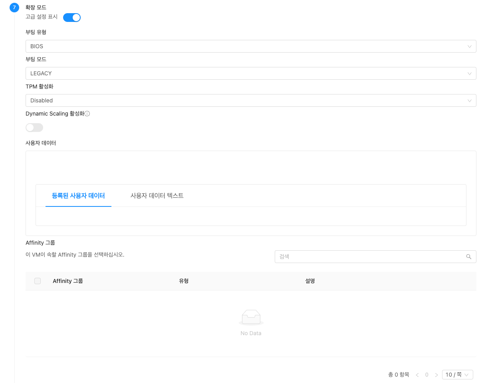{ width="600" }
</center>

확장 모드에서는 가상머신의 부팅 유형을 설정합니다. 가상머신은 레거시 방식 또는 EFI 방식 중에서 하나를 부팅 방식으로 선택할 수 있습니다. EFI 방식을 선택하는 경우 부팅 모드를 LEGACY 또는 SECURE 중에서 선택할 수 있습니다. 원하는 가상머신의 부팅 방식을 선택합니다. 

!!! warning "부팅 유형 선택 시 주의사항"
    가상머신은 초기 부팅 유형 선택에 의해 가상머신이 부팅되고, 운영체제가 설치되면 그 다음부터 가상머신은 반드시 해당 부팅 유형으로 시작되어야 합니다. 따라서 가상머신 부팅 유형을 선택할 때 주의해야 합니다. 기본값은 BIOS, LEGACY 모드입니다. 

마지막으로 가상머신의 상세 정보를 설정합니다. "상세" 화면은 다음과 같습니다. 

<center>
{ width="600" }
</center>

상세화면에서 가상머신의 이름을 입력하면 가상머신을 시작할 모든 준비가 완료됩니다. 가상머신을 실행합니다. 

## 운영체제 설치

가상머신이 실행되면 `컴퓨트 > 가상머신` 화면에 표시되는 목록에서 해당 가상머신의 실행 여부를 확인할 수 있습니다. 다음의 그림과 같습니다. 

<center>
{ width="600" }
</center>

위의 그림에서 :fontawesome-solid-ellipsis-v: 버튼에 마우스를 올려 놓으면 메뉴가 표시되는데 첫번째 메뉴 아이콘이 가상머신의 콘솔을 표시하는 메뉴입니다. 해당 메뉴를 클릭하면 브라우저의 신규 탭에 해당 가상머신의 콘솔이 다음과 같이 표시됩니다. 

<center>
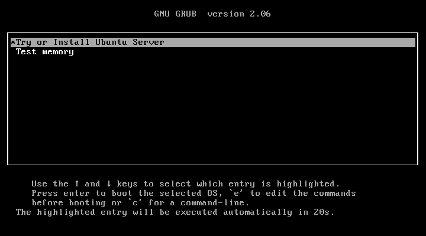{ width="600" }
</center>

콘솔에 접속했다면 "Try or Install Ubuntu ... "을 선택하여 운영체제 설치 절차를 진행합니다. 전체적인 설치 과정은 일반적인 설치 과정을 따르되 다음의 사항을 확인합니다.

- Installer update available: 업데이트 여부 선택 입니다. 기본 값인 업데이트 비활성으로 선택합니다.
- Guided storage configuration: 디스크의 파티션이 원하는 데로 설정되어 있는지 확인합니다. (custome storage layout을 선택하여 직접 설정하는 것을 권장)
- SSH Setup: Install OpenSSH server 체크하여 설치합니다.
- Profile setup: 가상머신 템플릿을 만들 것이므로, 기억하기 쉬운 기본 비밀번호를 사용합니다.

설정한 내용을 확인하고 설치를 시작합니다. 모든 설치과정이 완료되면 "Reboot Now" 를 선택하여 재부팅합니다. 

재부팅 전에 가상머신에 연결되어 있는 ISO 이미지의 연결을 해제하는 것이 좋습니다. 가상머신 목록 또는 상세 페이지의 가상머신 메뉴에서 "ISO 분리" 아이콘을 클릭하여 ISO 이미지를 분리합니다. ISO 이미지를 분리한 후 가상머신을 재부팅합니다. 

재부팅이 완료되면 가상머신이 정상적인지, 로그인이 잘 되는지 확인하여 최종적으로 가상머신의 설치 결과를 체크합니다. 

## 가상머신 템플릿 생성

가상머신 설치가 정상적으로 완료 되었다면, 마지막으로 가상머신 템플릿을 생성합니다. 가상머신 템플릿은 사용자가 생성한 가상머신의 형상을 그대로 이미지로 만들어, 언제든지 동일한 형상의 가상머신을 바로 만들 수 있도록 하기 위해 제공되는 기능입니다. 

!!! info "가상머신 템플릿 생성 없이 가상머신을 사용할 수 있는가?"
    사용자는 가상머신을 생성할 때 템플릿을 이용해서 생성할지, 또는 ISO를 이용해서 생성할지의 여부를 결정할 수 있습니다. 즉, 사용자는 반드시 템플릿을 생성해야 하는 것은 아닙니다. 만약 모든 가상머신을 ISO를 이용해 생성하기로 하는 경우 별도로 템플릿을 생성할 필요는 없습니다. 단, ISO를 통해 가상머신을 생성하는 경우, ABLESTACK Mold에서 제공하는 다양한 자동화 기능 중 일부를 사용하지 못할 수 있습니다. 

가상머신 템플릿을 생성하기 위해 실행 중인 가상머신을 정지합니다. 가상머신 목록 또는 상세화면의 가상머신 메뉴에서 "가상머신 정지" 버튼을 클릭합니다. 가상머신이 정지된 후 가상머신의 상세 페이지를 확인하면 다음과 같습니다. 

<center>
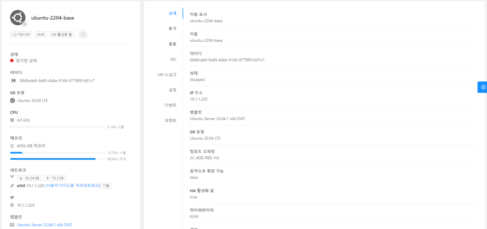{ width="600" }
</center>

위의 화면에서 우측의 상세 화면에서 "볼륨" 탭을 클릭하면 해당 가상머신에 연결된 볼륨의 목록이 표시됩니다. 처음 만든 가상머신이기 때문에 ROOT 디스크만 표시됩니다. 해당 디스크를 클릭하여 볼륨의 상세 화면으로 이동합니다. 다음의 그림과 같습니다. 

<center>
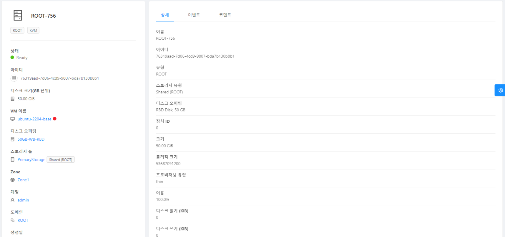{ width="600" }
</center>

위 화면에서 우측 상단의 볼륨 액션 메뉴 중 맨 우측의 "볼륨으로 템플릿 생성" 버튼을 클릭하여 가상머신 템플릿 생성을 시작합니다. 다음과 같은 "볼륨으로 템플릿 생성" 대화상자가 표시됩니다. 

<center>
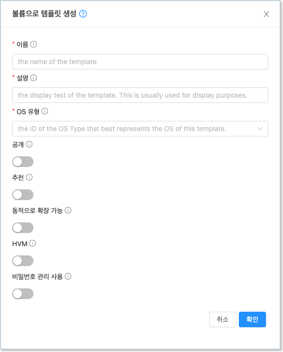{ width="400" }
</center>

"볼륨으로 템플릿 생성" 대화상자는 정지되어 있는 가상머신의 루트 디스크를 이용해 해당 가상머신에 대한 이미지를 생성하는 기능을 제공합니다. 다음의 정보를 입력합니다. 

- 이름 : 템플릿 이미지의 이름 (예제에서는 "Ubuntu 22.04 기본 이미지 템플릿" )
- 설명 : 템플릿 이미지에 대한 설명 (예제에서는 이름과 동일하게 설정)
- OS유형 : 이미지의 원본 가상머신의 OS 유형 (예제에서는 Ubuntu 20.04 LTS)
- 공개 : 이미지를 모든 사용자에게 공개할 것인지의 여부 (예제에서는 공개)
- 추천 : 이미지를 추전 이미지로 설정할 것인지의 여부 (예제에서는 추천하지 않음)
- 동적으로 확장 가능 : 템플릿에 의해 생성된 가상머신에 대해 동적 스케일링을 지원할 것인지의 여부 (예제에서는 선택하지 않음)
- HVM : 하드웨어 가상화를 지원하는지의 여부 (예제에서는 선택)
- 비밀번호 관리 사용 : 가상머신 생성 시 root 사용자에 대한 비밀번호를 생성할 것인지의 여부 (예제에서는 선택하지 않음)

모든 정보를 입력한 후 "확인" 버튼을 눌러 템플릿 생성을 시작합니다. 생성이 완료되면 해당 템플릿은 `이미지 > 템플릿` 화면의 목록을 통해 확인할 수 있으며, 해당 목록을 클릭하여 상세화면으로 확인하면 다음과 같이 템플릿 이미지가 생성됨을 확인할 수 있습니다. 

<center>
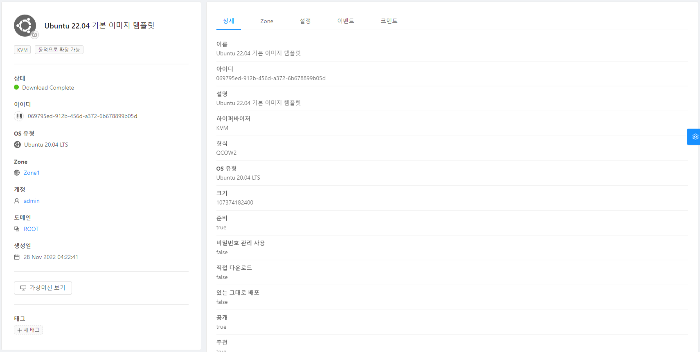{ width="600" }
</center>

!!! info "템플릿을 생성한 원본 가상머신의 관리"
    가상머신의 형상, 즉 최초로 생성한 원본 가상머신은 나중에 시스템을 운영할 때, 다양한 기능을 추가하여 템플릿을 생성하고자 할 때 유용하게 사용할 수 있습니다. 따라서 이러한 템플릿 운영 편리성을 위해 최초로 생성한 가상머신은 가상머신 스냅샷 등을 통해 시점별로 보관하여 관리하는 것을 권장합니다. 

이제 생성된 기본 템플릿을 이용해 언제든지 가상머신을 생성할 수 있습니다. 
