ABLESTACK을 이용해 기본 설치로 만들어진 Windows 가상머신에 가상머신 초기화 및 자동화 프로그램을 설치하여 다음과 같은 설정을 자동화 할 수 있습니다. 

- Windows 가상머신 호스트명
- Windows 가상머신 Administrator 비밀번호
- Administrator 계정에 대한 SSH Key 설정
- UserData 전송을 통한 설정 자동화

본 문서에서는 기본 템플릿에 비밀번호 관리 기능 및 가상머신에 UserData 전송을 통해 다양한 정보를 설정하는 기능을 가진 프로그램을 설치하여 사용하는 방법을 설명합니다. 

!!! info "예제에서 사용되는 가상머신 이미지"
    본 문서의 예제에서 사용되는 가상머신 이미지는 Windows 가상머신 가이드의 [가상머신 사용 준비](/userGuide/vms/windows-guide-prepare-vm/) 가이드에서 생성한 기본 가상머신 템플릿 이미지를 사용합니다. 

    따라서 본 가이드의 예제를 사용하기 전에 기본 가상머신 템플릿 이미지를 먼저 생성해야 합니다.

## 가상머신 이미지 준비

### 기본 템플릿을 통한 가상머신 생성

호스트명 설정, 비밀번호 관리와 UserData 전송 기능을 사용할 수 있도록 하기 위해 기본 가상머신 이미지를 준비합니다. 먼저 생성해 두었던 Windows 기본 이미지를 이용해 `컴퓨트 > 가상머신`으로 이동하여 다음과 같은 절차로 가상머신을 신규로 생성하여 실행합니다. 

1. 배포 인프라 선택 : 기본값으로 선택합니다.

2. 템플릿/ISO : Windows 기본 가상머신 템플릿 이미지를 다음의 그림과 같이 선택합니다. 

    { style="margin-top: 20px;" width="600" }

3. 컴퓨트 오퍼링 : 적정한 컴퓨트 오퍼링을 선택합니다. (4 vCore, 8GB 이상 권장)

4. 데이터 디스크 : '설정 안함'을 선택합니다.

5. 네트워크 : 가상머신 이미지 준비를 위해 만든 네트워크(인터넷 연결 필수)를 다음과 같이 선택합니다.

    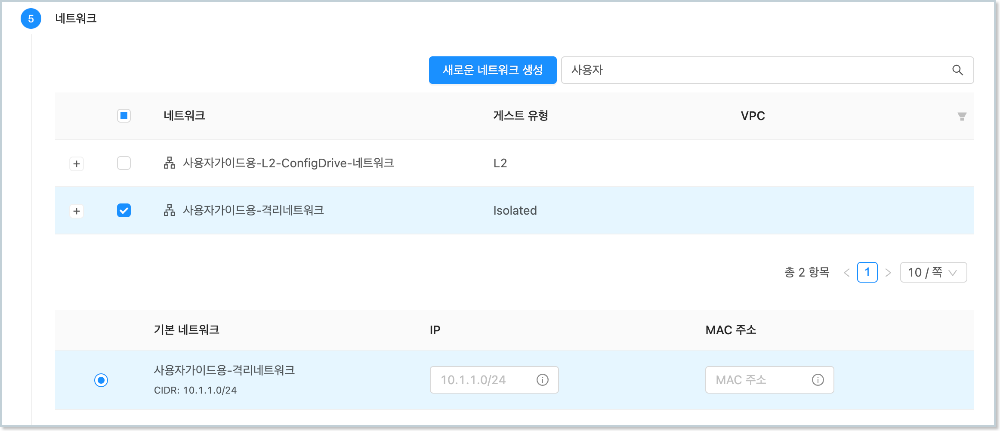{ style="margin-top: 20px;" width="600" }

6. SSH 키 쌍 : 선택하지 않습니다.

7. 확장 모드 : 고급 설정을 하지 않습니다.

8. 상세 : 가상머신 이름 (예를 들어 Windows-Cloudinit)을 다음과 같이 입력합니다.

    { style="margin-top: 20px;" width="600" }

모든 설정을 완료한 후 "VM 시작" 버튼을 클릭하여 가상머신을 생성합니다. 

가상머신이 실행되면 가상머신 목록해서 해당 가상머신을 찾은 후, 다음의 그림과 같이 액션 아이콘 메뉴의 좌측에 있는 "콘솔 보기" 버튼을 클릭하여 가상머신 콘솔에 접속합니다. 

<center>{ width="600" }</center>

### 가상머신 초기화

기본 가상머신 템플릿 이미지는 Microsoft System Preparation(Sysprep) 과정을 통해 시스템 일반화 및 초기화 되어 있는 상태입니다. 

따라서 템플릿을 이용해 가상머신을 생성하는 경우 가상머신 초기화 단계를 거쳐야 합니다. 

1. 가상머신 콘솔에 접속합니다. 

2. 국가 및 언어, 키보드 설정 후 다음 단계로 이동합니다. 

    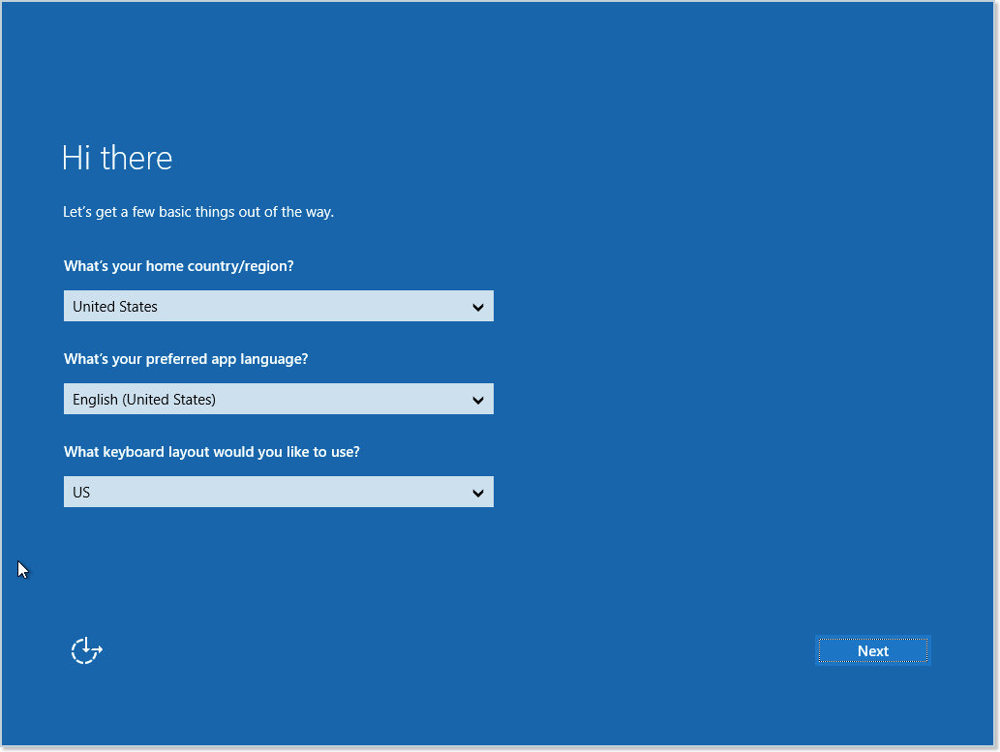{ style="margin-top: 20px;" width="600" }

3. 라이선스 정책에 동의합니다. 

4. Administrator 계정에 대한 비밀번호를 등록하고 초기화를 종료합니다.

    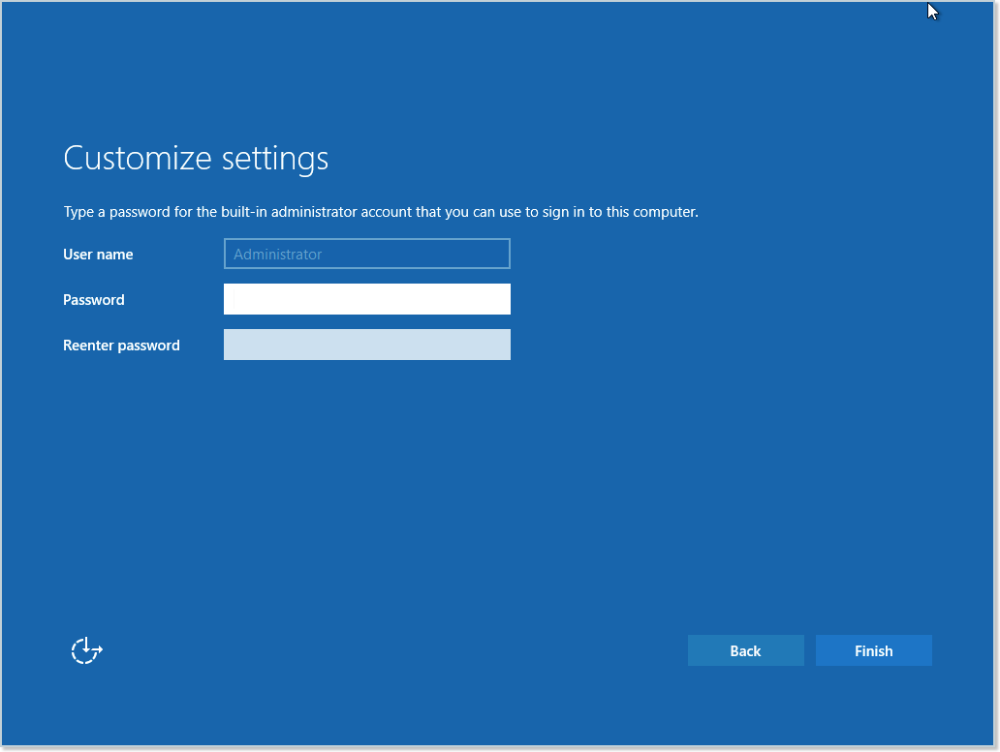{ style="margin-top: 20px;" width="600" }

### 가상머신 인터넷 접속 확인

가상머신 초기화 후 Administrator 계정을 이용해 가상머신에 로그인 합니다. 다음의 이미지와 같습니다. 

<center>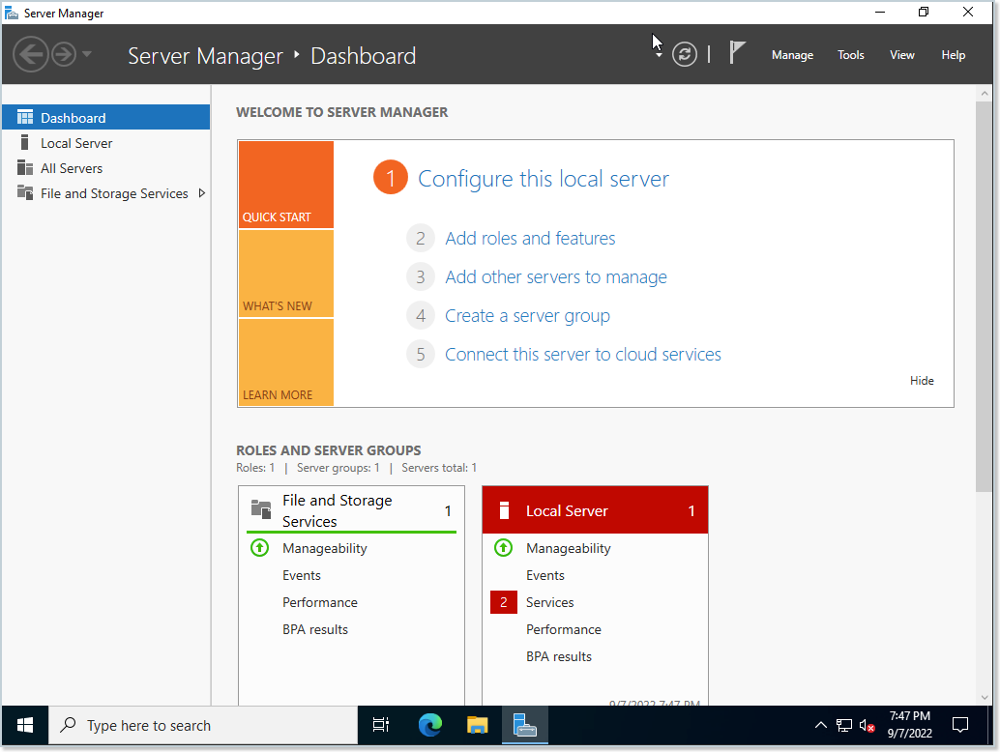{ width="600" }</center>

콘솔에 접속했다면 먼저 가상머신이 인터넷에 접속되어 있는지 확인합니다. Windows 하단의 상태 표시줄의 네트워크 상태를 다음과 같이 확인합니다. 

<center>{ width="200" }</center>

만약 정상적으로 인터넷 연결이 되지 않는다면 가상머신이 연결되어 있는 네트워크 정보를 확인하여 인터넷이 연결되도록 설정되어 있는지 확인해야 합니다. 가상머신 상세 화면에서 "NIC" 탭을 클릭하면 가상머신에 연결되어 있는 네트워크 정보를 다음과 같이 확인할 수 있습니다. 

<center>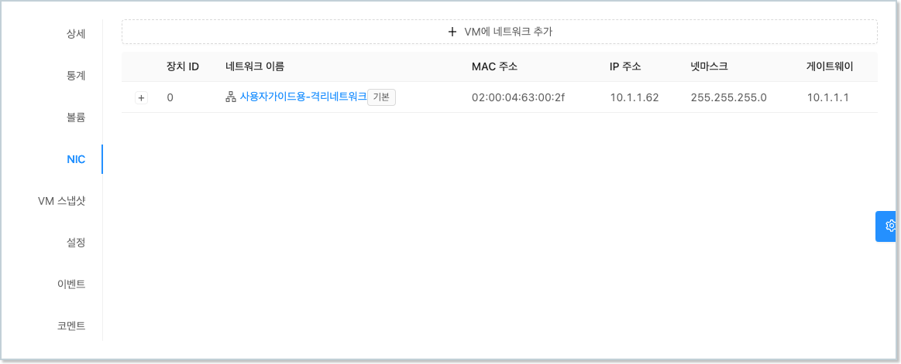{ width="600" }</center>

위의 그림과 같은 상태에서 "네트워크 이름" 항목을 클릭하면 가상머신에 연결되어 있는 네트워크의 상세 정보를 확인할 수 있습니다. 네트워크 상세 정보 화면에서 "송신 규칙" 탭을 클릭합니다. 다음의 그림과 같습니다. 

<center>{ width="600" }</center>

기본적으로 Isolated Network의 송신규칙은 "거부"입니다. 즉, 가상머신은 인터넷에 연결이 차단되어 있습니다. 따라서 해당 가상머신이 외부로 연결될 수 있도록 설정해야 합니다. 예제에서는 모든 가상머신의 외부 송신이 가능하도록 설정할 것입니다. 

위의 화면에서 "프로토콜" 항목에서 "모두"를 선택한 후 "추가" 버튼을 클릭합니다. 이렇게 하면 해당 네트워크에 연결된 모든 가상머신에 대해 모든 외부로의 송신이 가능하도록 방화벽을 설정하는 것입니다. 다음과 같이 설정됩니다. 

<center>{ width="600" }</center>

설정이 완료되었다면 다시 한번 가상머신 콘솔을 통해 네트워크 상태를 확인하여 인터넷 연결이 활성화 되었는지 확인합니다. 

### UserData 관리 프로그램(cloudbase-init) 설치

가상머신의 인터넷 연결이 확인되었다면 가상머신 생성 시의 설정 자동화 기능을 지원하는 프로그램인 cloudbase-init을 가상머신에 설치합니다. 

cloudbase-init은 ABLESTACK에서 생성되는 가상머신의 호스트명, 관리자 비밀번호 설정, 그리고 UserData 전송 처리 등을 자동화 하는 기능을 제공합니다. 

cloudbase-init은 ABLESTACK 다운로드 사이트를 통해 다운로드 받을 수 있습니다. 가상머신에서 웹 브라우저를 실행하여 다음의 주소를 통해 이미지 파일을 다운로드 합니다. 

```
https://images.ablecloud.io/CloudbaseInitSetup_1_1_2_x64.msi
```

파일을 다운로드 한 후 파일을 실행하여 다음과 같이 프로그램을 설치합니다. 

1. 마법사 시작 페이지에서 'Next' 버튼을 클릭합니다. 

    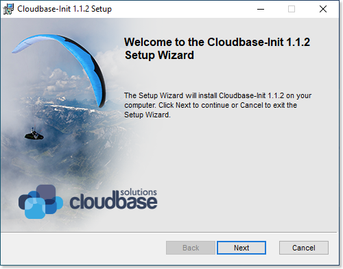{ style="margin-top: 20px;" width="450" }

2. 라이선스 정책에 동의한 후 'Next' 버튼을 클릭합니다. 

    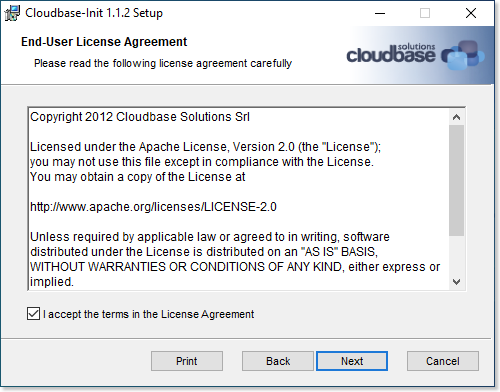{ style="margin-top: 20px;" width="450" }

3. 설치 사용자 정의 단계에서 기본값 사애에서 'Next' 버튼을 클릭합니다. 

    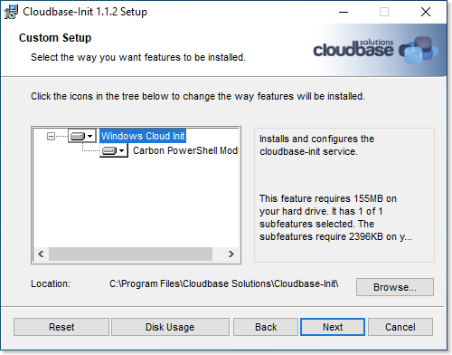{ style="margin-top: 20px;" width="450" }

4. 구성 옵션 단계에서 Username을 Administrator로 설정한 후 'Next' 버튼을 클릭합니다. 

    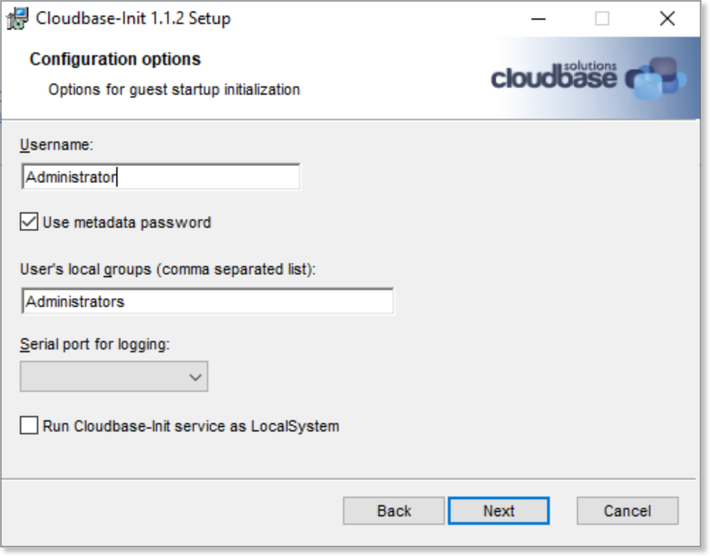{ style="margin-top: 20px;" width="450" }

5. 인스톨 준비 단계에서 'Install' 버튼을 클릭합니다. 

    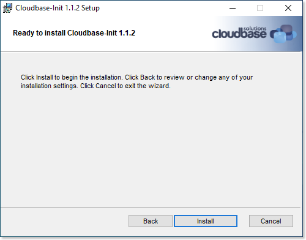{ style="margin-top: 20px;" width="450" }

6. 프로그램이 모두 설치된 후 표시되는 최종 구성 옵션 단계에서 기본 설정을 그대로 두고 'Finish' 버튼을 클릭하여 설치 마법사를 종료합니다. 

    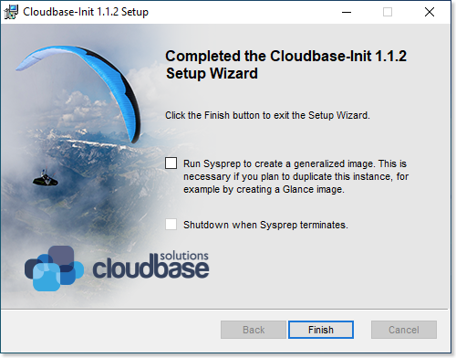{ style="margin-top: 20px;" width="450" }

### UserData 프로그램 패치

UserData 관리 프로그램이 Mold 환경에서 실행될 수 있도록 해당 프로그램을 패치해야 합니다. 패치 파일을 다음 경로에서 다운로드 합니다. 

```
http://10.10.0.202:81/cloudinit/Cloudbase-Init.zip
```

다운로드 된 파일을 다음의 순서로 압축을 풉니다. 

1. 다운로드 된 파일을 마우스 우측 버튼을 클릭하여 'Extract All' 메뉴를 클릭합니다.
2. 압축을 풀 폴더를 다음의 디렉토리로 지정합니다.
   ```
   C:\Program Files\Cloudbase Solutions
   ```
3. 파일의 압축을 풉니다. 이 때 모든 파일을 덮어쓰도록 설정하여 패치가 이루어지도록 합니다. 

### Windows 가상머신 일반화

가상머신 자동화를 위한 프로그램 설치 및 패치 파일 적용을 완료한 후 템플릿을 생성하기 위해 Windows 가상머신을 일반화 합니다. 

현재 가상머신을 일반화 하기 위해서 가상머신 콘솔에서 PowerShell을 다음의 그림과 같이 실행합니다. 

<center>
{ width="600" }
</center>

PowerShell을 실행 한 후 명령창에 다음의 명령을 입력하여 가상머신의 이미지를 일반화 합니다. 

```
C:> cd \Windows\System32\Sysprep
C:\Windows\System32\Sysprep> .\sysprep.exe /generalize /oobe /shutdown /unattend:"C:\Program Files\Cloudbase Solutions\Cloudbase-Init\conf\Unattend.xml"
```

위의 명령을 실행하면 일반화 과정이 실행 되고, 가상머신이 자동으로 종료됩니다. 

만약 HA가 설정되어 있는 가상머신인 경우 가상머신이 종료되면 Mold 화면으로 이동하여 다시 한번 가상머신을 종료하여 HA 작업에 의해 가상머신이 다시 실행되지 않도록 합니다.

### 가상머신 템플릿 이미지 생성

이제 가상머신을 이용해 가상머신 템플릿 이미지를 생성합니다. 다음의 절차로 템플릿을 생성합니다. 

1. 가상머신이 정지되어 있는지 확인합니다. 

2. 해당 가상머신의 상세 화면에서 "볼륨" 탭을 클릭합니다. 

3. ROOT 디스크 볼륨 링크를 클릭하여 볼륨 상세 화면으로 이동합니다. 

4. "볼륨으로 템플릿 생성"을 클릭합니다. 표시된 대화상자에 필요한 정보를 입력합니다. 

    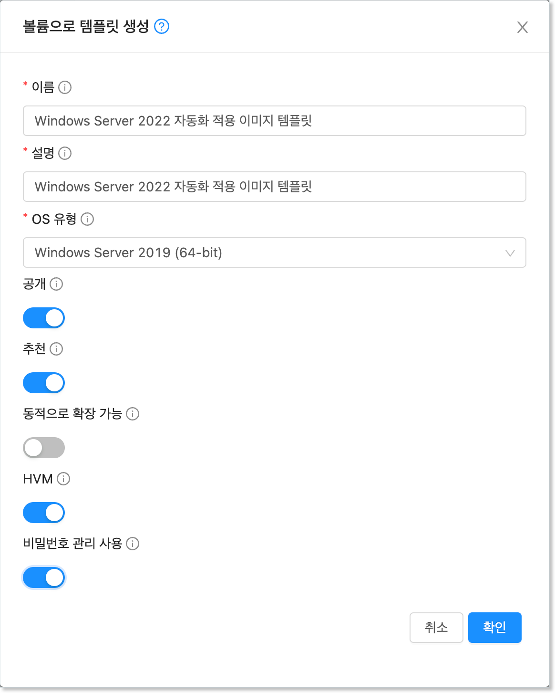{ style="margin-top: 20px;" width="450" }

5. "확인" 버튼을 클릭하여 템플릿을 생성합니다. 

만들어진 템플릿을 이용해 가상머신을 만들게 되면 해당 가상머신은 생성 시 다음의 기능이 자동화 됩니다. 

* 사용자가 설정한 가상머신 이름으로 호스트명이 설정됨(윈도우즈 특성 상 10글자 이내)
* 비밀번호가 생성되어 해당 비밀번호로 초기 설정되며 최초 로그인 시 비밀번호를 변경하도록 설정됨
* 사용자가 지정한 SSH Key가 Administrator 계정에 대해 설정됨
* UserData를 전송하여 해당 데이터를 이용해 가상머신을 필요에 따라 초기 설정할 수 있음

## 비밀번호 관리

위의 가상머신 템플릿 이미지를 이용해 가상머신을 생성하면 가상머신의 `Administrator` 사용자에 대한 비밀번호가 자동으로 생성되어 사용자에게 제공됩니다. 

ABLESTACK은 가상머신의 비밀번호를 자동으로 생성하는 기능 및 비밀번호 분실 시 재설정 하는 기능을 제공하여 편리하게 가상머신의 Administrator 사용자 비밀번호를 관리할 수 있도록 합니다. 

### 비밀번호 관리 기능 설정

가상머신 템플릿 이미지는 생성 후에도 언제든지 비밀번호 관리 기능을 활성화 하거나 비활성화 할 수 있습니다. 다음과 같은 절차로 비밀번호 관리 기능의 사용여부를 설정할 수 있습니다. 

1. `이미지 > 템플릿` 화면으로 이동해 템플릿 목록을 표시합니다. 

2. 비밀번호 관리 기능을 설정할 템플릿을 검색합니다. 

3. 검색된 템플릿의 상세 화면으로 이동합니다. 

4. 화면 우측 상단의 액션 아이콘 버튼 중 "편집" 아이콘을 클릭합니다.

    { style="margin-top: 20px;" width="150" }

5. 표시된 "편집" 대화 상자에서 "비밀번호 관리 사용" 항목을 원하는 값으로 설정합니다. 

    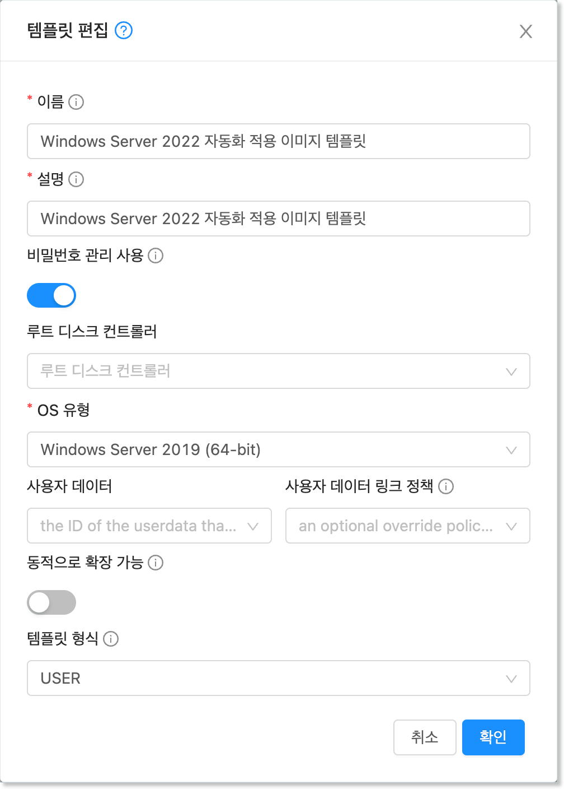{ style="margin-top: 20px;" width="450" }

6. 확인 버튼을 클릭하여 기능을 적용합니다.

위와 같이 비밀번호 관리 기능이 설정된 가상머신 템플릿 이미지를 이용해 가상머신을 만듭니다. 가상머신을 생성하면 다음과 같이 생성된 비밀번호가 Mold 화면에 표시됩니다. 

<center>{ width="300" }</center>

가상머신 콘솔에 접속하여 Administrator 계정에 대해 화면에 표시된 비밀번호를 이용해 로그인할 수 있습니다. 

!!! warning "가상머신 비밀번호의 관리 주의사항"
    생성된 가상머신은 보안을 위해 화면에 임시로 표시됩니다. ABLESTACK은 사용자 가상머신의 비밀번호를 별도로 저장하지 않습니다.

    Windows 가상머신에 접속하면 로그인 화면이 표시되고, 생성된 비밀번호를 이용해 로그인하면 비밀번호를 변경하는 화면이 표시됩니다. 사용자는 반드시 해당 비밀번호를 기억할 수 있는 비밀번호로 변경해야 합니다. 
    
    생성되는 비밀번호는 기본값이 영문 대소문자와 숫자를 혼용하여 6글자로 생성됩니다. 비밀번호의 글자수(길이)는 관리자가 글로벌 설정에 설정한 `vm.password.length` 값에 의해 제어됩니다. 

### 가상머신의 비밀번호 재설정

실행 중인 가상머신의 비밀번호를 분실했다면 가상머신을 생성한 사용자는 해당 가상머신의 비밀번호를 재설정할 수 있습니다. 가상머신 비밀번호 재설정은 다음과 같은 절차로 수행합니다. 

1. 가상머신을 정지 합니다. 

2. 가상머신 상세 화면의 우측 액션 아이콘 메뉴에서 "비밀번호 재설정" 아이콘을 클릭합니다. 

    { style="margin-top: 20px;" width="450" }

3. "비밀번호 재설정" 대화상자에서 "확인" 버튼을 클릭합니다. 
   
4. Mold 화면에 재설정된 비밀번호가 표시됩니다. 비밀번호를 기억합니다. 

5. 가상머신을 다시 시작합니다. 가상머신이 시작되면 재설정된 비밀번호로 Administrator 사용자 비밀번호가 변경됩니다. 

6. 변경된 비밀번호로 로그인 합니다. 

## SSH Key 쌍 관리

Windows 기반의 가상머신은 별도의 절차를 통해 SSH Server를 설치하면 SSH 클라이언트를 통해 외부에서 가상머신으로 접속할 수 있습니다. 

!!! info "Windows에 SSH Server 설치"
    본 문서에서는 Windows에 SSH Server를 설치하는 과정은 설명하지 않습니다. 

    SSH Server 설치에 관한 사항은 Microsoft의 공식문서인 [OpenSSH 설치](https://learn.microsoft.com/ko-kr/windows-server/administration/openssh/openssh_install_firstuse){target="_blank"} 문서를 참고합니다.

ABLESTACK은 보다 안전한 가상머신 연결 환경을 제공하기 위해 사전에 만들어진 SSH Key 쌍을 이용해 가상머신에 접속할 수 있는 기능을 제공합니다. SSH Key 등록이 활성화된 가상머신은 SSH 클라이언트 접속 시 사전에 발급 받은 키 파일을 이용해서 가상머신에 연결할 수 있게 됩니다. 따라서 가상머신 연결을 위해서는 물리적으로 키 파일이 있어야 하기 때문에 더 안전하게 가상머신 접속을 관리할 수 있게 됩니다. 

### SSH Key 쌍 생성

가상머신에 SSH Key를 적용하기 위해서는 먼저 SSH Key 쌍을 생성해야 합니다. 

SSH Key 쌍은 `컴퓨트 > SSH 키 쌍` 화면에서 확인할 수 있습니다. 다음과 같은 절차로 SSH 키 쌍을 생성합니다. 

1. "SSH 키 쌍 생성" 버튼을 클릭합니다. 다음과 같은 화면이 표시됩니다. 

    { style="margin-top: 20px;" width="450" }

2. 대화상자에서 "이름"을 입력하고 "확인" 버튼을 클릭합니다. 다음과 같은 화면이 표시됩니다. 

    { style="margin-top: 20px;" width="450" }

3. 다운로드를 클릭하여 키 파일을 다운로드 합니다. 파일이 다운로드 되면 '닫기' 버튼을 클릭하여 화면을 닫습니다. 

!!! warning "SSH Key 파일의 보관"
    다운로드 받은 파일은 사용자가 보관해야 합니다. 다운로드는 SSH 키 쌍을 생성할 때만 가능하며, 그 이후에는 파일을 다운로드 할 수 없습니다. 
    
    파일을 분실하면 가상머신에 SSH로 접속할 수 없게 되며, 이 때는 SSH Key 쌍을 신규로 생성하여 가상머신에 키를 재설정해야 합니다. 

### SSH Key를 적용한 가상머신 생성

SSH Key 쌍을 생성한 후 해당 키를 적용하여 가상머신을 생성합니다. SSH 키를 적용한 가상머신은 다음과 같은 절차로 생성합니다. 

1. `컴퓨트 > 가상머신` 메뉴를 클릭하여 이동합니다. 

2. "가상머신 추가" 버튼을 클릭하여 가상머신 추가 마법사를 실행합니다.

3. 배포 인프라를 선택합니다. 

4. 템플릿/ISO에서 비밀번호 관리/SSH Key 쌍 관리 기능이 포함된 템플릿 이미지를 선택합니다. 

5. 컴퓨트 오퍼링을 선택합니다. 

6. 필요한 경우 데이터 디스크를 선택합니다. 

7. 가상머신에 연결할 네트워크를 선택합니다. 

8. SSH 키 쌍을 다음과 같이 선택합니다. 

    { style="margin-top: 20px;" width="600" }

9. 확장모드를 선택합니다. 

10. 상세단계에서 이름을 입력한 후 가상머신을 시작합니다. 

가상머신이 시작된 후, 사용자 비밀번호를 설정한 후 가상머신을 재부팅 하면 SSH Key가 `C:\Users\Administrator\.ssh` 폴더에 `authorized_keys` 파일에 설정됩니다. 

!!! info "SSH Key 설정 시점"
    SSH Key는 사용자 정보가 완전히 설정된 후에 해당 사용자의 디렉토리에 키 파일을 저장합니다. 

    따라서 초기 설정 후 SSH Key는 가상머신을 재부팅 한 후에 적용됩니다. 또한 SSH Key는 최초에 가상머신을 생성하는 시점에만 설정이 가능합니다.

authorized_keys에 저장된 키 파일이 Administrator 사용자를 위한 키 파일로 사용하는 경우 다음의 파워쉘 명령을 추가적으로 실행하여 관리자 권한으로 SSH 접속이 가능하도록 설정해야 합니다. 상세한 사항은 마이크로소프트의 [키 기반 인증](https://learn.microsoft.com/ko-kr/windows-server/administration/openssh/openssh_keymanagement){ target=_blank } 문서를 참고합니다. 

```
Copy-Item C:\Users\Administrator\.ssh\authorized_keys -Destination C:\ProgramData\ssh\administrators_authorized_keys -Force
icacls.exe "C:\ProgramData\ssh\administrators_authorized_keys" /inheritance:r /grant "Administrators:F" /grant "SYSTEM:F"
```

### Key 파일로 가상머신 접속

이제 생성된 가상머신에 SSH 클라이언트로 접속할 수 있습니다. SSH 클라이언트를 이용해 가상머신에 접속하기 위해서는 다음과 같은 사항을 확인해야 합니다. 

1. SSH 서비스가 가상머신에서 작동 중인지 확인
2. SSH를 위한 방화벽이 열려 있는지 확인

Windows 상에 SSH 서비스를 설치하고 실행하는 것은 마이크로소프트의 [SSH 설치 가이드](https://learn.microsoft.com/ko-kr/windows-server/administration/openssh/openssh_install_firstuse){target="_blank"}를 참고합니다. 

가상머신 내부의 SSH 연결 준비가 완료되었다면 이제 가상머신이 연결되어 있는 네트워크가 외부 사용자의 연결을 받아들일 준비를 해야 합니다. 

가상머신에 연결되어 있는 네트워크가 격리 네트워크인 경우 다음의 절차로 네트워크를 준비합니다. 

1. `네트워크 > 가상머신용 네트워크`에서 가상머신에 연결된 네트워크를 조회합니다. 
   
2. 해당 네트워크의 상세 화면에서 "Public IP 주소" 탭을 클릭합니다. 

    { style="margin-top: 20px;" width="600" }

3. 표시된 IP 주소를 클릭하여 Public IP 주소 상세 화면으로 이동하여 포트 포워딩 탭을 클릭한 후 해당 가상머신의 ssh port로 포트포워딩 합니다. 

    { style="margin-top: 20px;" width="600" }

4. 해당 화면에서 "방화벽" 탭을 클릭한 후 해당 네트워크의 ssh port(22번)를 엽니다. 

    { style="margin-top: 20px;" width="600" }

네트워크 연결 준비가 완료되면 SSH 클라이언트로 가상머신에 연결합니다. 격리네트워크의 경우 앞서 조회한 public ip를 이용해 가상머신에 접속합니다. 

ssh 클라이언트에 다음과 같이 명령을 입력하여 ssh key file을 이용해 가상머신에 접속합니다. 

~~~
$ chmod 400 <vm-keypair.key>
$ ssh -i <vm-keypair.key> root@<vm public ip>
~~~

## UserData 적용

가상머신에 자동화 설정이 되어 있는 경우, 가상머신이 생성되는 시점에 사용자가 설정하기 원하는 데이터, 즉 사용자 데이터를 전송하여 가상머신에서 사용자 데이터를 받아 원하는 작업을 처리할 수 있도록 할 수 있습니다. 

사용자 데이터는 가상머신 생성 시 설정할 수 있으며, 기존에 이미 만들어진 사용자 데이터를 사용하거나, 가상머신 생성 마법사에서 직접 입력하여 적용할 수 있습니다. 

본 문서에서는 간단한 파워쉘 스크립트를 전송하여 가상머신 생성 시 해당 스크립트를 실행하도록 하는 예제를 실행합니다. 스크립트는 다음과 같습니다. 

```
#ps1_sysnative
$TargetFile = "$env:SystemRoot\System32\notepad.exe"
$ShortcutFile = "$env:Public\Desktop\Notepad.lnk"
$WScriptShell = New-Object -ComObject WScript.Shell
$Shortcut = $WScriptShell.CreateShortcut($ShortcutFile)
$Shortcut.TargetPath = $TargetFile
$Shortcut.Save()
```

위의 스크립트는 바탕화면에 메모장 프로그램에 대한 바로가기를 만듭니다. 즉, 가상머신이 생성되면 바탕화면에 해당 프로그램의 아이콘이 바로가기로 만들어져 있게 됩니다. 

Windows 운영체제에서 사용자 데이터는 가상머신 생성 시에 한번 실행되기 때문에 다음과 같이 가상머신 생성 시 사용자 데이터를 전송합니다. 

1. `컴퓨트 > 가상머신` 화면에서 "가상머신 추가" 버튼을 클릭합니다.
   
2. 템플릿/ISO 단계에서 가상머신 자동화 설정이 적용된 템플릿을 선택합니다. 
   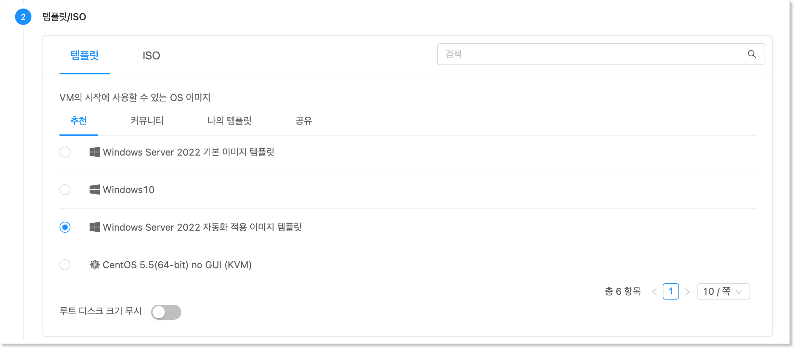{ style="margin-top: 20px;" width="600" }

3. 적절한 컴퓨트 오퍼링을 선택합니다. 

4. 네트워크에서 사용자데이터 전송을 지원하는 네트워크(격리 네트워크 또는 ConfigDrive 지원 네트워크)를 선택합니다.
   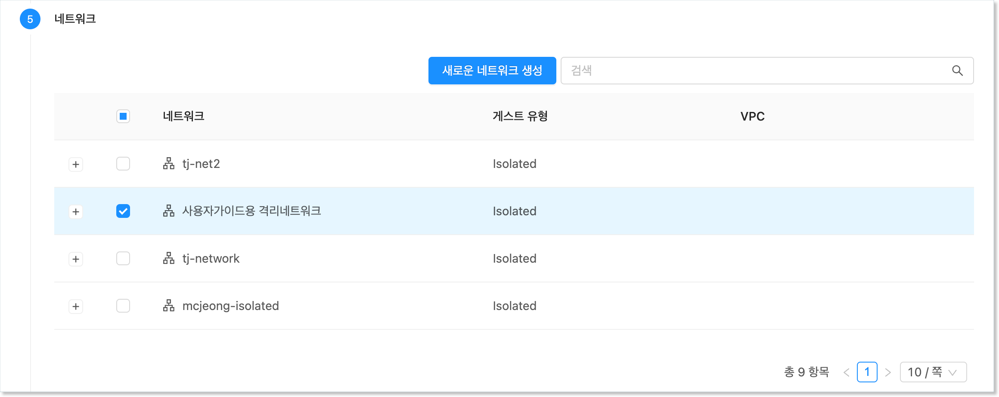{ style="margin-top: 20px;" width="600" }

5. "확장 모드" 단계에서 "고급 설정 표시"를 활성화 한 후 "사용자 데이터\사용자 데이터 텍스트" 항목에 위의 스크립트를 입력합니다.
   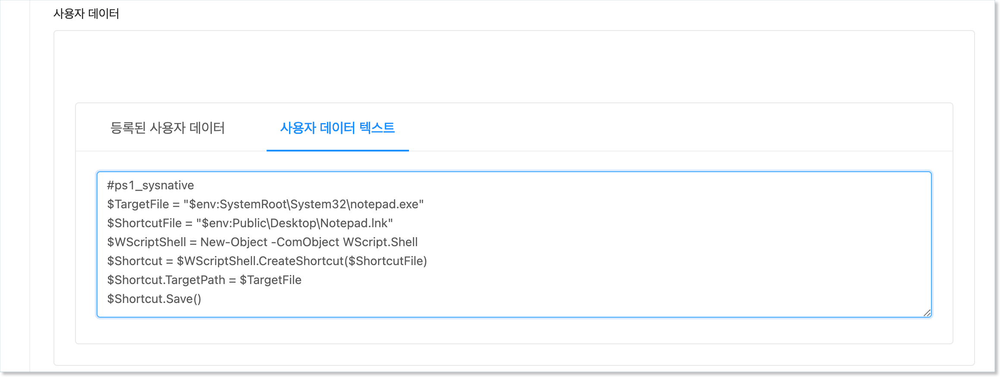{ style="margin-top: 20px;" width="600" }

6. 그 외의 필요한 정보를 입력한 후 "VM 시작" 버튼을 클릭하여 가상머신을 시작합니다. 

가상머신이 생성되면 가상머신 콘솔에 접속하여 바탕화면에 메모장 바로가기가 다음과 같이 생성되었는지 확인합니다. 

<center>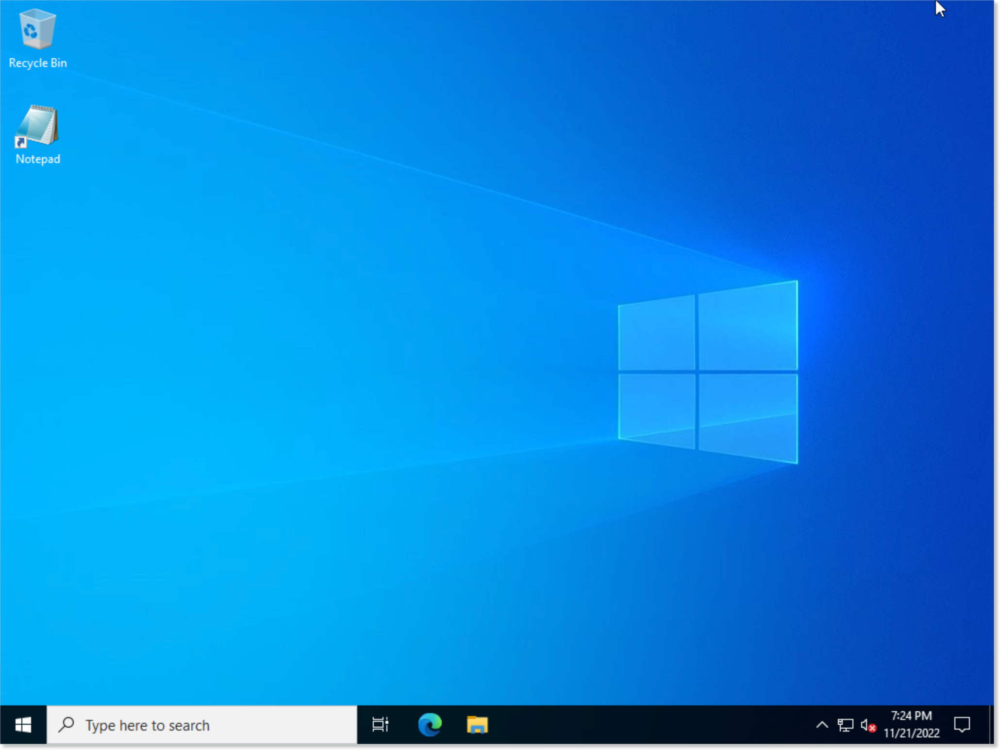{ style="margin-top: 20px;" width="600" }</center>

!!! info "사용자 데이터 전송 지원 네트워크"
    ABLESTACK은 사용자 데이터를 전송하기 위해 가상머신의 네트워크를 사용합니다. 따라서 사용자 데이터 전송을 위해서는 이에 적합한 네트워크를 사용해야 합니다.

    가상머신에 연결된 네트워크가 사용자 데이터 전송을 지원하는지 확인하려면 다음의 절차로 해당 기능의 지원여부를 확인합니다. 

    1. 가상머신 상세 화면에서 "NIC" 탭을 클릭합니다.
    2. 연결된 네트워크 목록에서 링크를 클릭하여 네트워크 상세 화면으로 이동합니다. 
    3. 네트워크 상세 화면의 좌측 가운데에 "네트워크 오퍼링" 항목의 링크를 클릭하여 네트워크 오퍼링 상세화면으로 이동합니다. 
    4. 네트워크 오퍼링 상세화면의 우측 하단에 "지원되는 서비스"의 서비스 중 UserData 항목이 있는지 확인합니다.

    기본적으로 제공되는 네트워크 오퍼링은 "기본 L2 VLAN 네트워크오퍼링"을 제외하고 모두 사용자 데이터 전송을 지원합니다. 

사용자 데이터 구성을 완료합니다.
